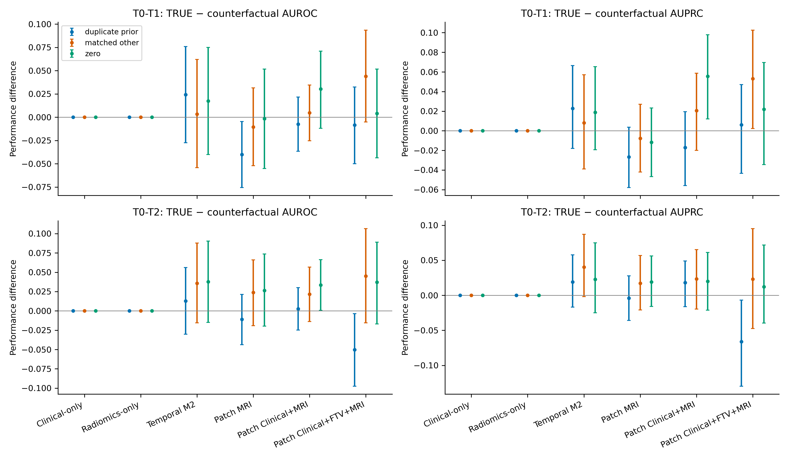
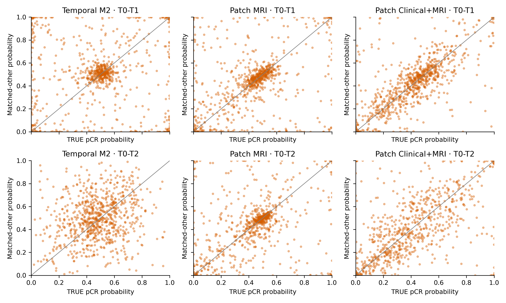
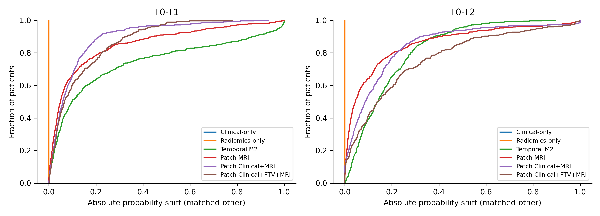
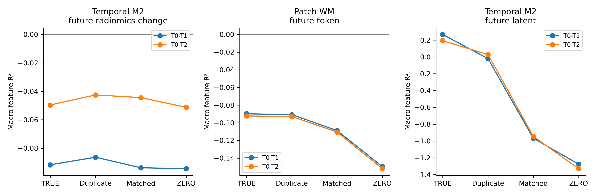

# I-SPY2 世界模型反事实影像依赖审计：中文总结报告

**实验完成日期：2026-09-08。**

## 一、核心结论

**当前 Patch-token 世界模型会使用患者特异性的影像信息，但对真实纵向变化的依赖较弱。**

支持这一结论的关键证据是：

- 换成临床条件匹配的其他患者影像后，Patch 模型的未来 token R² 在两个训练种子中均下降约 **0.018–0.020**，95% 配对置信区间均不含零。
- 将当前影像换成同一患者的前次影像，未来 token R² 的变化绝对值均 **小于 0.001**，四个种子×时间点组合的置信区间均包含零。
- pCR 概率会明显改变，但所有模型、两个 Patch 种子的“真实−匹配他人”**AUROC 差值置信区间均包含零**。预测变化尚未转化为稳定的正确预测增益。
- 真实影像下 Patch 的未来 token R² 仍为负值。时间模型 M2 的真实未来 radiomics R² 也为负，且没有稳定的匹配影像替换惩罚。

因此，不能把本次结果解释为模型完全忽略 MRI；也不能据此宣称已经学到了具有临床价值的纵向肿瘤演变。

## 二、实验范围与方法

本次审计沿用原始外层五折，覆盖 **808 名独立 held-out 患者**，其中 **375 人具有纵向测量数据**。评估了两个 Patch 训练种子（2026、3026）的十个检查点、M2 时间模型的五个检查点，以及临床与 radiomics 阴性对照，共 **15 个影像模型检查点**。没有重新划分数据，也没有重新训练编码器、转移模块或未来状态预测头。

| 条件 | 当前影像输入 | 目的 |
| --- | --- | --- |
| TRUE：真实 | 本人的真实当前 MRI | 原始评估 |
| DUPLICATE-PRIOR：复制前次 | 本人的前次 MRI | 检查是否需要真实纵向变化 |
| MATCHED-OTHER：匹配他人 | 同一 held-out 折内，匹配患者的当前 MRI | 主要反事实：检查患者特异性影像贡献 |
| ZERO：零图像 | 正确形状的全零图像，经原编码器处理 | 仅作为分布外敏感性诊断 |

所有条件均保持接收者的临床变量、治疗分配、时间位置、FTV 等表格先验、标签与未来目标不变。替换的是完整影像观测：Patch 使用原有 DCE7 裁剪和归一化；M2 的 DCE8 包含第八通道 ROI mask，替换时八个通道及相应 online/EMA 编码一并更换。

代码中的 **T0 为基线，T1/T2 为后续访视，T3 为晚期/术前访视**。T0–T1 审计替换 T1、复制 T0、预测 T2；T0–T2 审计替换 T2、复制 T1、保留 T0、预测 T3。T3 没有被当成早期预测点。

没有找到以 TDN 命名的对应实现，因此使用已有的 **M2 Next-Change 因果时间 Transformer** 作为时间基线，并明确保留这一模型映射。临床基线包含原实验中的治疗变量。

一个重要实现区别：**Patch 的 pCR 读出使用已观察 MRI 的时间顺序特征拼接；其未来 token 预测属于另一条输出路径。** 原有 FTV 头预测的是当前访视 FTV，不能被当成未来 radiomics 头。本报告因此分别评估 Patch 未来 token 和 M2 原生未来 radiomics。

原 Patch 实验没有保存 logistic 系数。本次只按原先已选定的 C、原训练样本与相同求解器恢复读出，未重新搜索超参数；恢复后 TRUE 概率与原结果最大偏差为 **9.62×10⁻⁷**。Patch 分类阈值仅由原验证集确定；M2 直接读取已有系数和阈值。

## 三、供体匹配质量与数据边界

供体只从同一 held-out 折选择，禁止本人作为供体，禁止利用 pCR、未来 radiomics 或未来响应进行匹配。优先匹配治疗方案和 HR/HER2 亚型，再按基线 ROI 体积、可用的基线 LD/FTV 以及年龄做确定性近邻匹配；缺失值有明确惩罚，种子固定为 260908。

- **807/808（99.88%）**：相同治疗方案、相同亚型、相同访视。
- **1/808**：回退到相同亚型、相同访视。
- 无患者使用更低匹配层级，也无患者因找不到供体而被丢弃。
- 共使用 **535 名不同供体**，单个供体最多被使用 5 次。

基线 ROI 大小可用于 807 人，基线 LD/FTV 可用于 375 人，年龄可用于 805 人。实际扫描间隔、站点和扫描仪资料不足，未能用于匹配。治疗与亚型匹配较好，不等于所有影像采集因素都已控制。

缺少测量数据的 **433 人仍参与完整 MRI 与临床分析**，仅不进入需要测量值的分析。808 人本身是四访视完整队列，375 人又是测量完整子集，不能忽略这种选择性。

## 四、pCR 结果

下表为 **seed 2026、T0–T2** 的主要结果。完整 T0–T1、第二训练种子和五折汇总见附带 CSV。所有差值均为“真实−反事实”，置信区间来自 **10,000 次折内患者级配对 bootstrap**。不同 N 的绝对分数不应直接作增量比较；另附 [共同 375 人比较表](tables/common_375_metrics.csv)。

### AUROC

| 模型 | N | 真实 | 复制前次 | 匹配他人 | 零图像 | 真实−匹配他人（95% CI） |
| --- | --- | --- | --- | --- | --- | --- |
| 临床（含治疗） | 808 | 0.680 | 0.680 | 0.680 | 0.680 | +0.000 [+0.000, +0.000] |
| Radiomics-only | 375 | 0.756 | 0.756 | 0.756 | 0.756 | +0.000 [+0.000, +0.000] |
| 临床+FTV | 375 | 0.726 | 0.726 | 0.726 | 0.726 | +0.000 [+0.000, +0.000] |
| 时间模型 M2 | 808 | 0.541 | 0.528 | 0.505 | 0.503 | +0.036 [-0.015, +0.088] |
| Patch MRI-only | 808 | 0.546 | 0.557 | 0.522 | 0.520 | +0.024 [-0.019, +0.066] |
| Patch 临床+MRI | 808 | 0.635 | 0.633 | 0.614 | 0.602 | +0.021 [-0.014, +0.057] |
| Patch 临床+FTV+MRI | 375 | 0.623 | 0.674 | 0.578 | 0.586 | +0.045 [-0.015, +0.106] |

### AUPRC（average precision）

| 模型 | N | 真实 | 复制前次 | 匹配他人 | 零图像 | 真实−匹配他人（95% CI） |
| --- | --- | --- | --- | --- | --- | --- |
| 临床（含治疗） | 808 | 0.542 | 0.542 | 0.542 | 0.542 | +0.000 [+0.000, +0.000] |
| Radiomics-only | 375 | 0.515 | 0.515 | 0.515 | 0.515 | +0.000 [+0.000, +0.000] |
| 临床+FTV | 375 | 0.540 | 0.540 | 0.540 | 0.540 | +0.000 [+0.000, +0.000] |
| 时间模型 M2 | 808 | 0.374 | 0.355 | 0.334 | 0.351 | +0.040 [-0.002, +0.087] |
| Patch MRI-only | 808 | 0.381 | 0.385 | 0.364 | 0.362 | +0.017 [-0.021, +0.057] |
| Patch 临床+MRI | 808 | 0.470 | 0.451 | 0.446 | 0.450 | +0.023 [-0.019, +0.065] |
| Patch 临床+FTV+MRI | 375 | 0.397 | 0.463 | 0.374 | 0.385 | +0.023 [-0.047, +0.095] |

两个 Patch 种子的匹配影像 AUROC 差值置信区间均包含零。T0–T1、seed 2026 的 Patch 临床+FTV+MRI 出现一个名义 AUPRC 增益：**+0.053 [0.002, 0.103]**；第二种子没有复现非零置信区间，且未做多重比较校正，因此不能据此声称稳定成功。

## 五、预测是否真的发生变化？

下表仍为 seed 2026、T0–T2，比较真实与匹配他人影像。分类翻转使用验证集确定的阈值。CIRS_abs 为绝对 logit 变化；CIRS_aligned 将变化乘以 `(2y−1)`，其正值表示真实影像平均把预测推向正确标签。

| 模型 | 平均绝对概率变化 | Spearman | 分类翻转率 | 平均 CIRS_abs | 平均 CIRS_aligned |
| --- | --- | --- | --- | --- | --- |
| 临床+FTV | 0.000 | 1.000 | 0.0% | 0.000 | 0.000 |
| 临床（含治疗） | 0.000 | 1.000 | 0.0% | 0.000 | 0.000 |
| Patch 临床+FTV+MRI | 0.229 | 0.540 | 28.3% | 2.785 | 0.290 |
| Patch 临床+MRI | 0.150 | 0.665 | 22.6% | 1.924 | 0.145 |
| Patch MRI-only | 0.138 | 0.497 | 28.3% | 1.646 | 0.195 |
| Radiomics-only | 0.000 | 1.000 | 0.0% | 0.000 | 0.000 |
| 时间模型 M2 | 0.178 | 0.193 | 36.4% | 0.851 | 0.077 |

临床、临床+FTV 和 radiomics 对照的概率变化与翻转率均**严格为零**，说明本次影像干预没有改变这些对照的输入或输出。

Patch 临床+MRI 的平均绝对概率变化，在两个种子的 T0–T1/T0–T2 分别为 **0.102/0.150** 和 **0.127/0.136**。这种变化不是“忽略当前图像”的表现；但所有匹配影像的 CIRS_aligned 均未获得排除零的置信区间，故不能把变化幅度当成正确预测贡献。

为处理极端概率，主分析在计算 logit 时使用 [1e-7, 1−1e-7] 截断；原始概率保留。改用 1e-12 或 1e-15 后，匹配影像的标签对齐分数仍没有排除零的区间。完整均值、中位数、Pearson/Spearman、翻转率与置信区间见汇总表。

## 六、未来状态：患者身份信息与纵向变化的区别

### Patch 原生未来 token 预测

下表为宏平均通道 R²。潜在特征按折内中心化评估，避免不同检查点坐标系之间的差异虚增 R²；同一患者的 token 不被当作独立患者重采样。

| 训练种子 | 观察前缀 | 真实未来 token R² | ΔR²：匹配他人（95% CI） | ΔR²：复制前次（95% CI） |
| --- | --- | --- | --- | --- |
| 2026 | T0-T1 | -0.0899 | +0.01895 [+0.01685, +0.02105] | +0.00085 [-0.00009, +0.00178] |
| 2026 | T0-T2 | -0.0922 | +0.01829 [+0.01618, +0.02044] | +0.00065 [-0.00025, +0.00157] |
| 3026 | T0-T1 | -0.0698 | +0.01987 [+0.01754, +0.02215] | -0.00065 [-0.00157, +0.00026] |
| 3026 | T0-T2 | -0.0724 | +0.01860 [+0.01640, +0.02087] | +0.00013 [-0.00086, +0.00118] |

这一结果在两个种子上很一致：**正确患者身份有贡献，但真实当前访视并没有稳定优于同一患者的前次访视。** 同时，TRUE 的未来 token R² 仍为负。零图像造成更大下降（约 0.060），主要反映分布外敏感性，不能替代匹配影像证据。

### M2 原生未来 radiomics 与 latent 预测

M2 的四个测量目标为 FTV、sphericity、LD、BPE，使用原始训练折拟合的标准化变化目标。

| 观察前缀 | 真实 radiomics 宏平均 R² | 复制前次 | 匹配他人 | 零图像 | 真实−匹配他人（95% CI） |
| --- | --- | --- | --- | --- | --- |
| T0–T1 | −0.0916 | −0.0863 | −0.0938 | −0.0944 | +0.0021 [−0.0062, +0.0104] |
| T0–T2 | −0.0496 | −0.0425 | −0.0444 | −0.0512 | −0.0052 [−0.0126, +0.0022] |

所有条件下，未来 radiomics 的宏平均 R² 均为负，没有稳定的真实纵向影像优势。T0–T2 复制前次影像反而有小幅改善。

M2 的未来 latent R² 确实对影像替换敏感，但其预测具有“当前 EMA 状态 + 预测变化”的结构。与已有的直接复制当前状态参考相比，原生模型的 aggregate R² 仍更差：

| 前缀 | M2 原生预测 | 直接复制当前 latent | 原生−复制（95% CI） |
| --- | --- | --- | --- |
| T0–T1 | 0.2932 | 0.3135 | −0.0203 [−0.0395, −0.0004] |
| T0–T2 | 0.2163 | 0.2517 | −0.0354 [−0.0525, −0.0181] |

因此，正的 latent R² 不能直接解释为成功预测了肿瘤变化；患者身份和状态持续性可能贡献很大。

## 七、验证、局限与科研含义

八人 smoke 测试在完整运行前通过；随后完成全部 15 个检查点评估、**7 项针对性测试**和独立完整性核验。原检查点、原预测和选择文件的哈希未改变；Patch 条件编码与检查点记录完全一致；原生未来 radiomics 目标逐项一致。

M2 的最大 TRUE 概率复现偏差约为 2.56×10⁻⁵，已通过原始 evaluator 的数值重放核查，低于明确记录的 1e-4 容差。不同卷积 batch shape 也会产生小幅数值差异；固定相同形状的直接观测替换检查完全一致。这些实现与数值问题均在审计记录中保留，没有据反事实结果选择模型或阈值。

主要解释边界：

1. 配对区间条件于固定的供体分配，不包含重新匹配、重新训练或预处理变化的不确定性。
2. 没有完整的扫描间隔、站点与扫描仪匹配；M2 还使用 ROI mask 通道。
3. Patch token R² 属于潜在空间指标，并非独立生物学测量预测。
4. 阴性的 AUROC 差异证据不证明 MRI 毫无信息；明显的概率变化也不证明 MRI 有益。
5. 亚型、治疗和 MP 分组仅作探索性描述，不用来改变主结论。

当前结果不足以支持“Patch 世界模型已学习到超越临床、治疗、测量先验的有效纵向肿瘤动态”这一强主张。下一步若讨论训练或架构调整，应先明确需要改善的是纵向变化的可预测性、独立测量 grounding，还是 pCR 读出；本次审计没有实施这些改动。

## 八、图表与复核材料

所有图展示 seed 2026；两个种子的统计结果均在附带表格中。PDF 版本位于 [figures](figures/)。

- [AUROC](tables/table_auroc.csv)、[AUPRC](tables/table_auprc.csv)、[预测一致性](tables/prediction_consistency.csv)、[pCR/CIRS 配对区间](tables/paired_bootstrap.csv)。
- [未来状态指标](tables/future_metrics.csv)、[逐特征 R²](tables/future_feature_r2.csv)、[未来状态配对区间](tables/future_paired_bootstrap.csv)。
- [匹配质量](tables/matching_quality.csv)、[匹配层级人数](tables/donor_tier_counts.csv)、[复制当前状态参考](tables/existing_copy_current_reference.csv)、[logit 截断敏感性](tables/logit_clipping_sensitivity.csv)。

该 GitHub 报告包包含中文总结、汇总统计与不含患者标识的图表。患者 ID、逐患者预测、供体逐人映射、原始 MRI 和模型权重仍保留在本地。原实验源代码基准提交为 `f66c6b35817b22956dc20ea410537bc0f9c2658a`，五折划分 SHA256 为 `143e482d711225c0611006d99bd7345d2fa1a5c16c65fbaf8399341a0d26aa38`。文件校验值见 [manifest.json](manifest.json)。诊断思路参考 [BrainDiff](https://arxiv.org/abs/2609.00593v2)，未复现其架构或训练目标。

## 最终判定

**B. “The model uses patient-specific imaging, but longitudinal-change sensitivity is weak.”**

中文：**模型使用了患者特异性影像，但对纵向变化的敏感性较弱。** 两个 Patch 种子均出现约 0.019 的匹配影像未来 token R² 惩罚，而复制前次影像的影响小于 0.001 且区间包含零；pCR AUROC 改善尚无稳定证据，未来生物学测量预测也没有建立可靠优势。这是一个有价值的机制性审计结果，而不是可以仅凭原始 AUROC 宣称成功的实验。
