# Direct Grounded Response State 最终报告

> **最终结论：NO-GO。** Direct FTV grounding 确实改变了 observed image representation，并稳定增强了 observed ΔFTV 的可解码性；但是 primary 候选 G4 相对 G2 未达到预注册的 static grounding 幅度门槛，也没有获得可靠的纵向 pCR 增益。G3 的 FTV/ΔFTV 排名指标改善更强，但 fold 3 违反 validation base-loss 安全门槛，因此不能作为合格的 GO 证据。当前结果不足以进入 Grounded-State World Model。

## 1. 科学问题

本实验回答一个受控问题：在不修改 M0-style Next-State/JEPA transition 的前提下，把 static FTV 作为仅训练阶段可见的辅助目标，直接施加到真实 observed response state `r_t`，能否得到更有肿瘤治疗响应含义、且不依赖 binary mask channel shortcut 的影像表征？训练后进一步检验：

1. `r_t` 是否更容易解码 `FTV_t`；
2. 从未直接接受 ΔFTV loss 的 `r_(t+1)-r_t` 是否自然更容易解码 ΔFTV；
3. 改变是否迁移到 LD、sphericity 和 image-only pCR readout；
4. 改善是否在 representation 稳定性和 JEPA validation base loss 的安全边界内成立。

正式分析使用固定 seed-2026 五折：375 名 complete-measurement I-SPY2 患者用于 frozen Ridge probes，808 名 complete-four-visit I-SPY2 患者用于 pCR readout。最终汇总覆盖 39,375 行 probe 预测和 12,120 行 pCR 预测，所有 test 患者仅产生一次 outer-fold OOF 预测。汇总状态、覆盖和零登记问题见[正式汇总](../metrics/final/aggregation_summary.json)与[覆盖表](../metrics/final/coverage.csv)。

## 2. 为什么把 grounding 提前到 observed state

旧路径把 radiomics supervision 放在 transition 预测之后：`observed latent -> predicted future delta -> radiomics head`。这条链路把 encoder 表征质量、transition 误差和 auxiliary head 误差混在一起；即使 predicted delta 的 FTV loss 下降，也不能证明真实 observed state 获得了 response meaning。

本轮改为 `DCE MRI_t -> r_t -> Linear FTV head -> FTV_t`。FTV gradient 直接进入 3-D encoder 和 128→192 的 response projection；FTV head 不参与 feature extraction、Ridge probe 或 pCR readout。这样，冻结后仍能由 `r_t` 或 `r_(t+1)-r_t` 解码 measurement 的变化，才可归因于 image-derived representation 被塑形，而不是推理时读取 radiomics 或复用 head 输出。

## 3. 前序审计对本实验的启发

前序审计给出五项直接约束：

- M0 的 online pre-projector observed state 对 static FTV 最稳定，且通常优于 projected latent，因此本轮固定使用 192-D pre-projector `r`；
- observed latent difference 已含有限但稳定的 ΔFTV 信号，而 M1 Next-Change 与 M2 predicted-delta auxiliary supervision 没有改善 observed representation；
- frozen transition-predicted delta 无法稳定恢复 observed ΔFTV 信号，因此本轮不 ground predicted delta；
- LD、sphericity 的 longitudinal signal 弱于 FTV，所以只用 FTV 训练，二者仅作 zero-shot transfer probes；
- mask geometry 对 FTV/ΔFTV 极强，旧审计中 FTV 与 mask voxel count 的 Spearman 达 0.935，因此 mask 必须成为显式受控变量。

由此，本轮只改变 mask contract、pooling 和 direct static FTV grounding，不引入 Next-Change、direction/magnitude/path loss、relational loss、clinical、treatment 或 pCR-supervised encoder loss。

## 4. G0–G4 方法

| 模型 | Backbone 输入 | Pooling | Direct FTV grounding | 角色 |
|---|---|---|---|---|
| G0 | DCE7 + binary mask channel | GAP | 无 | 复用的 ROI-assisted M0 对照；不是严格无 mask 模型 |
| G1 | DCE7 | GAP | 无 | 严格 DCE7 baseline |
| G2 | DCE7；mask 与 backbone 分离 | normalized occupancy-weighted ROI mean | 无 | 仅定位的 pooling baseline |
| G3 | DCE7 | GAP | 有，`lambda_FTV=0.25` | 严格 DCE7 grounding |
| G4 | DCE7；mask 与 backbone 分离 | normalized occupancy-weighted ROI mean | 有，`lambda_FTV=0.25` | **primary 候选** |

DCE7 严格取既有 DCE8 cache 的前七个增强相关通道；第八个 binary mask channel 不进入 G1–G4 backbone。单访视计算图为 3-D residual encoder → `[128,4,12,12]` spatial map → GAP 或 normalized ROI mean → `Linear(128,192)+LayerNorm` 得到 `r` → 原 projector 和 causal transition。G1/G3 完全拒绝 mask；G2/G4 的 mask 只在 spatial map 形成后进入独立 pooling 函数。

G1/G3、G2/G4 在每个 fold 共享公共模块初始化、seed 和 patient order，使 grounding 成为配对训练中的唯一优化差异。G0 与 G4 的输入 contract 不同，故 G4−G0 只作描述，不作为主要成功判断。

## 5. Mask shortcut 与控制设计

Normalized ROI pooling 使用 `sum(F*M)/max(sum(M), epsilon)`，而不是会直接携带体积幅值的 sum pooling。Smoke test 验证了缩放 mask occupancy 不改变输出、常量 spatial map 对不同非空 support 输出相同、all-ones mask 等于 GAP、empty mask 严格回退 GAP，且改变 mask 不改变 encoder spatial map。代码和 state schema 中不存在 mask voxel count、bbox、centroid、9-D geometry 或 explicit volume 进入 `r` 的路径。

这并不意味着 G2/G4 “geometry-free”：mask support 仍决定从哪里采样，`[32,96,96]` cache 也是 lesion-centered crop，crop 定位本身保留 ROI 先验。因此本报告只声称排除了 mask channel 和直接的 sum-volume 幅值路径，不声称消除了所有空间支撑或裁剪先验。

旧 mask-geometry control 远强于 learned states：static FTV 的 T0–T3 Spearman 为 0.910/0.875/0.904/0.876，R² 为 0.567/0.477/0.550/0.745；ΔFTV 的三个 transition Spearman 为 0.869/0.889/0.818，R² 为 0.681/0.750/0.648。完整数值见[geometry control](../metrics/final/geometry_control_reference.csv)。这说明 mask shortcut 风险是真实且占优势的对照，而非理论担忧。

## 6. FTV grounding 实现与评估协议

正式运行固定在 `feature/ispy-clean-corejepa` 分支、起始 commit `629b9cdb6d9a713ca03cc7ff700c8d2fd71dc960` 和 conda `bowen` 环境；Python 3.11.14、PyTorch 2.9.1+cu130、CUDA 13.0，硬件为 3 张 NVIDIA RTX PRO 6000 Blackwell Max-Q。训练不假定独占 GPU。

正式分析完成后，公开提交仅把本机数据根目录替换为 `${DGRS_DATA_ROOT}` 环境变量，并为配置/特征提取默认路径增加同等的可移植入口；没有改动 cohort、文件名、锁定 SHA、split、模型、训练、预测、统计或决策内容。20 个正式 checkpoint 保留训练时的原计划哈希，公开计划的新哈希与路径-only 变更范围记录在[计划脱敏 provenance](plan_redaction_provenance.json)中。

FTV target 在每个 outer fold 的 train patients 上独立拟合 `log(FTV+epsilon)`、1%/99% winsorization 和 median/IQR 标准化；validation/test 只应用 train transform。G3/G4 使用单层 `Linear(192,1)` 与 patient-mean SmoothL1：有 FTV 的患者优化 `L_base + 0.25*L_FTV`，无 FTV 的患者仍优化 `L_base`，没有删除、填造或极端过采样 measurement-missing 患者。推理时移除 FTV head，FTV 从不作为 encoder、transition、probe 或 pCR 输入。

统一训练配置为单一训练 seed 路径、最多 12 epochs、patience 4、batch size 32、AdamW、EMA 0.996 和 SIGReg。训练 loader 使用 `drop_last=True`：每 epoch 实际处理 672 名患者，fold train 总数为 681 或 682，因而每 epoch 随机遗漏 9 或 10 名；这是与旧 G0 一致的优化预算，但也构成有限数据下的额外随机性。

训练结束后，每个 model×fold 只提取一次 `[808,4,192]` frozen `r`，共 25 个 feature assets。Ridge 的 scaler、alpha 与 target transform 只在 outer train/validation 选择，test 只预测一次。pCR 使用 class-balanced logistic regression，输入仅为 `r0` 或 longitudinal `r`/difference 拼接，不使用 clinical、treatment、radiomics、mask feature、真实/预测 FTV 或 FTV-head output。25 个 probe 文件和 25 个 pCR 文件均保存 patient-level 结果并通过唯一键/覆盖检查；这些受控文件不公开提交，只公开不含 patient rows 的[预测资产清单](../metrics/final/prediction_file_manifest.csv)。机器可读完整 OOF 指标见[probe OOF 表](../metrics/final/probe_oof_metrics.csv)和[pCR OOF 表](../metrics/final/pcr_oof_metrics.csv)。

## 7. `lambda_FTV` 选择

只在 fold 0 的 train/validation 上比较预注册候选 `{0.02,0.05,0.10,0.25}`；没有读取 test FTV、test features、pCR label 或 AUROC。

| `lambda_FTV` | G3−G1 validation macro FTV Spearman | G4−G2 validation macro FTV Spearman | G3 base degradation | G4 base degradation | 联合有效 |
|---:|---:|---:|---:|---:|:---:|
| 0.02 | -0.0154 | -0.0051 | -0.38% | -0.08% | 否 |
| 0.05 | -0.0223 | +0.0053 | -0.79% | -0.20% | 否 |
| 0.10 | +0.0026 | +0.0141 | -0.88% | -0.39% | 否 |
| 0.25 | +0.0327 | +0.0693 | -1.77% | -1.60% | 是 |

`0.25` 是 G3 与 G4 同时满足联合有效性门槛的最小候选，因此按 `smallest_effective_lambda` 锁定，没有启用 pilot fallback。对应 representation std 为 0.645/0.805，均高于 0.05 collapse 门槛；base loss 在 pilot 中改善而非恶化。

## 8. Static FTV decodability

下表为 375 名患者的 pooled OOF Spearman/R²；“宏平均”是四时点简单平均。

| 模型 | T0 | T1 | T2 | T3 | 宏平均 |
|---|---:|---:|---:|---:|---:|
| G0 | 0.758 / 0.320 | 0.674 / 0.174 | 0.497 / 0.027 | 0.335 / 0.027 | 0.566 / 0.137 |
| G1 | 0.645 / 0.125 | 0.602 / -0.016 | 0.526 / -0.190 | 0.351 / 0.016 | 0.531 / -0.016 |
| G2 | 0.727 / 0.142 | 0.601 / 0.094 | 0.517 / -0.009 | 0.434 / 0.078 | 0.570 / 0.076 |
| G3 | 0.707 / 0.116 | 0.687 / 0.044 | 0.597 / -0.572 | 0.401 / 0.076 | 0.598 / -0.084 |
| G4 | 0.742 / 0.186 | 0.662 / 0.120 | 0.534 / -0.024 | 0.480 / 0.175 | **0.605 / 0.114** |

G3 相对 G1 的四时点 macro Spearman 增加 0.067，但 macro R² 下降 0.068。尤其 G3 T2 的秩相关提高至 0.597，而原 FTV 尺度 R² 降至 -0.572；这是 inverse-log 回到自然尺度后尾部误差被放大的 readout 现象，不是 representation collapse。G4 是表现最稳定的 grounded 模型：相对 G2 的 macro Spearman/R² 分别增加 0.035/0.038，但 Spearman 幅度小于预注册 0.05 门槛，R² 的 paired CI 也跨 0。

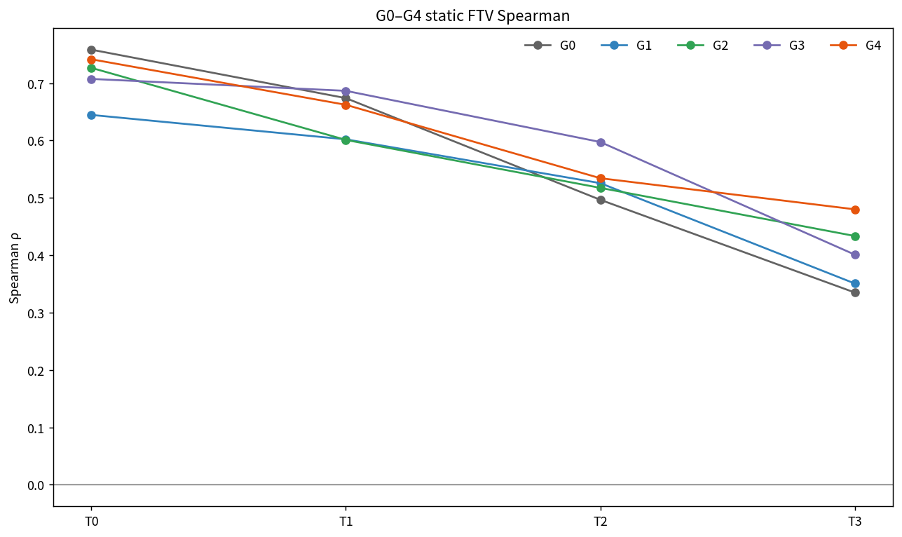

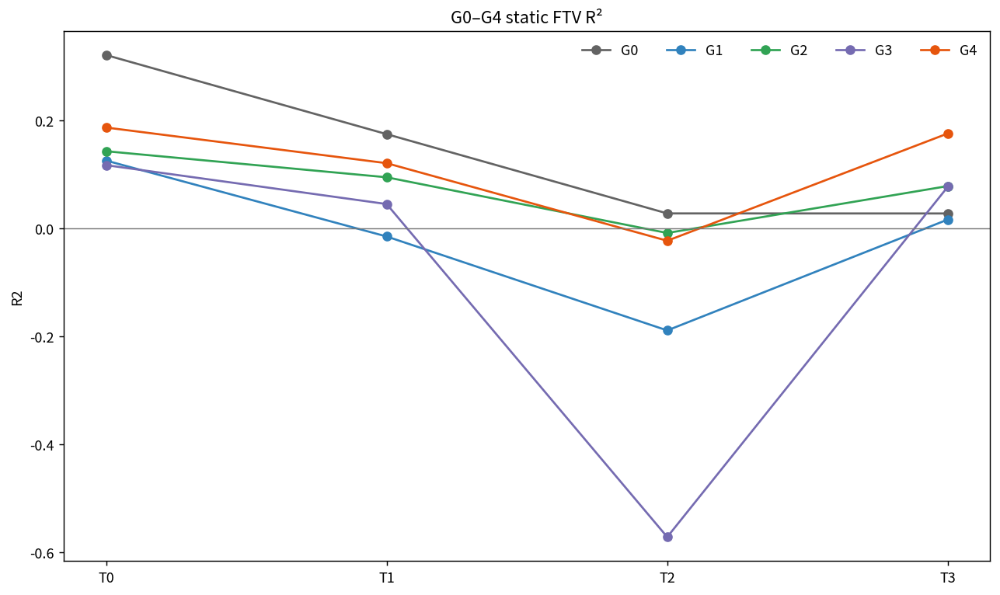

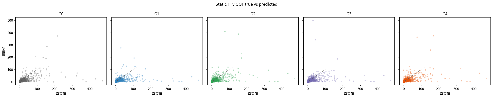

各指标的 patient bootstrap 区间、MAE、RMSE、B0 RMSE gain 和 prediction/target variance ratio 分别见[probe bootstrap 表](../metrics/final/probe_bootstrap_ci.csv)与[probe OOF 表](../metrics/final/probe_oof_metrics.csv)。

## 9. Observed ΔFTV decodability

训练从未使用 ΔFTV loss。下表用 frozen `r_(t+1)-r_t` 解码相邻 ΔFTV，仍为 pooled OOF Spearman/R²。

| 模型 | T0→T1 | T1→T2 | T2→T3 | 宏平均 |
|---|---:|---:|---:|---:|
| G0 | 0.408 / 0.119 | 0.260 / 0.058 | 0.247 / 0.071 | 0.305 / 0.083 |
| G1 | 0.383 / 0.072 | 0.248 / 0.072 | 0.238 / 0.084 | 0.290 / 0.076 |
| G2 | 0.305 / 0.078 | 0.223 / 0.026 | 0.204 / 0.035 | 0.244 / 0.047 |
| G3 | **0.503 / 0.168** | **0.327 / 0.110** | **0.266 / 0.114** | **0.366 / 0.131** |
| G4 | 0.383 / 0.131 | 0.257 / 0.055 | 0.246 / 0.076 | 0.295 / 0.087 |

G3−G1 的 macro ΔSpearman 为 +0.0759（95% CI 0.0464–0.1078），macro ΔR² 为 +0.0546（0.0296–0.0803）。G4−G2 的 macro ΔSpearman 为 +0.0514（0.0263–0.0756），macro ΔR² 为 +0.0405（0.0241–0.0571）。因此，static current-state grounding 确实使未受直接监督的 observed latent difference 更贴近 ΔFTV；这是本轮最清晰的正结果。

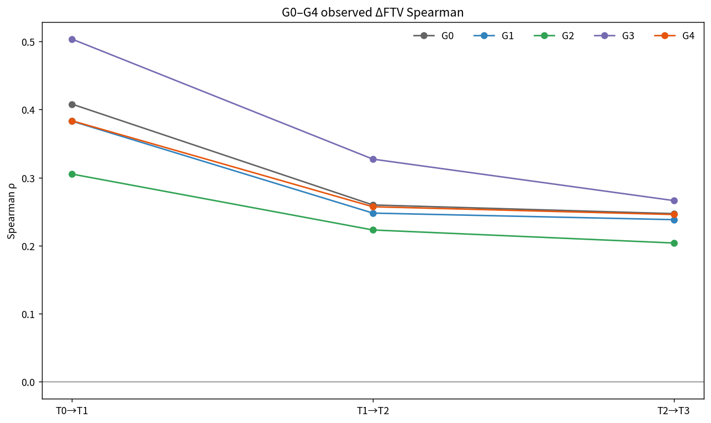

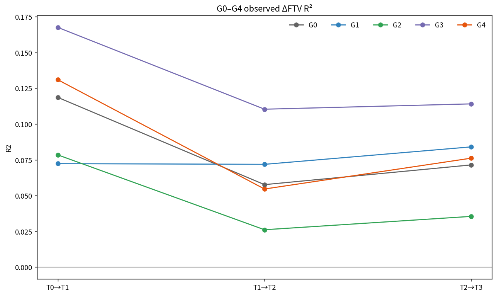

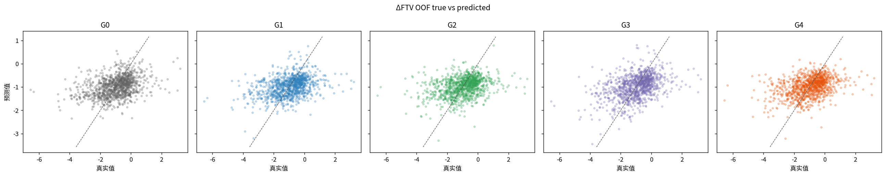

## 10. LD 与 sphericity transfer

以下为各 cell pooled OOF 指标的简单宏平均；这些 secondary probes 的训练没有使用 LD 或 sphericity。

| Target/任务 | G1 | G3 | G3−G1 | G2 | G4 | G4−G2 |
|---|---:|---:|---:|---:|---:|---:|
| Static LD Spearman | 0.280 | 0.324 | +0.044 | 0.302 | 0.334 | +0.032 |
| Static LD R² | -0.435 | -0.069 | +0.366 | -0.072 | -0.049 | +0.023 |
| ΔLD Spearman | 0.109 | 0.138 | +0.029 | 0.139 | 0.155 | +0.016 |
| ΔLD R² | -0.006 | 0.001 | +0.007 | 0.001 | 0.007 | +0.006 |
| Static sphericity Spearman | 0.262 | 0.318 | +0.056 | 0.438 | 0.436 | -0.002 |
| Static sphericity R² | 0.065 | 0.080 | +0.015 | 0.159 | 0.147 | -0.011 |
| Δsphericity Spearman | 0.009 | 0.034 | +0.025 | 0.011 | 0.042 | +0.031 |
| Δsphericity R² | -0.040 | -0.028 | +0.012 | -0.051 | -0.041 | +0.010 |

G3 在 static LD 的 T1/T2 和 static sphericity 的 T2/T3 有局部正向 paired evidence，但其整体资格受 base gate 否决；G1 static LD 的宏 R² 又被 T3 的反变换尾部误差（R²=-1.603）严重影响，不能把 +0.366 当作稳健的泛化增益。G4 相对 G2 最清楚的 transfer 是 ΔLD T1→T2：Spearman +0.041（0.010–0.075），R² +0.022（0.003–0.043）；static sphericity 没有系统改善，G2/G4 的较高水平更可能主要来自 ROI support prior。总体结论是“有局部迁移、没有跨 target/时点的一致迁移”。

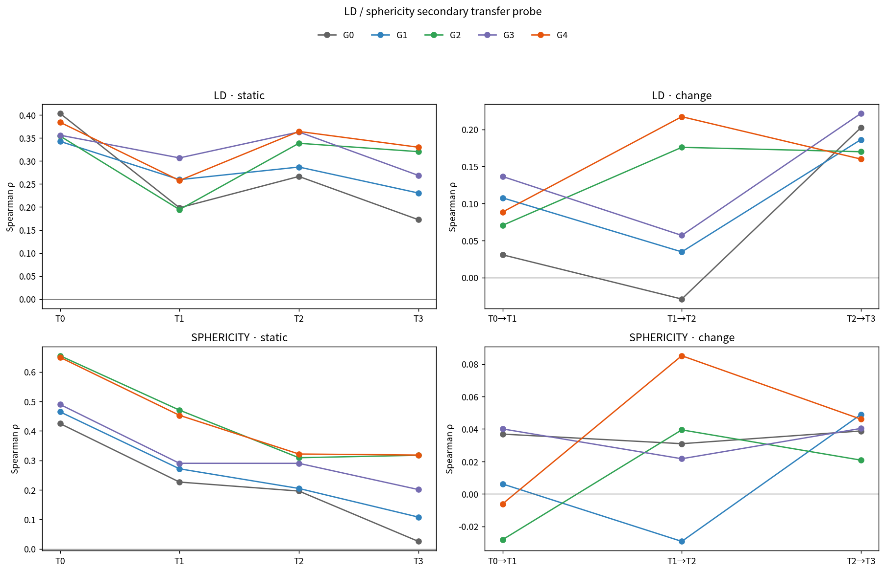

## 11. Image-only pCR 结果

下表为 808 名患者的 pooled OOF AUROC / AP。这里的 AP 使用 `sklearn` average precision，并在结果表中作为 AUPRC 报告；它不是额外读取 radiomics 得到的指标。

| 模型 | T0 | T0–T1 | T0–T2 |
|---|---:|---:|---:|
| G0 | 0.532 / 0.367 | 0.562 / 0.387 | 0.551 / 0.385 |
| G1 | 0.516 / 0.346 | 0.538 / 0.382 | 0.541 / 0.367 |
| G2 | 0.505 / 0.346 | 0.517 / 0.346 | **0.587 / 0.411** |
| G3 | 0.515 / 0.347 | 0.545 / 0.386 | 0.540 / 0.371 |
| G4 | 0.495 / 0.337 | **0.555 / 0.391** | 0.578 / 0.402 |

对应的 pooled accuracy / sensitivity / specificity 为：

| 模型 | T0 | T0–T1 | T0–T2 |
|---|---:|---:|---:|
| G0 | 0.512 / 0.669 / 0.432 | 0.542 / 0.531 / 0.548 | 0.548 / 0.487 / 0.580 |
| G1 | 0.540 / 0.411 / 0.606 | 0.507 / 0.505 / 0.508 | 0.507 / 0.604 / 0.458 |
| G2 | 0.468 / 0.636 / 0.381 | 0.499 / 0.585 / 0.454 | 0.545 / 0.629 / 0.501 |
| G3 | 0.500 / 0.582 / 0.458 | 0.530 / 0.549 / 0.520 | 0.545 / 0.516 / 0.559 |
| G4 | 0.475 / 0.553 / 0.435 | 0.564 / 0.367 / 0.666 | 0.535 / 0.589 / 0.507 |

五折 AUROC 均值±样本 SD 为：

| 模型 | T0 | T0–T1 | T0–T2 |
|---|---:|---:|---:|
| G0 | 0.527±0.050 | 0.555±0.027 | 0.561±0.013 |
| G1 | 0.511±0.032 | 0.551±0.020 | 0.550±0.037 |
| G2 | 0.510±0.038 | 0.528±0.066 | 0.588±0.033 |
| G3 | 0.514±0.026 | 0.553±0.031 | 0.556±0.033 |
| G4 | 0.490±0.036 | 0.544±0.042 | 0.572±0.052 |

Grounding 没有形成一致的 pCR 改善。G3−G1 在 T0–T1 为 +0.0065（95% CI -0.0311–0.0479），T0–T2 为 -0.0015（-0.0384–0.0355），longitudinal macro 为 +0.0025（-0.0303–0.0338）。G4−G2 在 T0–T1 为 +0.0380（-0.0118–0.0828），但 T0–T2 为 -0.0084（-0.0236–0.0065），macro 为 +0.0148（-0.0097–0.0408）。两组均无“明确下降”证据，但都不满足 C gate 所需的两个 longitudinal 点同时为正、macro≥0.02 且 CI 下界>0。

Pooled accuracy/sensitivity/specificity 等阈值指标见[pCR OOF 完整表](../metrics/final/pcr_oof_metrics.csv)，fold 级指标和汇总见[pCR fold 表](../metrics/final/pcr_fold_metrics.csv)与[pCR fold 汇总](../metrics/final/pcr_fold_summary.csv)。

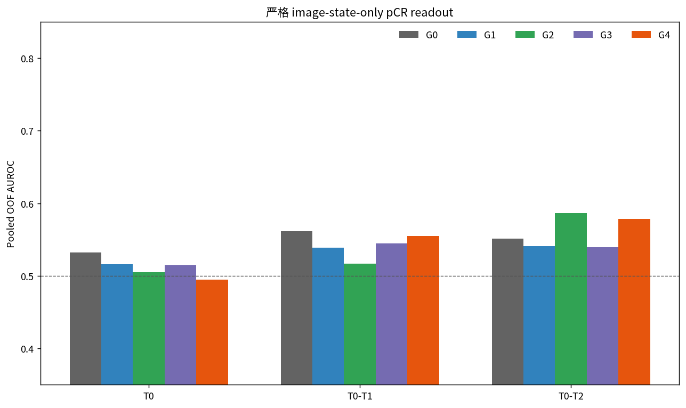

## 12. Representation 与训练稳定性

20 个新训练 model×fold checkpoint 全部 finite、无 collapse；selected representation std 范围为 0.212–0.828，远高于 0.05 门槛。G1 selected epoch 为 3/2/2/3/3，G2 全为 epoch 2，G3 为 3/2/2/3/2，G4 为 2/3/3/2/2。G1/G3 与 G2/G4 的公共初始化在每个 fold 完全一致。

唯一硬安全失败是 G3 fold 3：paired G1 validation base loss 为 0.102326，5% 上限为 0.107442，G3 fallback checkpoint 为 0.112142，即相对恶化 9.59%。该 fold 没有任何 epoch 通过 base gate，所以 selection mode 为 `fallback_base_gate_failed`；它可以保留在完整 OOF 审计中，但使整个 G3−G1 pairing 不具备 GO/PARTIAL GO 资格。G4 五折全部通过 base gate。详细证据见[training stability](../metrics/final/training_stability.csv)与[selection manifest](../metrics/final/selection_file_manifest.csv)。

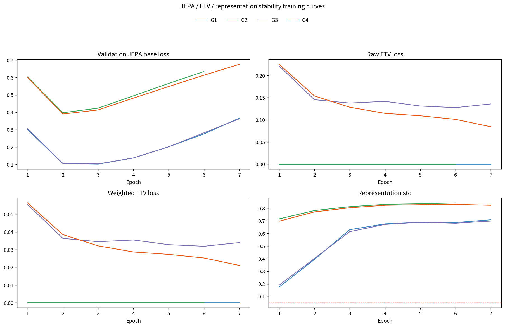

## 13. Mask ablation 结果

| 比较 | Static FTV macro ΔSpearman / ΔR² | ΔFTV macro ΔSpearman / ΔR² | 解释 |
|---|---:|---:|---|
| G1−G0 | -0.035 / -0.153 | -0.015 / -0.006 | 删除 mask channel 明显损害 static 自然尺度拟合，rank 与 longitudinal 损失较小 |
| G2−G1 | +0.039 / +0.092 | -0.046 / -0.029 | normalized ROI support 恢复部分 static signal，但未改善 dynamic signal |
| G3−G1 | +0.067 / -0.068 | +0.076 / +0.055 | 严格 DCE7 grounding 提高 rank 和 ΔFTV，但 static R² 与 base gate 有问题 |
| G4−G2 | +0.035 / +0.038 | +0.051 / +0.041 | primary pairing 稳定改善 ΔFTV，static 增幅不足 |
| G4−G0 | +0.039 / -0.023 | -0.009 / +0.005 | 宏观上接近 G0；仅描述，不能作为配对成功证据 |

删除 mask channel 后，pCR AUROC 的 G1−G0 差为 T0 -0.0159、T0–T1 -0.0231、T0–T2 -0.0098。G2/G4 说明 normalized ROI support 能保留有效 static signal，同时不把 mask volume 作为数值直接输入；但其 dynamic 表现不自动受益，且 support/crop prior 仍存在。G4 也不全面优于 G3：它的 static 自然尺度 R² 更稳，而 G3 的 ΔFTV 宏平均更强。

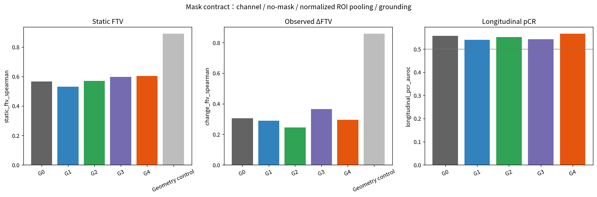

## 14. Paired 统计比较

所有主要差值均按相同患者、相同 outer fold、相同 cell 做 2,000 次 patient-within-fold paired bootstrap；macro bootstrap 对多个 cell 使用同一次 patient draw。区间只条件于已经拟合的**单个训练 seed**，不包含模型重训方差；单 cell CI **未作多重比较校正**。

| 比较 | Scope/指标 | 宏差值 | 95% CI | Gate |
|---|---|---:|---:|:---:|
| G3−G1 | A static FTV Spearman | +0.0673 | 0.0400–0.0938 | 通过 |
| G3−G1 | A static FTV R² | -0.0676 | -0.8488–0.1375 | — |
| G3−G1 | B ΔFTV Spearman | +0.0759 | 0.0464–0.1078 | 通过 |
| G3−G1 | B ΔFTV R² | +0.0546 | 0.0296–0.0803 | 通过 |
| G3−G1 | C longitudinal pCR AUROC | +0.0025 | -0.0303–0.0338 | 不通过 |
| G4−G2 | A static FTV Spearman | +0.0349 | 0.0145–0.0563 | 不通过：幅度<0.05 |
| G4−G2 | A static FTV R² | +0.0383 | -0.0368–0.1045 | 不通过 |
| G4−G2 | B ΔFTV Spearman | +0.0514 | 0.0263–0.0756 | 通过 |
| G4−G2 | B ΔFTV R² | +0.0405 | 0.0241–0.0571 | 支持正向变化 |
| G4−G2 | C longitudinal pCR AUROC | +0.0148 | -0.0097–0.0408 | 不通过 |

G3−G1 的 ΔFTV T0→T1 最强：Spearman +0.1205（0.0632–0.1866），R² +0.0952（0.0426–0.1477）。G4−G2 的对应值为 +0.0783（0.0399–0.1185）和 +0.0525（0.0300–0.0777）；后续 transition 的 rank CI 多跨 0，但 G4−G2 T2→T3 R² 仍为 +0.0407（0.0151–0.0695）。完整结果见[paired macro bootstrap](../metrics/final/paired_macro_bootstrap_ci.csv)、[paired cell bootstrap](../metrics/final/paired_differences_bootstrap_ci.csv)与[决策门槛表](../metrics/final/decision_gates.csv)。

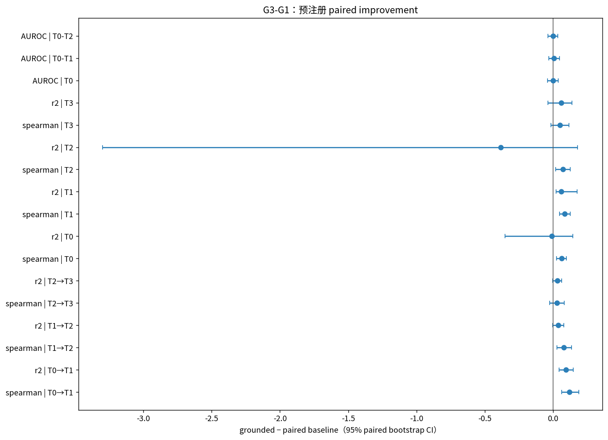

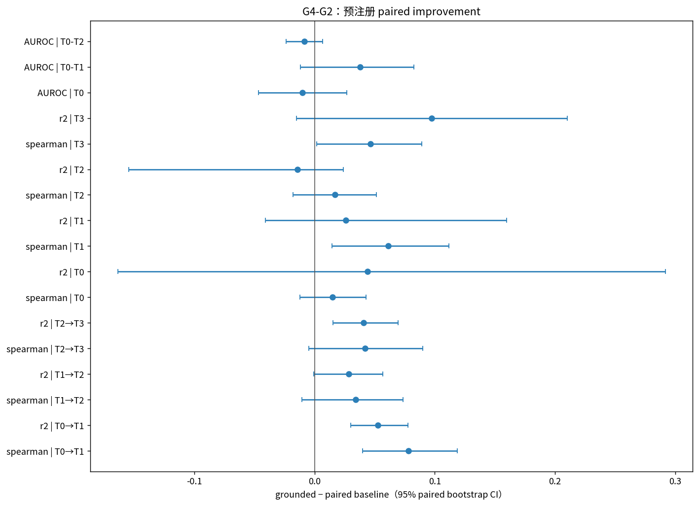

## 15. 局限性

1. 训练只有一个 seed；bootstrap 只量化固定 fitted models 下的患者抽样不确定性，不量化初始化、batch 顺序或 checkpoint 选择方差。
2. 单 cell CI 未做多重比较校正；transfer 中零散的显著 cell 应视为探索性证据。
3. 375 名 measurement-matched 患者小于 808 名 pCR cohort；measurement 缺失与 cohort selection 可能限制外推。
4. G3 fold 3 的 base-gate failure 说明严格 DCE7 grounding 对优化条件敏感；不能用其他四 fold 的良好表现掩盖该失败。
5. lesion-centered crop 和 normalized ROI support 都保留 ROI 定位先验；G4 排除了 mask channel/显式 volume，但不是无 ROI 先验的全乳图像模型。
6. G0 是复用的 DCE8 M0，对照输入 contract 与 G1–G4 不完全相同；G4−G0 只能描述。
7. FTV 在自然尺度重尾，inverse-log 可能放大少数高值误差；Spearman 改善不一定转化为 R² 改善，G3 T2 是突出例子。
8. 当前 encoder 是小型 3-D CNN，且 `drop_last=True` 每 epoch 不使用 9–10 名 train patients；更强 encoder 或重复 seed 可能改变效果。
9. pCR 是更远端、受分子亚型和治疗影响的结局；本轮严格禁止 clinical/treatment，因此接近随机至弱信号的 AUROC 并不意外。

## 16. GO / PARTIAL GO / NO-GO 决定

预注册规则要求某个**合格** pairing 满足 A（static grounding），并同时满足 B（observed ΔFTV）或 C（longitudinal pCR），且通过 no-collapse、pCR 不明确下降和 validation base degradation≤5% 等安全门槛。

- G3−G1：A=true，B=true，C=false，pCR 无明确下降；但 G3 fold 3 使 `stability_and_base_gate=false`，所以 `eligible=false`。
- G4−G2：B=true、pCR 无明确下降、五折安全门槛通过；但 A=false、C=false。其 static Spearman 差的 CI 为正，却只有 +0.0349，未达 +0.05 预注册幅度，不能事后降低门槛。

因此没有 grounded pairing 在全部安全门槛下满足 static grounding 标准，正式决定为 **NO-GO**，而不是 PARTIAL GO。机器可读结论及输入指标哈希见[decision.json](../metrics/final/decision.json)；分析层验收证据见[analysis acceptance evidence](../metrics/final/analysis_acceptance_evidence.json)。

## 17. 下一阶段建议

当前不应立即实现 `grounded r_0:t -> predicted r_(t+1)`，也不应继续给相同小型 CNN 叠加 direction、magnitude、path consistency 或更复杂 transition loss。更合理的下一步是：

1. 首先在不查看 test 的新实验中修复 optimization robustness，以多 seed 复核 G3 fold-3 类 failure；
2. 使用预训练 3-D medical encoder、MRI foundation encoder 或 multi-scale patch/token representation，提高 DCE7 本身提取 tumor burden/texture 的能力；
3. 将 ROI 从单一 pooled vector 改为多尺度、空间保真的 lesion/context tokens，同时继续禁止显式 mask volume 进入 state；
4. 在独立预注册实验中比较 richer imaging biomarker supervision，例如 enhancement/texture 与 LD/sphericity，而不是对本结果事后调 gate；
5. 只有当一个安全合格的模型稳定满足 static A 且满足 dynamic B 或 pCR C 后，再进入 Grounded-State World Model。

## 18. 对问题 a–i 的逐条回答

**a. Direct FTV grounding 是否真的改变了 observed image representation？**

是。FTV head 已在评估时移除，而 G3/G4 的 frozen `r` 仍相对配对 baseline 显示 paired static 与 ΔFTV 差异；两组 ΔFTV macro Spearman CI 均完全高于 0。这证明变化发生在 representation，不只是 head。

**b. G3 是否比 G1 更好？**

在 FTV rank 和 observed ΔFTV 上更好：static macro ΔSpearman +0.0673，ΔFTV macro ΔSpearman/+ΔR² 为 +0.0759/+0.0546。但 static macro R² 下降 0.0676，且 fold 3 base loss 恶化 9.59% 超过 5% 上限，所以 G3 不是合格的更优候选。

**c. G4 是否比 G2 更好？**

部分更好。ΔFTV macro ΔSpearman 为 +0.0514（CI>0），static Spearman/R² 也为正；但 static 增幅未达到 A gate，pCR 改善不一致。因此 primary G4 是稳定的 dynamic 改善，而不是达到总体成功标准的方法。

**d. FTV grounding 是否不仅提高 static FTV，而且提高 observed ΔFTV representation？**

是，而且 ΔFTV 是更一致的正结果。G3−G1 和 G4−G2 的 ΔFTV macro Spearman 分别提高 0.0759 和 0.0514，paired 95% CI 均高于 0；两组 macro R² 也为正。

**e. FTV grounding 是否改善 image-only pCR prediction？**

没有可靠证据。G3 longitudinal macro AUROC 仅 +0.0025，G4 为 +0.0148，CI 均跨 0；G4 的 T0–T1 改善与 T0–T2 下降方向相反，C gate 失败。

**f. 去掉 mask channel 后性能下降多少？**

G1−G0 的 static FTV macro Spearman/R² 为 -0.0352/-0.1533，ΔFTV 为 -0.0153/-0.0065；pCR AUROC 在 T0、T0–T1、T0–T2 分别下降 0.0159、0.0231、0.0098。最大损失出现在 static 自然尺度拟合。

**g. Mask-guided normalized ROI pooling 能否在避免直接 geometry leakage 的同时保留有效 signal？**

能避免显式 mask channel、voxel-count 和 sum-volume 幅值路径，并相对 G1 恢复 static FTV（macro +0.0389 Spearman、+0.0924 R²）。但它没有改善 baseline ΔFTV，且仍携带 support/crop 定位先验，因此只能称为降低直接 geometry leakage，不能称为完全消除 geometry 信息。

**h. Grounding 后的 representation 是否对 LD/sphericity 有迁移改善？**

只有局部而非系统性改善。G3 有若干 static LD/sphericity 正向 cell，但不合格且受尾部 R² 影响；G4 最稳健的局部证据是 ΔLD T1→T2，static sphericity 基本不变。不能据此声称形成通用 morphology state。

**i. 当前结果是否足以进入 Grounded-State World Model？**

否。G3 的正结果未通过 base safety gate，G4 又未满足 static A 和 pCR C；按预注册规则必须 NO-GO。应先提高严格 DCE7/ROI-support representation 的稳定性与静态 grounding 强度，再考虑 transition 阶段。
