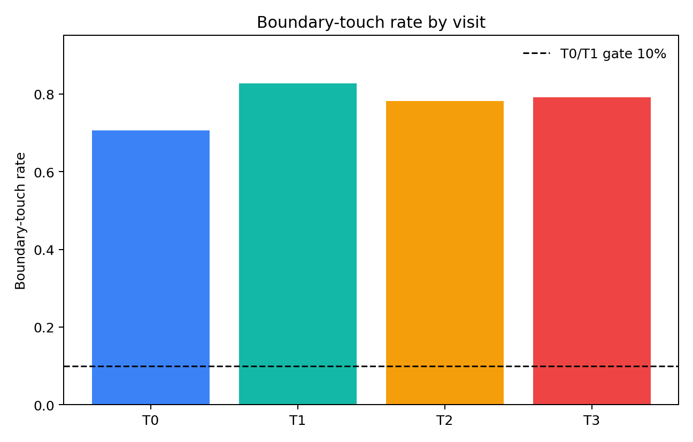
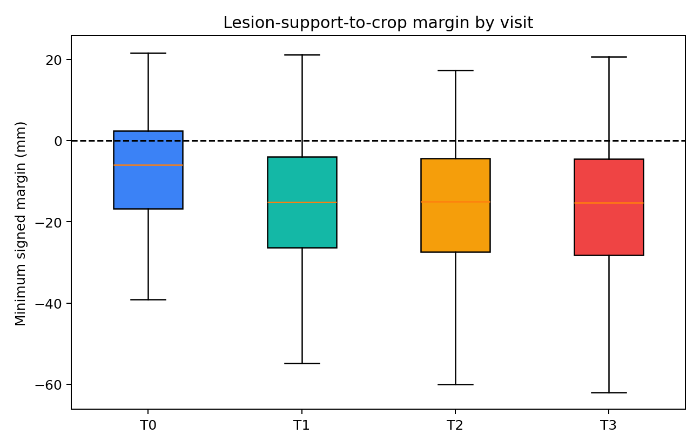
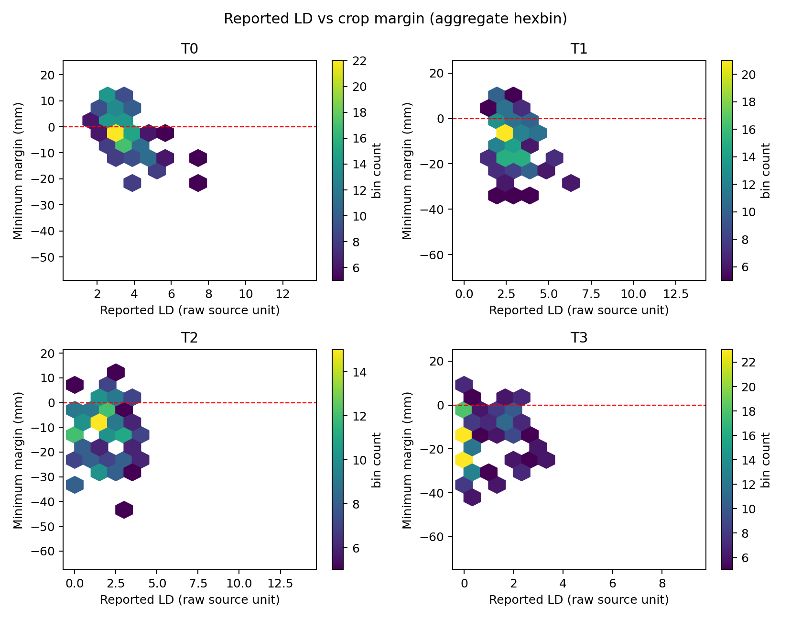
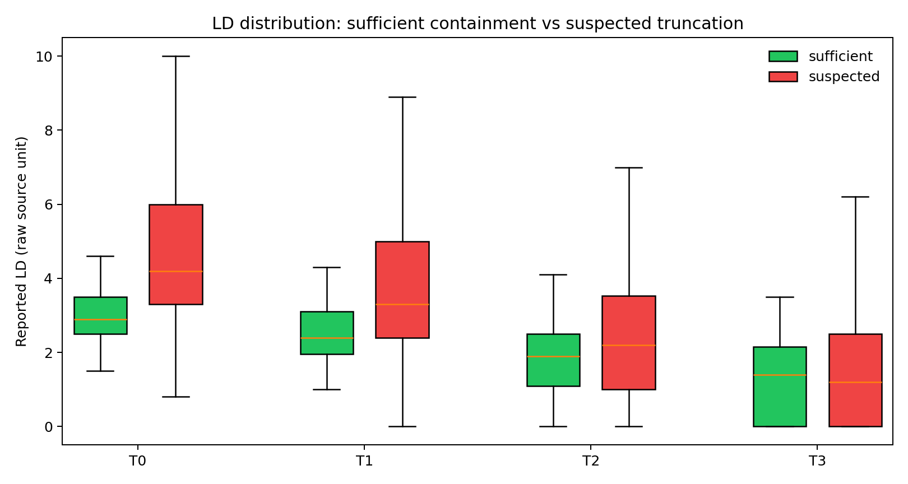
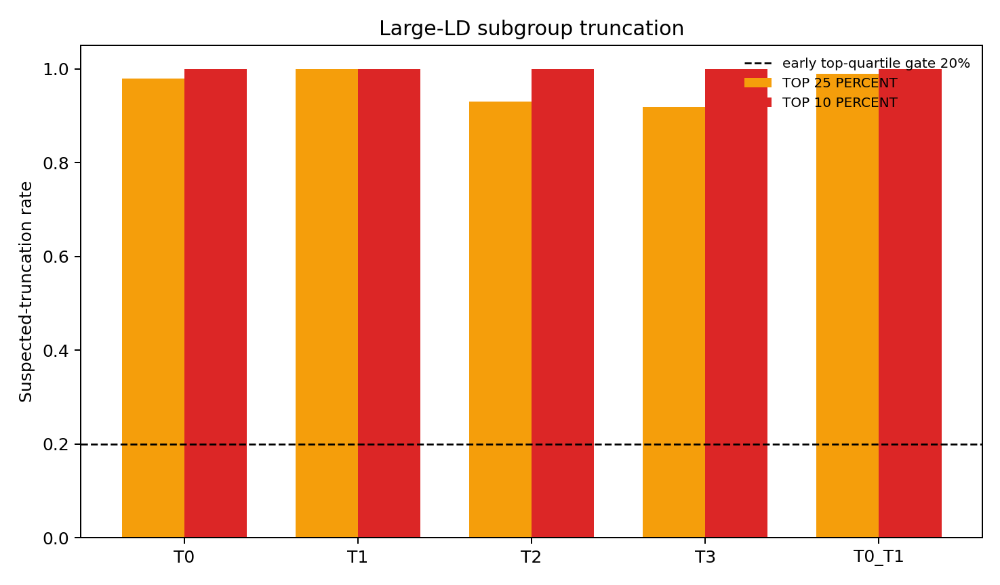
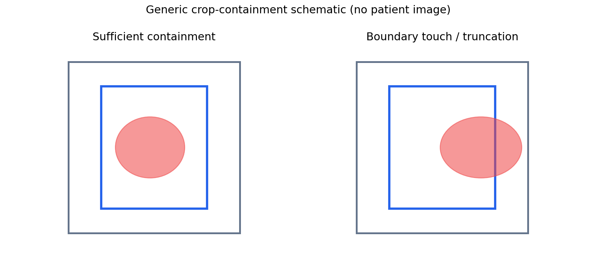

# LD Crop-Containment Audit 报告

## 1. 结论

Stage A 决策为 **NO_GO**。当前 crop 未通过预注册 gate；LD 在该 input contract 下不能被视为充分可观察，Stage B 必须停止。

- stop code：`LD_NOT_OBSERVABLE_UNDER_CURRENT_CROP`
- 未通过条件：t0_t1_suspected_truncation、t0_t1_top_quartile_suspected_truncation、all_visit_sufficient_containment
- 375 人、1,500 个 patient×visit 全部有 nonempty full-resolution FTV inclusion support；该 support 是 FTV workflow proxy，不是手工 dense lesion segmentation。
- actual legacy mask 的 bitwise origin reconstruction fraction 为 99.2%；unique 为 99.2%、ambiguous 为 0.0%。无法恢复的行没有伪造 margin。

## 2. LD semantics

LD 来源于 site radiologist MRI report，字段 `LD_T0`–`LD_T3` 分别映射 T0 pre-NAC、T1 early NAC、T2 inter-regimen、T3 pre-surgery。精确工作簿和同源资料没有明示单位，因此状态为 `LD_UNIT_NOT_EXPLICIT`；不能把值擅自换成 mm。0 是真实编码值，但来源不能区分 complete response、non-measurable、below detection 或 encoding floor，故状态为 `AMBIGUOUS_ZERO_SEMANTICS`。

本轮严格 overlap 中，T0/T1/T2/T3 的 LD zero fraction 见下表；T2/T3 floor 不参与放宽 containment gate。

## 3. 真实 crop 与计算协议

当前 cache 为 `[4,8,32,96,96]`，前七通道为 DCE7，第八通道是 binary localization support。crop 是固定 `(Z,Y,X)=(32,96,96)` voxel；crop 前不做 spacing harmonization，物理视野随 scanner/visit 变化。clean 公式以 released T0 bbox center 投影到后续 visit，但 legacy builder 未保存 origin 且存在历史舍入差异，所以本轮围绕 clean start 搜索并要求 full mask crop 与 actual cache mask bitwise exact match。1,500/1,500 visit 的 DCE 与 FTV mask 在实际 reader 的 index order 下 shape、spacing 和 slice-first handling 一致；mm 量仅解释为 matched-spacing index-space geometry，不声称 world-space affine registration。

Containment ratio 直接取 `actual cached support voxels / full support voxels`。`suspected_truncation` 定义为任一 boundary touch、ratio<0.99 或 support 不可审计；`severe_truncation` 为 ratio<0.90；`sufficient_containment` 要求 ratio≥0.99 且无 boundary touch。cache mask 为空而 full mask 非空时按 complete miss、ratio=0、severe truncation 处理。独立代码复核另加不改变 gate 的保守敏感性：`exact_full_support_containment` 要求一个 full-support voxel 都不丢，并比较 cached/full fixed-direction maximum-extent proxy。

## 4. 按访视结果

| Visit | n | Boundary touch | Suspected | Severe | Sufficient | Exact full support | Median margin mm | Q05 margin mm | LD zero |
|---|---:|---:|---:|---:|---:|---:|---:|---:|---:|
| T0 | 375 | 70.7% | 70.7% | 37.1% | 29.3% | 32.0% | -6.00 | -30.00 | 0.0% |
| T1 | 375 | 82.7% | 84.3% | 53.6% | 15.7% | 17.1% | -15.12 | -42.51 | 1.3% |
| T2 | 375 | 78.1% | 84.3% | 61.6% | 15.7% | 16.5% | -15.00 | -42.90 | 16.5% |
| T3 | 375 | 79.2% | 86.1% | 66.1% | 13.9% | 16.3% | -15.35 | -45.76 | 32.5% |

所有 visit 合并：boundary touch 77.7%，suspected truncation 81.3%，severe truncation 54.6%，sufficient containment 18.7%。更保守的 exact full-support retention 只有 20.5%，whole-union approximate extent retention 中位数为 0.850。

## 5. Early visit 与 large-LD audit

T0/T1 合并 suspected truncation 为 77.5%（gate ≤10%）；T0/T1 top-quartile LD 为 99.0%（gate ≤20%），其中 exact full-support retention 为 1.0%。T0/T1 pooled `Spearman(LD, minimum margin)` 为 -0.356，unique-only sensitivity 为 -0.356。full-support largest-component approximate extent 与 reported LD 的 Spearman 为 0.599；LD 单位未确认不影响秩，但这些值不提供物理校准，也不能证明 radiologist target lesion 与 FTV support 完全一致。

## 6. Gate

预注册五项 gate 的机器可读结果在 `metrics/crop_containment_gate.json`。决策未使用 pCR、clinical、treatment 或 test performance，也未修改阈值。保守 extent sensitivity 是独立代码复核后、查看 gate 汇总前加入的非 gate 指标；它只会加强或限定解释，不会把 NO-GO 改成 GO。

## 7. 局限性

1. FTV inclusion region由 inverse bit-coded analysis mask派生，不能等同 radiologist 所测 target lesion 的 dense segmentation；multifocal whole-union extent 尤其可能大于单病灶 LD。
2. legacy builder source与保存的 crop origin缺失；origin 由 actual cached mask exact matching反推，未恢复行只保留 origin-independent containment ratio/boundary结果。
3. 当前 legacy pipeline 按 index order/pixdim 而非 world-space affine registration 工作；本轮显式验证 DCE-mask shape/spacing/axis handling 一致，但不把它扩大解释为 affine registration QC。
4. reported LD 单位未确认，因此 segmentation-derived `approx_max_extent_mm` 只做 exploratory rank sanity，绝不替代 grounding target。
5. LD–margin hexbin 对每个 bin 使用 `n≥5` suppression；公开表对小于 5 的 LD distribution cell 抑制敏感统计。
6. T2/T3 LD zero floor分别明显增大；其临床语义仍不明确。

## 8. 下一步

优先扩大固定 crop、使用覆盖完整 lesion bbox 并保留 context 的 adaptive crop，或采用 lesion/context multi-scale representation；修改 input 后重新执行同一 containment gate。
