# Observed-State Radiomics Decodability Audit 最终报告

日期：2026-08-07

## 执行摘要

本审计使用既有 M0/M1/M2 五折 `best.pt`，没有重新训练或微调 world model、encoder、projector、transition、radiomics head 或 pCR 模型。正式分析覆盖 375 名 radiomics 配对患者、5 个 outer folds、15 个 checkpoint、743,544 条 outer-test prediction、9,960 个 fold-level cell 和 1,992 个 pooled OOF cell；聚合器登记问题为 0。

结论不是单一的 Case A/B/C，而是有 target 层次的多瓶颈：

- 当前 observed representation 明确保留静态 FTV，较弱地保留 LD 和 sphericity；但 9-D ROI mask geometry 对三者都更强，尤其 FTV，说明 learned latent 没有充分保留输入 mask 已显式提供的测量信息。
- 真实 observed difference 能稳定线性解码的纵向信号主要是 ΔFTV，M0 最明显；ΔLD 与 Δsphericity 基本不能稳定解码。
- ROI/local 并不普遍优于同一 128-D spatial map 的 GAP，因此没有证据把 global pooling 认定为主要瓶颈；pre-projector 相对 projected 的静态优势则提示 projector 存在次要信息损失。
- Frozen transition-predicted delta 的 27 个主 cell 中，没有一个 R² 或 B0 RMSE gain 的 95% CI 显著为正；对 ΔFTV，真实 observed delta 在若干阶段显著优于 transition delta。因此 FTV 的主要动态瓶颈位于 transition/forecasting pathway。
- M1 没有改善 observed image representation，很多配对比较反而下降；M2 与 M1 几乎相同。上一轮 M2 失败不是继续扫 `lambda_rad` 能自然解决的问题，关键在监督位置、representation grounding 与 transition 对变化方向/幅度的建模。

这里的 8 通道 encoder 输入包含 7 个 DCE 通道和二值 ROI mask。全文所说的“image representation”均应理解为 **ROI 辅助的 observed image representation**，而不是不含几何先验的严格纯影像表征。

## 1. 研究目的

本实验回答“真实 observed MRI 的信息在哪里丢失”，而不是重新比较临床预测性能。核心问题是：

1. 单个真实 observed state 能否线性解码同一时点 FTV、LD、sphericity；
2. 相邻两个真实 observed state 的差能否线性解码真实 measurement change；
3. pooling/projector 前的 ROI/local feature 是否比 global latent 保留更多变化信息；
4. M1 Next-Change 或 M2 radiomics auxiliary supervision 是否改变了 observed encoder representation；
5. 真实 observed delta 与 frozen transition-predicted delta 的差异指向哪个瓶颈。

本审计是 retrospective representation audit。真实 `T3` 只作为已经观察到的 endpoint MRI；任何使用 `T_(t+1)` 的 observed-pair/difference probe 都不是部署时 forecasting 方法。

## 2. 为什么执行该 audit

上一轮结果显示：M1 改善 normalized copy-current transition gain，但 downstream image-only pCR 没有稳定改善；M2 原生 radiomics head 接近常数，radiomics 信息也没有稳定转移到 pCR readout。仅观察 M2 head 失败无法区分以下两种机制：

- encoder 没有保留可用于 measurement grounding 的 observed information；
- encoder 已有信息，但 transition 无法由当前 prefix 生成正确的 future change。

因此，本轮冻结全部既有模型，先绕过 transition 对真实 observed states 做 probe，再把结果与 frozen transition delta 对照。pCR、clinical、treatment arm 和 test outcome 均未进入 probe。

## 3. 使用的 checkpoint 与数据

### 3.1 模型资产

| 模型 | 既有训练定义 | Checkpoint | Fold | 本轮操作 |
|---|---|---|---:|---|
| M0 | Image-only Next-State | `m0_final/fold_<k>/best.pt` | 0–4 | 冻结提取 |
| M1 | Image-only Next-Change | `m1_final/fold_<k>/best.pt` | 0–4 | 冻结提取 |
| M2 | Next-Change + radiomics auxiliary，`lambda_rad=0.05` | `m2_final/fold_<k>/best.pt` | 0–4 | 冻结提取 |

M0 的 best epoch 为 2–3，M1/M2 为 11–12。15 个 checkpoint 的完整 SHA-256、环境版本、fold hash 和 cache 说明见[资产检查](asset_inspection.md)。起始 Git commit 为 `16610447c3752f0943d31f389135c75d1f26350e`，fold manifest SHA-256 为 `143e482d711225c0611006d99bd7345d2fa1a5c16c65fbaf8399341a0d26aa38`。

### 3.2 样本和 split

- MRI cohort：808 名 I-SPY2 患者；radiomics 完整配对子集为 375 人。
- 每个 outer fold 的配对 train/validation/test 人数分别为 247/59/69、239/69/67、240/52/83、242/61/72、225/66/84。
- Global cell 每个 timepoint/transition 均有 375 个独立 outer-test 患者。
- ROI static T0/T1/T2/T3 的有效人数为 375/372/369/372；ROI change T0→T1、T1→T2、T2→T3 为 372/368/368。空 mask 明确剔除，不以零向量填充。
- 每名 test 患者只由其唯一 outer-test fold 的对应模型 checkpoint 产生 OOF prediction；同一患者的所有 visit/transition 始终处于同一 split。

## 4. Observed feature extraction

实测 encoder 计算图为：

```text
DCE7 + ROI mask [8,32,96,96]
→ 3-D residual encoder spatial map [128,4,12,12]
→ GAP [128]
→ Linear + LayerNorm [192]
→ projector [192]
```

主分析使用被训练且被 transition 读取的 online 分支：

| 名称 | 维度 | 诊断作用 |
|---|---:|---|
| `online_projected` | 192 | 当前主要 global latent |
| `online_preprojector` | 192 | 判断 projector 是否丢失信息 |
| `online_global_pool` | 128 | spatial map 的 GAP 输出 |
| `online_roi_mean` | 128 | 同一 spatial map 的 ROI occupancy-weighted mean |

另外完整运行 EMA target 四层作为敏感性分析，并保存 9-D `mask_geometry` 与 14-D `raw_roi_intensity` baseline。ROI mask 以 adaptive-average occupancy resize 到 `[4,12,12]` 后加权 pooling；没有长期保存巨大的完整 spatial tensor。Feature manifest 共 484,800 行，覆盖 15 个 model-fold、808 名患者、4 个 visit 和 10 类 representation；patient-level feature/prediction 只保存在授权环境，不提交 Git。

## 5. Radiomics target 与 probe protocol

### 5.1 Target

- 主 target：FTV、LD、sphericity。
- 探索 target：BPE。Lesion-centered crop 未必覆盖足够 contralateral/background parenchyma，因此 BPE 失败不能解释为 encoder 失败。
- Static FTV/LD：每折、每 timepoint 仅用 outer-train 拟合 `log(value+epsilon)`、1%/99% winsorization 和 median/IQR scale。
- Static sphericity/BPE：相同 train-only 流程，但使用 identity transform。
- Change：精确复用上一轮每折 train-only transform；ΔFTV/ΔLD 为 log difference，Δsphericity/ΔBPE 为 absolute difference。

### 5.2 Probe 与泄漏防护

主 probe 是单输出线性 Ridge，alpha 网格为 `1e-4` 至 `1e3`。每个 model/fold/timepoint 或 transition/representation/target 独立执行：outer-train 拟合 StandardScaler 与 Ridge，outer-validation 以 standardized MSE 选择 alpha，锁定后 outer-test 只调用一次预测。B0 是同 cell 的 fold-train target mean。

Change 输入完整覆盖 D1 current-only、D2 observed pair、D3 observed difference、D4 combined，以及 ROI 的 D5 difference/D6 combined。D2 与 D4在线性代数上冗余，故核心诊断使用 D3/D5。正式协议实现 SHA-256 为 `d4b57b395b62cf5f022ad01a18f0ac66d35e78f0f142dc50b442d4480a98ad1d`；所有 test-stat、split、target transform、manifest 和 patient-order 检查均为 fail-closed。

### 5.3 指标和不确定性

报告 MAE、RMSE、R²、Spearman、Pearson、fold-centered standardized prediction/target variance ratio（下文记为 `V`），change 另报方向指标与相对 B0 的 RMSE gain（下文记为 `G`）。Near-constant 定义为 fold-centered standardized `Var(pred) ≤ max(1e-10, 0.01×Var(target))`。

核心 333 个 group 使用 2,000 次 patient-within-fold percentile bootstrap；paired comparison 也在完全相同患者上重采样。CI 条件于已经拟合的 probe，不覆盖训练随机性。D1/D2/D4、EMA、BPE、B1 以及 static B2/B3 仅注册点估计，不能把它们写成具有正式 bootstrap CI 的结果；B2/B3 只有核心 change observed-difference cell 进入正式 CI 范围。

## 6. Static measurement 结果

### 6.1 M0 的 layer trace

下表依次给出 T0/T1/T2/T3 的 pooled OOF 点估计。它不是把四个时点拼接后重新算的 pooled correlation。

| Target / representation | Spearman ρ | R² | V | G |
|---|---|---|---|---|
| FTV projected | .683/.619/.491/.294 | .217/.100/.012/.008 | .683/.301/.363/.213 | .154/.085/.031/.027 |
| FTV pre-projector | .758/.674/.497/.335 | .320/.174/.027/.027 | .605/.498/.266/.211 | .211/.123/.038/.037 |
| FTV GAP | .744/.677/.537/.359 | .340/.239/.070/.019 | .632/.396/.282/.238 | .223/.158/.060/.033 |
| FTV ROI | .721/.539/.407/.291 | .287/.001/.000/−.045 | .556/.255/.295/.124 | .192/.036/.025/.002 |
| LD projected | .327/.153/.266/.161 | .102/−.065/−.942/−.429 | .161/.056/.157/.108 | .072/.009/−.234/−.038 |
| LD GAP | .457/.154/.255/.167 | .191/−.057/−.129/−.323 | .179/.036/.071/.136 | .119/.013/.059/.001 |
| LD ROI | .427/.119/.330/.351 | .149/−.104/−.309/−.209 | .255/.057/.150/.093 | .096/−.009/−.014/.046 |
| Sphericity projected | .399/.239/.184/.006 | .138/.040/.011/−.033 | .224/.082/.083/.029 | .075/.022/.011/−.015 |
| Sphericity GAP | .452/.253/.186/.054 | .172/.019/.026/−.007 | .257/.132/.043/.024 | .093/.011/.018/−.002 |
| Sphericity ROI | .614/.461/.225/.058 | .316/.189/−.001/.010 | .366/.263/.073/.038 | .176/.100/.005/.007 |

Static 144 个核心 cell 中，Spearman CI 完全高于 0 的有 126 个，R² CI 显著正 50 个、显著负 46 个、跨 0 有 48 个，B0 gain CI 显著正 76 个；没有 near-constant cell。结论是“rank 信息广泛存在”，但不能等价为“自然尺度预测已经校准良好”。

最稳健的例子是 M0 GAP FTV：T0 `ρ=.744 [.687,.792]`、`R²=.340 [.135,.588]`、`G=.223 [.106,.389]`；到 T3 降为 `ρ=.359 [.258,.445]`、`R²=.019 [−.022,.040]`、`G=.033 [.024,.045]`。FTV 信息随治疗时点明显衰减。

M0 projected LD 在 T0 尚有 `ρ=.327 [.238,.417]`、`R²=.102 [.027,.175]`，但 T2/T3 的 R² 分别为 `−.942` 和 `−.429`。M0 ROI sphericity 在 T0/T1 最清楚：`ρ=.614 [.535,.681]`、`.461 [.373,.541]`，到 T3 为 `.058 [−.048,.156]`。

### 6.2 模型与 representation 的时点等权中位数

| 模型 | Representation | FTV ρ | LD ρ | Sphericity ρ |
|---|---|---:|---:|---:|
| M0 | GAP | .607 | .211 | .220 |
| M0 | projected | .555 | .214 | .212 |
| M0 | ROI | .473 | .340 | .343 |
| M1 | GAP | .558 | .150 | .264 |
| M1 | projected | .448 | .127 | .231 |
| M1 | ROI | .464 | .262 | .280 |
| M2 | GAP | .573 | .150 | .265 |
| M2 | projected | .444 | .132 | .231 |
| M2 | ROI | .463 | .261 | .280 |

因此，当前 global latent 确实包含 FTV/LD/sphericity 信息，但强度依 target/timepoint 而变：FTV 最清楚，LD 与 sphericity 多数只保留弱 rank signal，晚期自然尺度校准常失败。

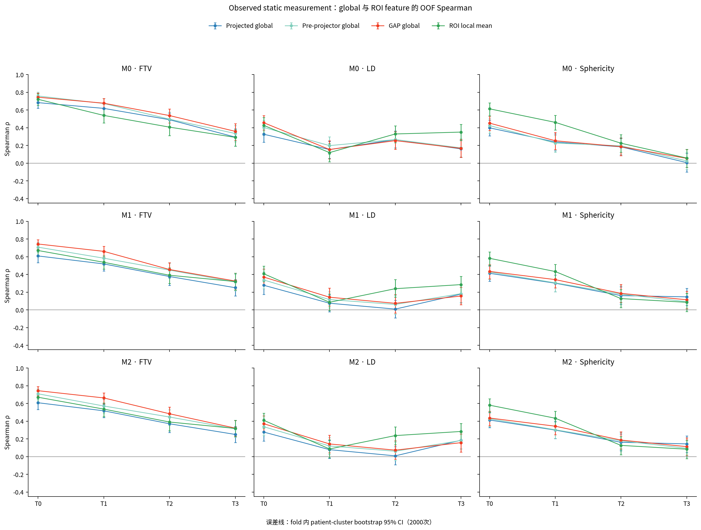

## 7. Longitudinal change 结果

### 7.1 核心 D3/D5 observed difference

ΔFTV 是唯一形成较稳定证据链的纵向 target。以下为 `ρ (R²)`：

| 模型 / representation | T0→T1 | T1→T2 | T2→T3 |
|---|---:|---:|---:|
| M0 GAP | .420 (.127) | .240 (.051) | .210 (.053) |
| M0 pre-projector | .408 (.119) | .260 (.058) | .247 (.071) |
| M0 projected | .353 (.084) | .239 (.022) | .188 (.014) |
| M0 ROI | .355 (.102) | .204 (−.013) | .282 (.051) |
| M1 GAP | .300 (.015) | .093 (.004) | .163 (.043) |
| M1 projected | .120 (−.012) | .067 (−.005) | .143 (−.000) |
| M1 ROI | .229 (.014) | .200 (.001) | .306 (.069) |
| M2 GAP | .301 (.015) | .093 (.003) | .163 (.043) |
| M2 projected | .119 (−.013) | .065 (−.005) | .141 (−.001) |
| M2 ROI | .228 (.014) | .196 (−.000) | .304 (.068) |

M0 T0→T1 的四层均稳定：GAP `ρ=.420 [.331,.502]`、`R²=.127 [.039,.204]`、`G=.072 [.027,.115]`；projected 为 `.353 [.255,.439]`、`.084 [.007,.152]`、`.049 [.012,.087]`；ROI 为 `.355 [.263,.440]`、`.102 [.047,.149]`、`.058 [.031,.086]`。M0 pre-projector 在三个 transition 均达到预注册的联合判据，且 T2→T3 仍有 `ρ=.247 [.148,.341]`、`R²=.071 [.003,.127]`。

M1/M2 最可信的 cell 是 T2→T3 ROI ΔFTV：M1 `ρ=.306 [.215,.397]`、`R²=.069 [.025,.109]`、`G=.037 [.015,.058]`，M2 几乎相同。相反，它们的 projected ΔFTV 三阶段 R² 均不显著为正。

ΔLD 和 Δsphericity 整体接近零：四层、三个模型中没有一个 cell 同时满足稳定正 Spearman 与正 R²/B0 gain 的预注册联合判据。少数 rank-only 结果不能称为自然尺度可解码，例如 M0 ROI ΔLD T1→T2 `ρ=.123 [.018,.227]`，但校准仍为负。

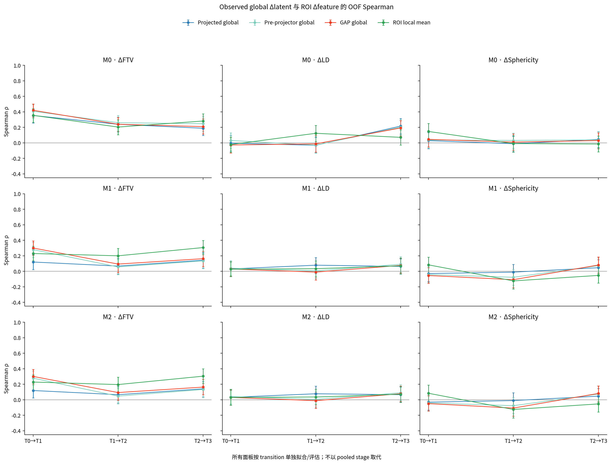

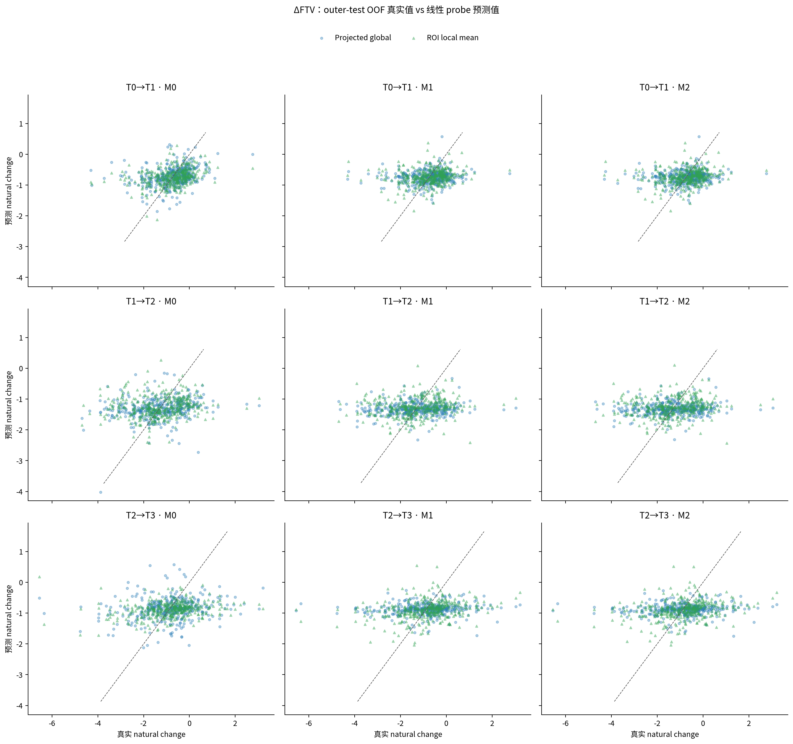

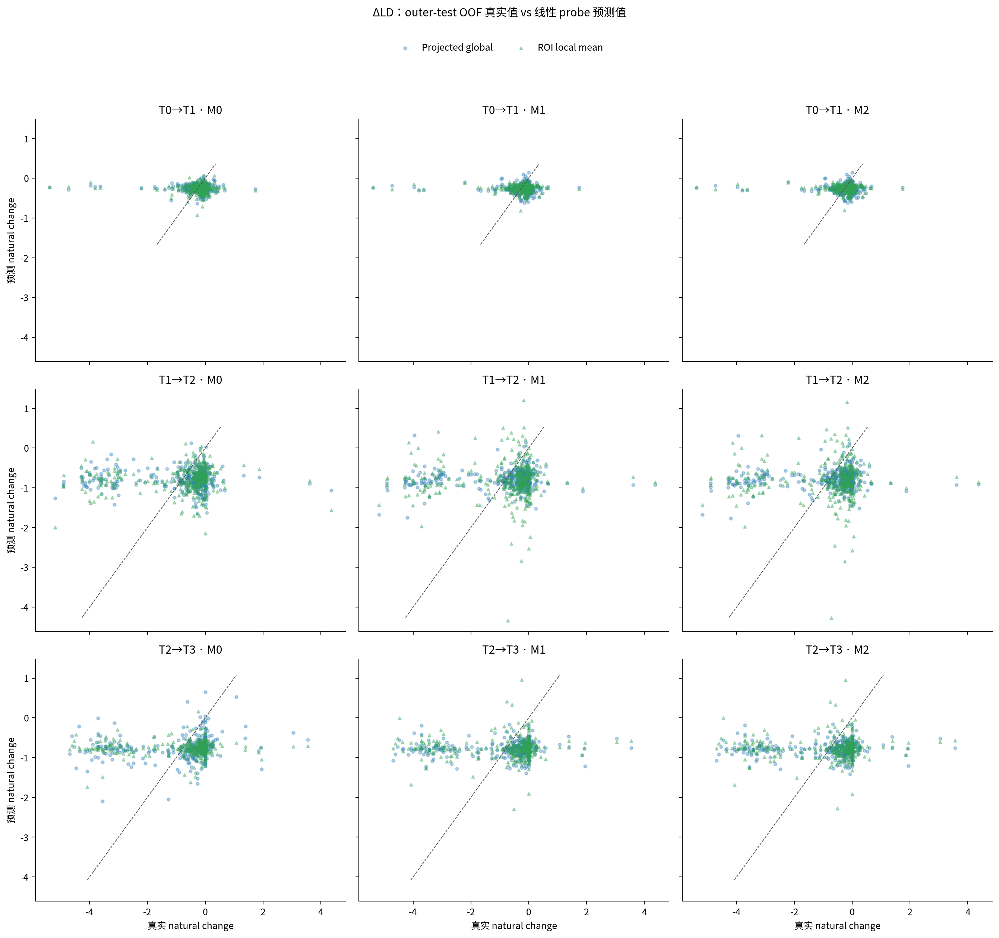

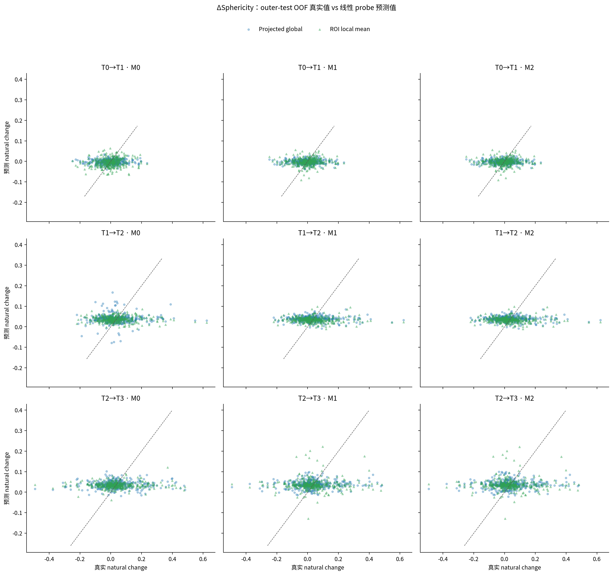

### 7.2 D1/D2/D4 补充

D1 current-only、D2 observed pair 和 D4 combined 只作为点估计敏感性。以三个 transition 的等权中位数为例，M0 projected ΔFTV 的 D1/D2/D3/D4 Spearman 分别为 `−.007/.263/.239/.297`；M0 ROI 为 `−.012/.268/.282/.285`。这说明 ΔFTV 主要来自看到两个真实 observed endpoints，而不是单独 current phenotype。M1/M2 projected 的 D2/D4 仍弱；LD/sphericity 的各输入大多没有正 R²。D4 与 D2在线性代数上冗余，其差异只反映 Ridge 参数化，不应解释为新信息。

## 8. Global vs ROI/local

同一 `[128,4,12,12]` spatial map 的 ROI mean 与 GAP 配对比较没有形成普遍 ROI 优势：

| 任务 | Cell 数 | Spearman gain CI 正/负 | R² gain CI 正/负 | B0-gain 差 CI 正/负 |
|---|---:|---:|---:|---:|
| Static ROI−GAP | 36 | 9/7 | 4/13 | 4/14 |
| Change ROI−GAP | 27 | 5/1 | 0/4 | 0/4 |

Static sphericity 的确存在 local 优势，例如 M0 T0 `Δρ=.161 [.074,.251]`、T1 `.200 [.098,.297]`；但 FTV 常由 GAP 更好，例如 M0 T1 `Δρ=−.143 [−.226,−.064]`、T2 `−.139 [−.227,−.043]`。

Change 中只有局部 rank 增益：M1/M2 ROI ΔFTV 在 T2→T3 相对 GAP 为 `+.149 [.032,.271]` / `+.147 [.031,.270]`。然而 27 个 cell 中没有任何 ROI 的 R² 或 B0 gain paired CI 显著为正，且有 4 个显著负校准差。因此本结果不是 Case B，global pooling 不是当前主要瓶颈。

相对地，static pre-projector−projected 的 36 个 cell 中 Spearman 点估计 31 个为正，9 个 CI 显著正、0 个显著负；M0 FTV T0 的 `Δρ=.075 [.036,.116]`。这说明 projector 会丢失部分已有 measurement rank information，但它是次要、而非唯一瓶颈。

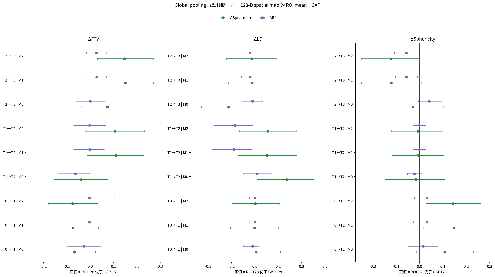

## 9. M0/M1/M2 比较

M1 没有把 observed encoder representation 变得更 measurement-aware：

- Static M1−M0 的 48 个配对 cell 中，Spearman 13 个显著下降、3 个显著上升。
- Change 四层的 36 个配对 cell 中，Spearman 16 个显著下降、仅 1 个显著上升。
- ΔFTV T0→T1 的 GAP/pre-projector/projected/ROI 均显著下降；projected `Δρ=−.233 [−.346,−.126]`。

M2 相对 M1 基本不变：static Spearman 48 个 cell 只有一正一负显著且幅度极小；change 的 36 个 observed Spearman paired CI 全部跨 0。少数 R² 差值约 `0.001–0.004`，没有实质意义。

M1 projected FTV T2 的 pooled R² 为 `−6.408`，M2 为 `−3.430`，但 Spearman 仍为 `.377/.371`。原因是某一 outer fold 的无界 standardized Ridge prediction 经指数反变换后出现极端自然尺度预测。不能把 M2“较不负”的 R² 当作 representation 改善；晚期 log-target 必须联合解读 Spearman、R²、B0 gain 和 fold-level outlier。

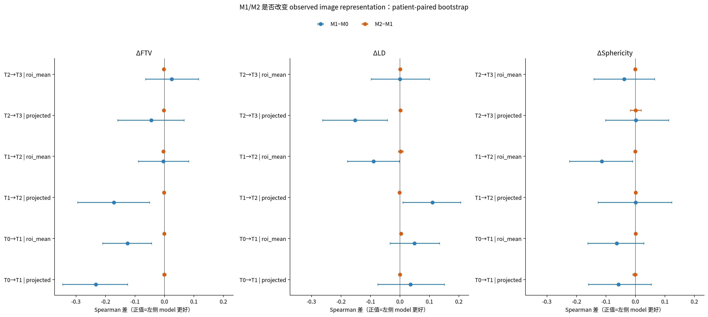

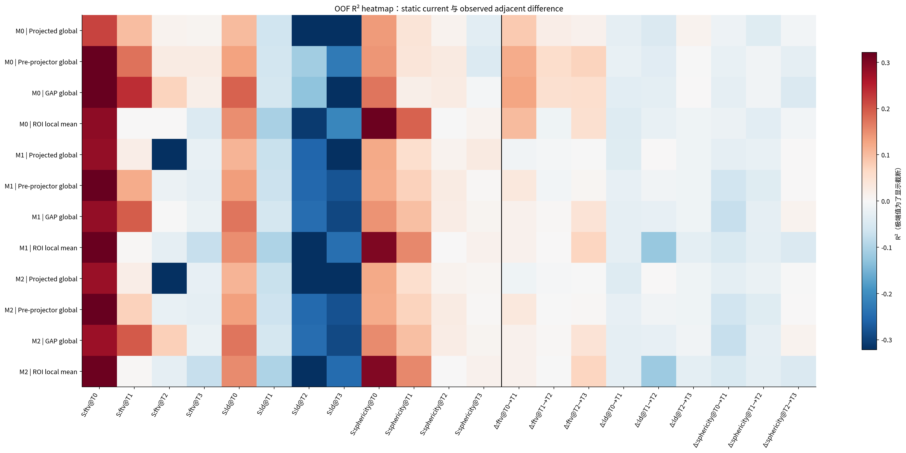

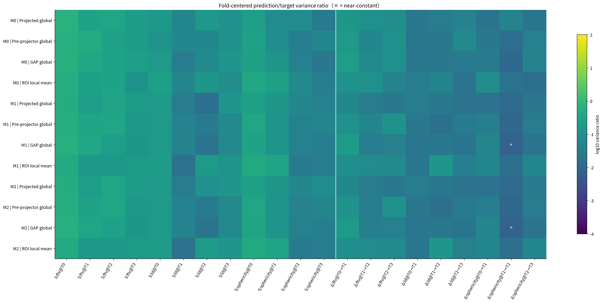

## 10. Baseline 比较

### 10.1 Static baseline

下表为 T0–T3 点估计的时点等权中位数；baseline 在三个模型间完全相同。

| Baseline | Target | Spearman | R² | V | G |
|---|---|---:|---:|---:|---:|
| B2 mask geometry | FTV | .890 | .559 | .784 | .358 |
| B2 mask geometry | LD | .544 | .203 | .209 | .176 |
| B2 mask geometry | Sphericity | .715 | .453 | .484 | .264 |
| B3 raw ROI intensity | FTV | .551 | .022 | .335 | .040 |
| B3 raw ROI intensity | LD | .297 | −.082 | .072 | .051 |
| B3 raw ROI intensity | Sphericity | .518 | .218 | .293 | .119 |

B2 仅有 9 个 mask-derived geometry 变量，却明显强于 learned global/ROI representation，尤其 static FTV。这既证明 target 可预测，也表明 FTV grounding 很大程度受输入 ROI mask geometry 支配，不能直接等同于丰富的治疗响应语义。

### 10.2 Change baseline

| Baseline / target | T0→T1 ρ/R²/G | T1→T2 ρ/R²/G | T2→T3 ρ/R²/G |
|---|---|---|---|
| B1 current radiomics / ΔFTV | .064/.004/.008 | −.018/−.004/.001 | .350/.152/.081 |
| B2 mask geometry Δ / ΔFTV | .869/.681/.439 | .889/.750/.502 | .818/.648/.408 |
| B3 raw ROI intensity Δ / ΔFTV | .436/.114/.065 | .353/.103/.056 | .358/.133/.070 |
| B2 mask geometry Δ / ΔLD | .287/.018/.012 | .205/.009/.010 | .255/.025/.013 |
| B2 mask geometry Δ / ΔSphericity | −.179/−.049/−.015 | .420/.121/.068 | .403/.174/.093 |

B1 使用完整 4-D 当前 radiomics `[FTV,sphericity,LD,BPE]`，只注册点估计。B2/B3 的核心 CI 进一步确认 ΔFTV 可预测：例如 B2 T0→T1 `ρ=.869 [.823,.906]`、`R²=.681 [.574,.760]`，B3 同阶段 `ρ=.436 [.351,.514]`、`R²=.114 [.016,.190]`。因此 observed latent 的弱变化解码不能归咎于 ΔFTV 标签本身没有信号。

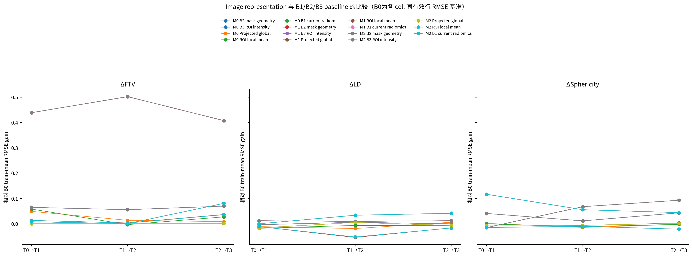

## 11. 不同 transition 与 frozen transition comparator

### 11.1 Frozen transition-predicted delta

Frozen comparator 直接使用既有 checkpoint transition 输出，不重新训练 transition；随后仍以相同五折 Ridge protocol 评估其 radiomics decodability。27 个主 cell 中：

- Spearman CI：1 个显著正、2 个显著负、24 个跨 0；
- R² CI：0 个显著正、18 个显著负、9 个跨 0；
- B0 gain CI：0 个显著正、15 个显著负、12 个跨 0；
- 按 1% 阈值均未被判作 near-constant，但 `V` 只有约 0.01–0.09，属于“非严格常数但动态范围很小且方向错位”。

唯一显著正 rank cell 是 M0 ΔFTV T2→T3：`ρ=.204 [.100,.303]`，但 `R²=.029 [−.024,.074]`、`G=.016 [−.008,.040]` 均跨 0。M0 ΔFTV T0→T1 的 transition delta 为 `ρ=−.014 [−.114,.086]`、`R²=−.085 [−.149,−.033]`，与 observed projected delta 的稳定正结果形成鲜明差异。M1/M2 的三阶段 ΔFTV transition ρ 约为 `.037/−.079/.020` 与 `.035/−.084/.018`。

### 11.2 Observed 与 predicted 的配对解释

M0 ΔFTV T0→T1，observed projected−transition 的配对差为 `Δρ=.367 [.230,.506]`、`ΔR²=.170 [.080,.269]`；T1→T2 的 `Δρ=.286 [.153,.423]`。27 个配对 cell 中，Spearman/R²/RMSE reduction 分别有 10/3/3 个显著正，没有显著负。

这个比较只能用于瓶颈定位，不能称为公平的 forecasting contest：**observed delta 看见真实 endpoint MRI，而 transition-predicted delta 只见当前 prefix，两者不是 information-matched baseline。** 它支持“只要终点 MRI 已经发生，M0 encoder 能在 ΔFTV 上表达一部分变化；但既有 transition 无法由 prefix 稳定生成相应变化”，而不证明 observed probe 可以用于未来预测。

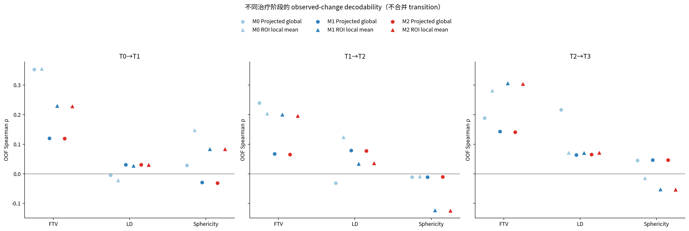

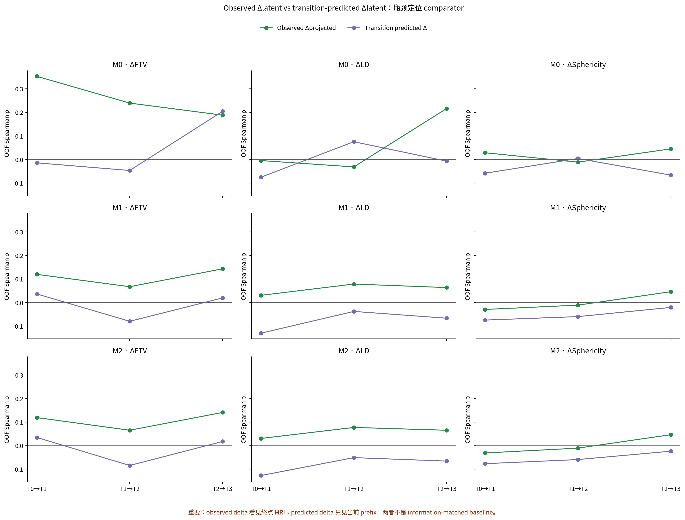

## 12. 对前一轮 M2 失败的解释

前一轮 M2 的 radiomics supervision 没有带来可检测的 observed representation 改善，原因更符合以下组合，而不是单一“head 太弱”：

1. **监督路径与位置不合适。** M2 主要约束 transition-predicted delta，而本轮显示 M2 observed representation≈M1，说明 loss 没有稳定反向塑造 observed encoder feature。
2. **Transition 动态范围压缩和方向错位。** 对 ΔFTV，真实 endpoint difference 可解码，而 frozen transition delta 没有显著正 R²/B0 gain。
3. **Encoder/local morphology grounding 不完整。** ΔLD 与 Δsphericity 即使使用真实 observed endpoints 也大多不可解码；这部分不能只怪 transition。
4. **Projector 有次要损失，pooling 不是主因。** Pre-projector 的 static rank 通常好于 projected，但 ROI−GAP 没有稳定校准优势。
5. **Target/shortcut 结构复杂。** FTV 被 ROI mask geometry 极强地解释；B1 在部分晚期 transition 也较强，说明当前值、自相关和几何变化可解释相当部分。BPE 还存在 lesion-centered crop 与 target 空间不匹配。

所以，M2 near-constant head 既不是“radiomics 完全没有影像信号”，也不能简单归因于 global pooling；它更像监督被施加在一个已经压缩、难以预测且未对 observed feature 直接 grounding 的路径上。

## 13. 当前真正瓶颈与八个明确回答

### 13.1 瓶颈判断

| 组件 | 证据 | 判断 |
|---|---|---|
| Encoder / observed feature | Static FTV 强，但 ΔLD/Δsphericity弱；B2 明显更强 | 存在 target-dependent grounding 缺口 |
| Global pooling | ROI−GAP 没有普遍 R²/B0-gain 优势 | 不是主要瓶颈 |
| Projector | Static pre-projector 多数优于 projected | 次要信息瓶颈 |
| Transition / forecasting | ΔFTV observed 正，而 predicted delta 无正 R²/B0 gain | ΔFTV 的主要动态瓶颈 |
| Radiomics target | B2/B3 可预测 ΔFTV；LD/sphericity机制不同，BPE空间不匹配 | 不是整体不可学，但 target 选择/语义需拆分 |
| Supervision placement | M2≈M1，未改变 observed feature | 当前 M2 的关键设计问题 |

总体诊断是 **多瓶颈共同作用**：FTV 主要卡在 transition/forecasting pathway；LD/sphericity 还卡在 encoder/local morphology representation 与 target 对齐；projector 有轻度丢失；global pooling 不是首要矛盾；M2 的监督位置没有有效改变 observed representation。

### 13.2 对最终八问的回答

1. **当前 global image latent 是否包含 FTV/LD/sphericity？** 是，但有明显层次。FTV 尤其 T0/T1 可稳定解码；LD 和 sphericity 多为弱 rank 信息，晚期 R²常不可靠。
2. **当前 ROI/local feature 是否包含这些信息？** 是。Static 早期 sphericity 最清楚，但 ROI 并不普遍优于 GAP，FTV 在若干时点反而更差。
3. **真实 observed latent difference 是否能表示 measurement change？** 部分能，主要是 ΔFTV，且以 M0 最稳健；ΔLD/Δsphericity没有稳定证据。
4. **ROI feature difference 是否明显优于 global difference？** 否。少数 transition 有 rank gain，但没有任何 R²/B0-gain paired CI 显著正，并存在显著负反例。
5. **M1 是否改善 observed image representation？** 否。整体配对证据方向相反，尤其早期 ΔFTV 明显退化。
6. **M2 是否改善 observed image representation？** 否。M2≈M1；change Spearman 没有任何显著改善，static 差异极小且方向混合。
7. **前一轮 grounding 失败主要属于哪类问题？** 是多因素：ΔFTV 以 transition/forecasting 为主，ΔLD/Δsphericity还涉及 encoder/local grounding，projector为次要因素，supervision placement 是 M2 设计关键；不能归因于单纯 pooling 或 radiomics target 全部无效。
8. **下一阶段优先修改什么？** 第一优先是把 measurement grounding 直接施加到真实 observed pre-projector/local multi-scale feature，并拆分 target/几何依赖；第二优先是保留 GAP/pre-projector 或 lesion token，避免无必要 projector 压缩；确认 observed grounding 后，再针对 ΔFTV 改 transition。暂不扫 `lambda_rad`、不做 M3，也不先增加更复杂 Transformer。

## 14. 下一步模型设计建议

### 14.1 建议的最小验证顺序

1. **Observed-state direct grounding pilot。** 在不改 world-model transition 的条件下，对 pre-projector、GAP 与 ROI/multi-scale token 直接施加 current FTV/LD/sphericity 辅助头；按 target 分开报告，避免用 FTV 掩盖 LD/sphericity 失败。现有 frozen Ridge 已经完成“head 能否读取”的 pilot，下一轮只需验证少量 direct-grounding 是否真的改变 encoder，而不是扩大 head。
2. **消除 mask shortcut 混淆。** 做 DCE7-only、mask-channel dropout/ablation 或只把 mask 用于 pooling 不送入 encoder 的受控比较；同时以 B2 geometry 为显式上限/控制。没有这个对照，不能把高 FTV decodability 称为丰富的治疗响应语义。
3. **保留空间与 pre-projector 信息。** 优先尝试 lesion token、multi-scale local token 或 GAP/pre-projector skip；不因本轮结果直接宣称 ROI mean 优于 global，也不必先替换为复杂 attention pooling。
4. **再改 transition。** 当 observed feature 对目标稳定后，针对 ΔFTV 检验 local transition、direction/beat-copy、path consistency 与 multi-step trajectory loss，并继续逐 transition 评估动态范围和方向，而不是只看平均 latent loss。
5. **重新定义 radiomics supervision。** FTV、LD、sphericity分别建模；BPE 保持探索性。将 current-state grounding 与 future-change forecasting 分成两个 loss/head，避免 predicted delta 的失败阻断所有 encoder supervision。

### 14.2 暂不建议

- 不继续盲扫 `lambda_rad`；
- 不启动 M3 relational loss；
- 不先增加更复杂 Transformer；
- 不用复杂 MLP 把弱 representation 强行变成监督模型；
- 不把真实 endpoint observed probe 当成未来预测性能；
- 不以 pCR 重新选择本审计的 probe 或 target。

## 15. 限制与可复现性边界

- 全部 CI 条件于已拟合 probe，不覆盖 world-model 或 probe 训练随机性。
- Radiomics 配对子集只有 375 人；结果适用于该 matched subset，不自动外推到完整 cohort。
- 输入含 ROI mask，geometry shortcut 无法仅凭本审计完全分离。
- Natural-scale log-target 的 Ridge 反变换无界，少数 fold 会放大 outlier；因此必须联合看 Spearman、R²、B0 gain、V 与 fold 结果。
- ROI mean 是单一尺度的线性 occupancy pooling，不等于穷尽所有 local representation；“ROI 没有普遍优势”不排除更好的 lesion token/multi-scale feature。
- BPE 与 lesion-centered crop 存在空间不匹配，仅作探索性结果。BPE static 的时点中位 Spearman约 `.22–.32`，但 observed change 中位 Spearman约 `.01–.06`、R²多为负，不能据此诊断 encoder。
- Peritumoral ring、ElasticNet 和 MLP 没有执行，因为核心线性矩阵已经足以定位瓶颈，增加复杂度不会改变本轮停止决策。

正式聚合产物包括[聚合摘要](../metrics/final_analysis/aggregation_summary.json)、[fold 指标](../metrics/final_analysis/fold_metrics.csv)、[OOF 指标](../metrics/final_analysis/oof_metrics.csv)、[核心 bootstrap CI](../metrics/final_analysis/bootstrap_ci.csv)、[paired bootstrap CI](../metrics/final_analysis/paired_differences_bootstrap_ci.csv)和[图表清单](../metrics/final_analysis/figure_manifest.csv)。聚合实现 SHA-256 为 `cd50b2e8fe5cca5b8c75114416429e782640313a13be95665762fc300a219a6e`；聚合状态为 `complete`，输入问题数为 0。

## 16. 最终结论

MRI treatment-response signal 并非在单一层一次性消失。Observed encoder 已经保留了明显的静态 tumor burden 和一部分真实 ΔFTV，但这些信息高度受 ROI geometry 支配，且没有被 M1/M2 系统性增强。ROI mean 没有证明 global pooling 是主瓶颈，projector只造成部分额外损失；真正突出的断点是既有 transition 无法从当前 prefix 生成与 ΔFTV 对齐的变化，而 ΔLD/Δsphericity还暴露出 observed morphology grounding 本身不足。

因此，下一阶段应先把 supervision 从 predicted future delta 前移到真实 observed pre-projector/local representation，并用 mask ablation 区分几何 shortcut；随后才对已经 grounded 的 representation 设计更好的 local/trajectory transition。本轮证据不支持继续原位置的 M2 权重扫描，也不支持直接进入 M3。
