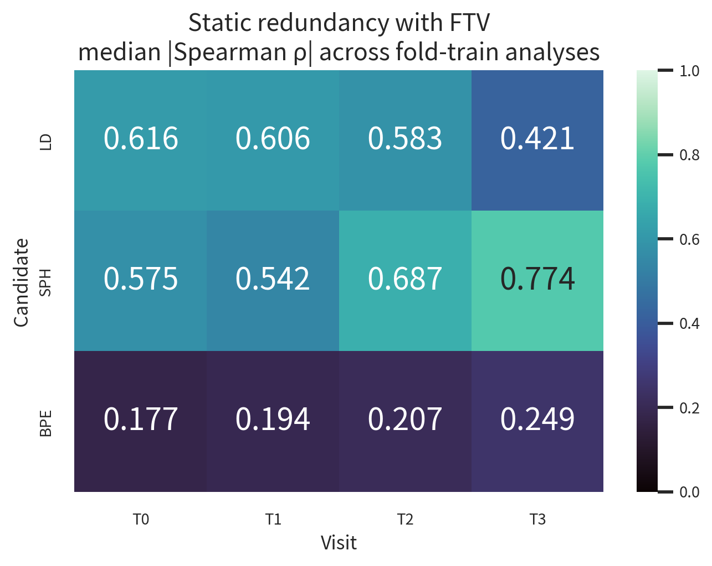
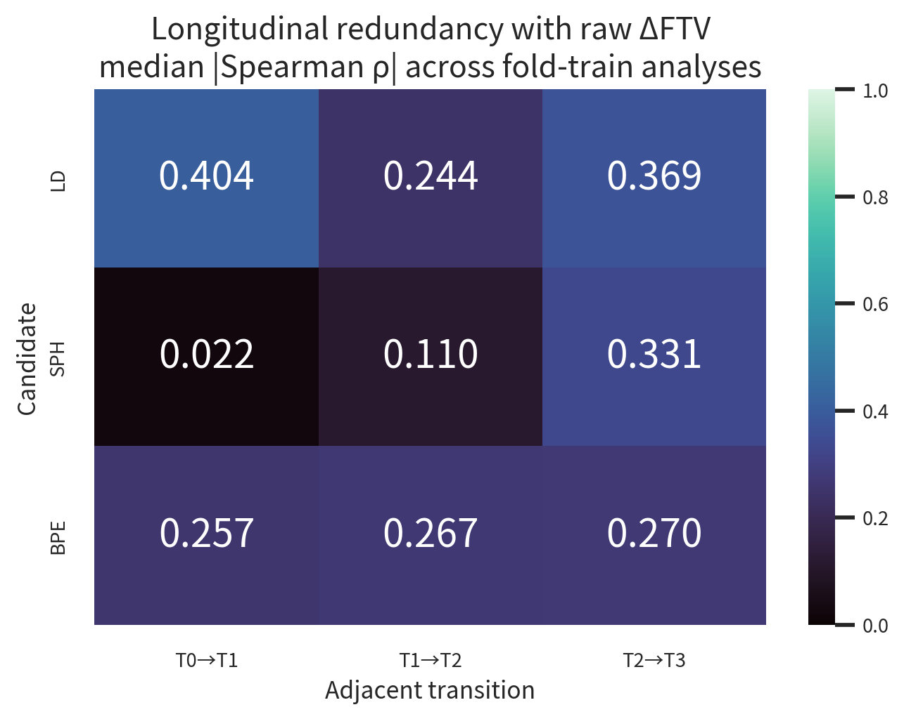
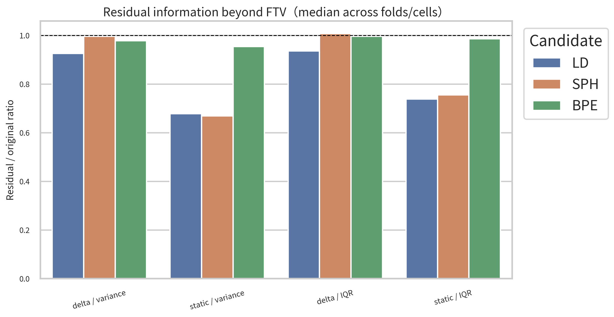
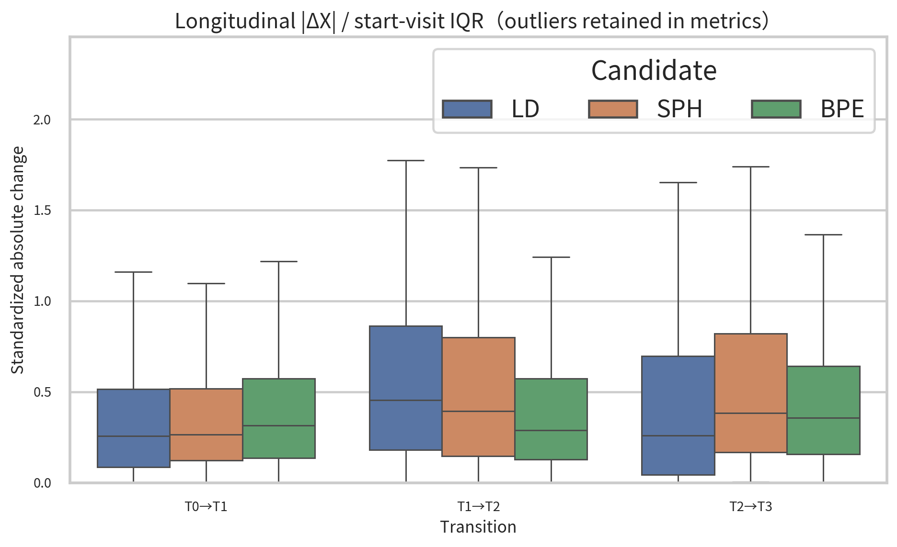
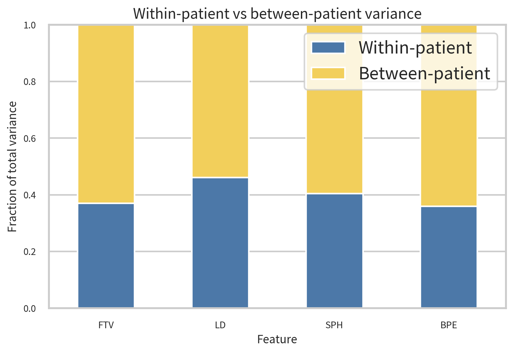
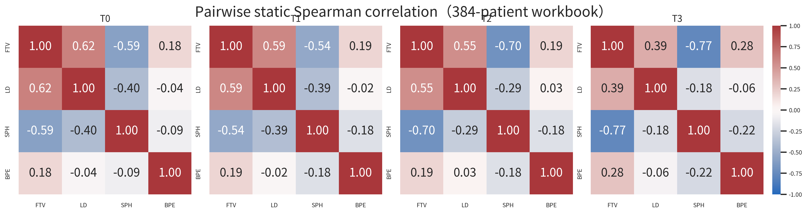
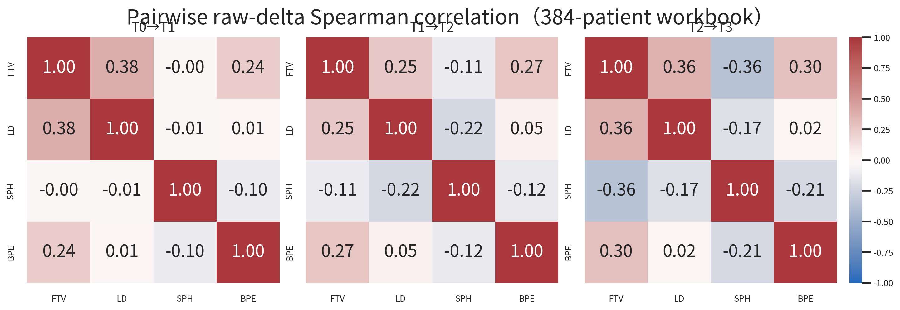
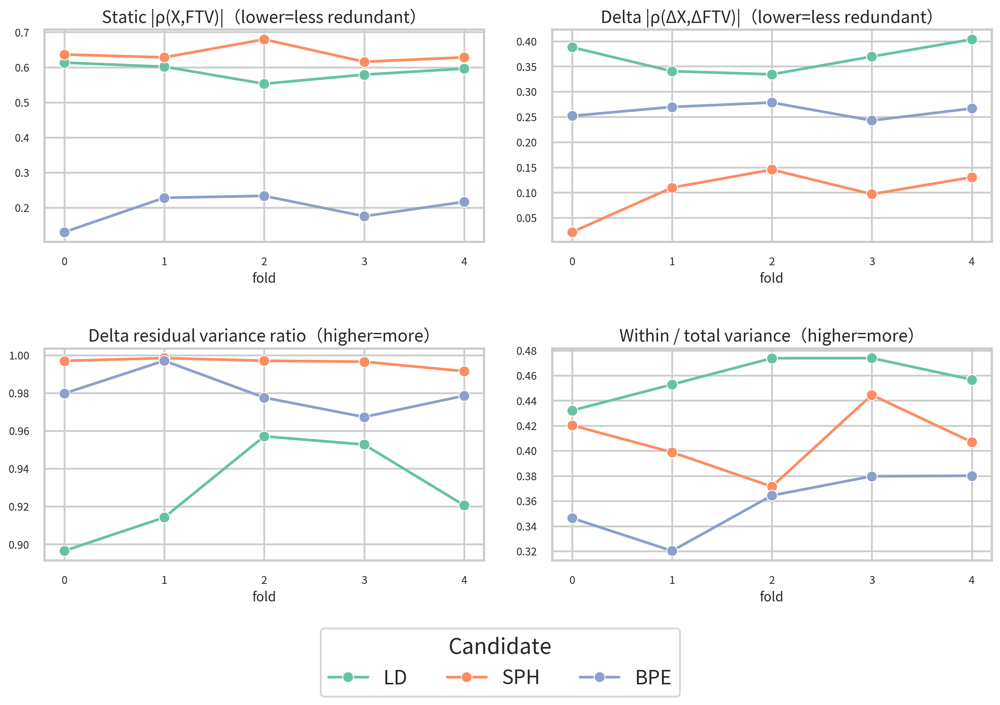
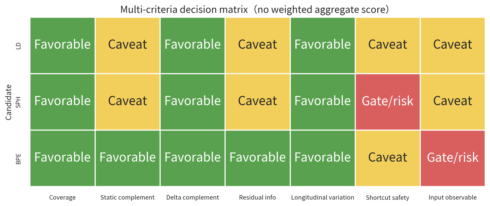

# Radiomics Target Screening 最终报告

## 1. 最终结论

在**不改变当前 G3 input contract**（DCE7 lesion/ROI-centered crop → encoder → GAP，严格无 mask channel），并明确优先“shortcut safety + 当前可执行性”的 operational preference 下，唯一第一 pilot 推荐是 **LD（longest diameter）**；第二候选是 **SPH（sphericity）**。这是一个透明的 pragmatic/conditional adjudication，不是统计数据唯一推出的全序：LD 与 SPH 在定量维度上均为 Pareto non-dominated。BPE 的 **static** FTV 互补性最强，但其测量需要对侧乳腺中央 5 层纤维腺体，当前 lesion-centered crop 不保证包含所需解剖区域，因此被 architecture observability gate 淘汰；动态 Δ 互补性最强的是 SPH。

LD 并非完美候选：它仍是 tumor burden measure，static 与 FTV 中等冗余，且 T2/T3 出现明显零值 floor。它胜出不是因为单一综合分数，而是因为在上述 operational preference 下，LD 同时具有完整 coverage、当前输入的部分可观察证据、稳定纵向变化、较高 FTV residual information、仅中等而非高 mask-geometry 风险。既有 strict-DCE7 probe 的 ΔLD Spearman 点估计高于 ΔSPH，但二者 target transform 不同且没有 paired cross-target CI，因此只作弱 feasibility 旁证，不构成正式优效检验。固定 crop 是否逐例容纳完整最长径尚未被证明，因此 crop-containment audit 是进入 pilot 前的必要 gate。

## 2. Outcome-free screening 边界

本 screening 的目标不是寻找与 pCR correlation 最大的 biomarker，而是寻找一个与 FTV complementary 的 imaging-response axis，供下一阶段 factorized/multi-dimensional response state 使用。正式 selection 代码只读取 fold manifest 的 `patient_id/fold/split` 三列，**没有读取 `label_pcr`**；没有使用 pCR AUROC、pCR association、treatment response label、molecular subtype 或任何 clinical outcome。下一阶段才能在严格 held-out 条件下评估额外 response axis 是否改善 pCR prediction，从而避免 target-selection bias。

## 3. Excel 真实结构

- 文件：`/data/data/Breast_Cancer/I-SPY2/Multi-feature-MRI-NACT-Data.xlsx`；SHA-256 `f714c7784b1e57daa74d7cfb20db71cd432b4e4596b9b4eacdd5a76b7f8a58dc`。
- Sheet：仅 `datawith4visits`；data shape 384×29，Excel used range `A1:AC385`。
- 384 个唯一六位患者 ID；所有 29 列 0% missing；0 个重复患者、0 个重复整行、0 个 non-finite。
- 表为 wide longitudinal structure；FTV `V10/V20/V30/V40` 映射 T0/T1/T2/T3。
- 12 个 `pch` 字段全部逐行验证为相对 T0 百分比派生量，不是新的 measurement，也不是相邻 Δ。

详细逐列检查见 [table_schema_report.md](table_schema_report.md) 和 `../metrics/table_schema.csv`。

## 4. Measurement 定义与候选池

| Measurement | 角色 | 定义 | 当前 target 含义 |
|---|---|---|---|
| FTV | reference | 满足 PE/SER 阈值的增强组织功能性肿瘤体积 | 主 tumor burden response axis |
| LD | formal candidate | site radiologist MRI report 中的肿瘤最长径 | 线性病灶范围/burden axis |
| SPH | formal candidate | 等体积球表面积除以 3D FTV tumor mask 表面积 | tumor morphology/compactness axis |
| BPE | formal candidate | 对侧乳腺中央连续 5 层纤维腺体的平均早期 PE | normal-tissue physiology axis |

定义来源为同一 384 人表对应的原始论文方法：https://pmc.ncbi.nlm.nih.gov/articles/PMC7695723/。工作簿中没有其他真正的 longitudinal MRI-derived quantitative measurement；`pch` 列只作一致性核验。

## 5. Patient coverage 与严格 mapping

| feature | workbook_total_patients | strict_mri_overlap_patients | T0_available_overlap | T1_available_overlap | T2_available_overlap | T3_available_overlap | complete_4visit_overlap | missing_pct_overlap |
|---|---|---|---|---|---|---|---|---|
| FTV | 384 | 375 | 375 | 375 | 375 | 375 | 375 | 0.000 |
| LD | 384 | 375 | 375 | 375 | 375 | 375 | 375 | 0.000 |
| SPH | 384 | 375 | 375 | 375 | 375 | 375 | 375 | 0.000 |
| BPE | 384 | 375 | 375 | 375 | 375 | 375 | 375 | 0.000 |

工作簿 384 人、MRI cohort 808 人，严格 overlap 375 人，workbook-only 9 人、MRI-only 433 人。只允许 `^(ISPY2-|ACRIN-6698-)######` 后缀、clinical ID 与 workbook 六位 ID 三者精确等值，不做 fuzzy matching。workbook-only IDs 为 `246134, 495440, 516763, 652480, 745633, 748611, 790722, 889225, 893874`。

## 6. Fold-safe protocol

锁定 seed-2026 manifest SHA-256 `143e482d711225c0611006d99bd7345d2fa1a5c16c65fbaf8399341a0d26aa38`。每个 outer fold 只用显式 `split=train` 的 measurement-overlap 患者计算正式指标；五折 n 分别为 {'0': 247, '1': 239, '2': 240, '3': 242, '4': 225}. validation/test 没有进入 ranking。全 384 人结果仅作 descriptive summary。

相关性主指标为 absolute Spearman，Pearson 辅助；raw longitudinal change 定义为相邻 endpoint 的 `X_end-X_start`。Residual analysis 在各 fold/cell 内使用简单 `StandardScaler + Ridge(alpha=1)`；static predictor 为 `log1p(FTV)`，LD target 使用 `log1p`，SPH/BPE 为 identity；raw delta 模型不作 log 变换。该同一训练集拟合/描述关系用于量化可被 FTV 解释的线性信息，不用于泛化性能宣称。

## 7. Static FTV redundancy

| candidate | T0 | T1 | T2 | T3 | 跨访视/折中位数 | 分类 |
|---|---|---|---|---|---|---|
| LD | 0.616 | 0.606 | 0.583 | 0.421 | 0.596 | MODERATE |
| SPH | 0.575 | 0.542 | 0.687 | 0.774 | 0.628 | MODERATE |
| BPE | 0.177 | 0.194 | 0.207 | 0.249 | 0.216 | LOW |

Static 最不冗余的是 **BPE**（跨 fold/visit 中位 |ρ|=0.216）。BPE 始终只有弱 static FTV correlation。LD 属中等冗余，符合其线性 tumor burden 含义。SPH 与 FTV 呈强负相关（主表 signed ρ 为负），因此 absolute redundancy 反而高于 LD；到 T3 尤其明显。相关方向不影响“是否复制 FTV 信息”的判定，所以正式指标取绝对值。



## 8. Longitudinal raw-Δ redundancy

| candidate | T0→T1 | T1→T2 | T2→T3 | 跨transition/折中位数 | 分类 |
|---|---|---|---|---|---|
| LD | 0.404 | 0.244 | 0.369 | 0.369 | LOW |
| SPH | 0.022 | 0.110 | 0.331 | 0.110 | LOW |
| BPE | 0.257 | 0.267 | 0.270 | 0.267 | LOW |

Raw change 与 ΔFTV 最不冗余的是 **SPH**（跨 fold/transition 中位 |ρ|=0.110）。SPH 在 T0→T1/T1→T2 基本独立于 ΔFTV，但 T2→T3 冗余上升；LD 的 ΔFTV redundancy 为低至中等；BPE 为低冗余，但不如其 static 结果极端。



## 9. Residual information beyond FTV

| candidate | delta_residual_variance_ratio | static_residual_variance_ratio | delta_residual_iqr_ratio | static_residual_iqr_ratio |
|---|---|---|---|---|
| LD | 0.926 | 0.678 | 0.937 | 0.739 |
| SPH | 0.997 | 0.669 | 1.008 | 0.756 |
| BPE | 0.979 | 0.954 | 0.996 | 0.986 |

按实现中预先固定的 simple-transform static/delta residual variance ratio 中位描述，保留最多信息的是 **BPE**（中位 ratio=0.966）。本节表格先把所有 fold×cell 直接取中位；Decision Matrix 则先在每个 fold 内跨 cell 取中位、再跨 fold 取中位，因此小数可略有差异，但候选排序不变。三个候选都不是由简单单变量 FTV relation 完全决定；BPE static 最接近完全残留，SPH delta 也几乎完全残留。LD 虽为另一种 burden measure，仍保留大部分方差/IQR。这些 ratio 是各 feature 自身 transform space 内的保留比例（LD static 使用 log1p，SPH/BPE 使用 identity），适合判断“是否容易由 FTV 解释”，但不能把跨 feature 的小数差异当成严格同量纲效应量。



## 10. Longitudinal responsiveness

| candidate | median_standardized_abs_change | median_abs_delta | within_to_total_variance_ratio | near_zero_fraction |
|---|---|---|---|---|
| LD | 0.261 | 0.600 | 0.457 | 0.128 |
| SPH | 0.373 | 0.050 | 0.407 | 0.021 |
| BPE | 0.312 | 4.417 | 0.364 | 0.013 |

纵向响应的答案取决于 metric。按本任务的主摘要 within-patient / total variance，**LD** 最高（0.457）；按 standardized |Δ|，**SPH** 最高（0.373；LD=0.261，SPH=0.373）。因此不存在不加限定的“最强变化”候选；必答 F 按 within/total 口径回答 LD。三个候选都不是 near-constant patient trait：within/total ratio 均为实质正值，相邻变化的 near-zero 比例低。LD 后期 floor 会把部分变化压到 0；SPH/BPE 也有明确治疗期变化。





## 11. Dynamic range 与 measurement quality

| feature | visit | median | iqr | n_zero | zero_fraction | heavy_tail_flag | floor_effect_flag | near_zero_variance_flag |
|---|---|---|---|---|---|---|---|---|
| LD | T0 | 3.700 | 2.325 | 0 | 0.000 | False | False | False |
| LD | T1 | 3.100 | 2.200 | 6 | 0.016 | False | False | False |
| LD | T2 | 2.100 | 2.300 | 65 | 0.169 | False | True | False |
| LD | T3 | 1.200 | 2.400 | 128 | 0.333 | False | True | False |
| SPH | T0 | 0.198 | 0.135 | 0 | 0.000 | False | False | False |
| SPH | T1 | 0.198 | 0.127 | 0 | 0.000 | False | False | False |
| SPH | T2 | 0.229 | 0.150 | 0 | 0.000 | False | False | False |
| SPH | T3 | 0.256 | 0.196 | 0 | 0.000 | False | False | False |
| BPE | T0 | 24.617 | 18.380 | 0 | 0.000 | False | False | False |
| BPE | T1 | 20.123 | 15.062 | 0 | 0.000 | False | False | False |
| BPE | T2 | 18.090 | 11.423 | 1 | 0.003 | False | False | False |
| BPE | T3 | 17.022 | 11.255 | 4 | 0.010 | False | False | False |

所有 feature×visit 均非 near-constant，未删除任何 outlier。FTV heavy-tail 最明显；LD 在 T2/T3 分别有 65/128 个零值，T3 达到显著 floor effect。BPE T2/T3 有 1/4 个零值。源表不能区分“真实完全消失、不可测、分割失败或编码下限”，因此这些值保留原样，并在推荐中把 LD floor 作为风险而非悄然清洗。

## 12. Candidate–candidate redundancy

完整 static 和 raw-delta Spearman matrices 分别保存在 `pairwise_static_spearman.csv` 与 `pairwise_delta_spearman.csv`，按每个 visit/transition 分块。主要结构是：LD 与 FTV 形成 tumor burden 轴；SPH 与 FTV/LD 多为负相关的 compactness/morphology 轴；BPE 与病灶 features 的 static correlation 最弱，构成 normal-tissue physiology 轴。





## 13. Shortcut / mask-geometry audit

| feature | shortcut_risk | static_median_abs_spearman | static_median_r2 | change_median_abs_spearman | change_median_r2 | formal_ci_status | interpretation |
|---|---|---|---|---|---|---|---|
| FTV | HIGH | 0.890 | 0.559 | 0.869 | 0.681 | change 有正式 CI | 9-D geometry 对 static/change 均高度可预测；reference target。 |
| LD | MODERATE | 0.544 | 0.203 | 0.255 | 0.018 | change 有正式 CI | static geometry 中等可预测；raw change 的历史 probe 使用 log-difference，R² 较弱。 |
| SPH | HIGH | 0.715 | 0.453 | 0.403 | 0.121 | change 有正式 CI | 由 3D FTV mask 表面积直接定义；static 高、后两段 change 也明显依赖 geometry。 |
| BPE | LOW | 0.121 | 0.024 | 0.156 | 0.026 | 仅探索点估计；无 BPE 正式 CI | 观察到的 geometry predictability 低，但 BPE 仅有探索性点估计、无正式 bootstrap CI。 |

9-D geometry control 包括 ROI voxel volume、normalized bbox extents/diagonal 与 centroid。SPH 为 **HIGH**：它直接由 3D FTV mask 表面积定义，static geometry predictability 高，后两段 change 也明显。LD 为 **MODERATE**：static 可由 lesion geometry 中等预测，但历史 log-difference coordinate 的 change R² 弱。BPE 的观察点估计为 **LOW**，但没有正式 BPE bootstrap CI，不能写成已完全排除 shortcut。

重要边界：这些 control 说明 target 对显式 mask geometry 的依赖，**不代表 G3 已经读取 mask**。G3 代码硬性排除了 mask channel；仍存在 ROI-centered crop 的定位先验，但没有直接 voxel-count/geometry scalar route。历史 audit 的 ΔFTV/ΔLD 使用 log difference，而本 screening 使用任务指定的 raw difference，两者只作旁证，不直接数值等同。

## 14. Current MRI input observability gate

| feature | required_imaging_region | mri_observable | gate | rationale |
|---|---|---|---|---|
| FTV | 病灶 VOI/FTV 分析区域 | YES | REFERENCE | ROI-centered DCE7 含病灶局部增强代理；既有严格 G3 probe 的 static/delta signal 支持其作为 reference。 |
| LD | 病灶本体 | YES_WITH_CAVEAT | PASS | ROI-centered crop 含病灶定位区域且 strict-DCE7 static probe 为正，因此仅支持部分可观察；固定 crop 未逐例保证容纳完整最大径，且 ΔLD 校准很弱。 |
| SPH | 病灶 3D FTV mask/边界 | YES_WITH_CAVEAT | PASS_WITH_HIGH_SHORTCUT_RISK | ROI-centered crop 含局部病灶边界代理且 static probe 为正，因此仅支持部分可观察；固定 crop 未逐例保证完整 3D 表面，GAP/无 mask 下 ΔSPH 几乎不可解码。 |
| BPE | 对侧乳腺中央纤维腺体组织 | NO_WITH_CURRENT_INPUT | FAIL_INPUT_MISMATCH | BPE 需要对侧乳腺中央 5 层纤维腺体；lesion-centered crop 不保证包含该区域，历史弱 signal 不能替代解剖可见性。 |

BPE 的 static 统计互补性不能覆盖 architecture mismatch：对侧乳腺中央 tissue 不在 lesion-centered crop 的保证区域内。因此 BPE 是 **STATICALLY ATTRACTIVE BUT INPUT-MISMATCHED**，在当前 input contract 下不能推荐。LD/SPH 的 ROI-centered crop 含病灶定位区域，且 strict-DCE7 static probe 提供弱正 proxy signal，因此仅作 **conditional pass**；现有契约没有逐例证明完整最长径或完整 3D 表面未被固定 crop 截断。SPH 还因没有显式 mask、GAP 弱化空间结构而带有更强 caveat。

## 15. Prior frozen representation decodability

| feature | model | task | macro_mean_spearman | macro_mean_r2 | cell_values |
|---|---|---|---|---|---|
| LD | G1 | static | 0.280 | -0.435 | T0:rho=0.343,R2=0.067; T1:rho=0.260,R2=-0.042; T2:rho=0.287,R2=-0.162; T3:rho=0.230,R2=-1.603 |
| LD | G1 | change | 0.109 | -0.006 | T0→T1:rho=0.108,R2=-0.002; T1→T2:rho=0.035,R2=-0.013; T2→T3:rho=0.186,R2=-0.003 |
| SPH | G1 | static | 0.262 | 0.065 | T0:rho=0.465,R2=0.174; T1:rho=0.272,R2=0.061; T2:rho=0.205,R2=0.033; T3:rho=0.108,R2=-0.008 |
| SPH | G1 | change | 0.009 | -0.040 | T0→T1:rho=0.006,R2=-0.084; T1→T2:rho=-0.029,R2=-0.023; T2→T3:rho=0.049,R2=-0.013 |
| LD | G3 | static | 0.324 | -0.069 | T0:rho=0.356,R2=0.081; T1:rho=0.307,R2=-0.013; T2:rho=0.363,R2=-0.068; T3:rho=0.269,R2=-0.276 |
| LD | G3 | change | 0.138 | 0.001 | T0→T1:rho=0.136,R2=-0.003; T1→T2:rho=0.057,R2=-0.003; T2→T3:rho=0.221,R2=0.009 |
| SPH | G3 | static | 0.318 | 0.080 | T0:rho=0.490,R2=0.179; T1:rho=0.290,R2=0.063; T2:rho=0.290,R2=0.070; T3:rho=0.201,R2=0.007 |
| SPH | G3 | change | 0.034 | -0.028 | T0→T1:rho=0.040,R2=-0.038; T1→T2:rho=0.022,R2=-0.022; T2→T3:rho=0.040,R2=-0.023 |
| BPE | G1/G3 | static | NA | NA | UNKNOWN：DGRS 未评估 BPE；OSRA 的旧输入含 mask 且空间不匹配 |
| BPE | G1/G3 | change | NA | NA | UNKNOWN：DGRS 未评估 BPE；OSRA 的旧输入含 mask 且空间不匹配 |

Strict-DCE7 G3 对 LD/SPH 的 static rank signal 均为弱至中等；ΔLD Spearman 点估计为弱正，ΔSPH 接近零且 R² 为负。由于两者历史 target transform 不同且没有 paired cross-target CI，这一差异不是正式的跨 target 优效检验。BPE 没有同 contract 的 DGRS probe，记为 UNKNOWN；含 mask 的旧 OSRA 弱 signal 不能越过 observability gate。Decodability 仅作 feasibility 旁证，不是“选当前最容易预测的 target”的单一规则。

## 16. Cross-fold consistency

| candidate | static_rho_min | static_rho_max | delta_rho_min | delta_rho_max | residual_delta_min | residual_delta_max | within_ratio_min | within_ratio_max |
|---|---|---|---|---|---|---|---|---|
| LD | 0.553 | 0.613 | 0.334 | 0.404 | 0.897 | 0.957 | 0.432 | 0.474 |
| SPH | 0.615 | 0.679 | 0.022 | 0.145 | 0.992 | 0.998 | 0.371 | 0.444 |
| BPE | 0.130 | 0.233 | 0.243 | 0.278 | 0.967 | 0.997 | 0.320 | 0.380 |

三个候选的相对结论在五个 fold-train 子集中没有翻转：BPE 持续 static 最不冗余；SPH 持续 raw-delta 最不冗余；LD 持续表现出较强 within-patient variation。这里的五个 train sets 高度重叠，是 split sensitivity/consistency check，不是五个独立重复实验；正式 recommendation 取这种一致的 multi-criteria pattern，而非 held-out fold 表现。



## 17. Candidate Decision Matrix

| Candidate | Coverage | Static FTV redundancy | ΔFTV redundancy | Static residual info | Δ residual info | Longitudinal variation | Shortcut risk | MRI observable | Overall |
|---|---|---|---|---|---|---|---|---|---|
| LD | 375/375 complete | 0.596 | 0.369 | 0.682 | 0.921 | 0.457 | MODERATE | YES_WITH_CAVEAT | RECOMMENDED |
| SPH | 375/375 complete | 0.628 | 0.110 | 0.676 | 0.997 | 0.407 | HIGH | YES_WITH_CAVEAT | POSSIBLE SECOND CHOICE |
| BPE | 375/375 complete | 0.216 | 0.267 | 0.953 | 0.979 | 0.364 | LOW | NO_WITH_CURRENT_INPUT | NOT RECOMMENDED WITH CURRENT INPUT |



决策采用 Pareto/multi-criteria gate，不存在人为权重相加得到的唯一分数。LD 与 SPH 在统计维度上均 Pareto non-dominated；为满足任务要求给出唯一第一候选，本报告显式用“优先降低 geometry shortcut、优先当前 strict-DCE7 可执行性”作 qualitative tiebreaker：

1. **LD — RECOMMENDED（conditional/pragmatic first）。** 在上述 tiebreaker 下，数据、纵向响应、部分可观察证据和 shortcut safety 的可行交集最好。它比 SPH 少一个 HIGH geometry-risk gate，比 BPE 少一个 input-mismatch hard failure。代价是与 FTV 中等 static redundancy、后期 floor，以及完整最长径可能超出固定 crop；下一阶段前必须完成 crop-containment audit。
2. **SPH — POSSIBLE SECOND CHOICE。** 它是最清晰的 morphology candidate，ΔSPH 与 ΔFTV 最互补且 residual 最大；但 SPH 的精确定义就是 FTV mask surface geometry，历史 strict-DCE7 Δ解码几乎为零，因此不作为第一候选。
3. **BPE — NOT RECOMMENDED WITH CURRENT INPUT。** 它在 static 统计上最 complementary，但所需对侧乳腺区域不在当前输入 contract；只有扩大/增加全乳或对侧乳腺输入后才值得重新评估。

## 18. LD / SPH / BPE 专项回答

1. **LD 是否主要只是另一种 tumor burden measure？** 是，static 与 FTV 中等相关，且二者均随病灶缩小；但 raw Δ 相关低于 static、Ridge residual 仍高，因此不是 FTV 的完全复制。
2. **SPH 是否增加 morphology dimension？** 定义与表格统计支持一个 morphology axis：它刻画等体积条件下的表面复杂度/球形度，raw Δ 与 ΔFTV 最不冗余；但当前 G3 的 longitudinal morphology decodability 尚未建立（ΔSPH ρ=0.034，R²=-0.028）。
3. **SPH 是否过度依赖 mask geometry？** 是。定义直接使用 3D FTV mask 表面积，9-D mask geometry 的 static predictability 高，shortcut 风险为 HIGH。
4. **BPE 是否统计上与 FTV 最互补？** Static 是；delta 也低冗余且 residual 很高，但 delta 最不冗余的是 SPH。
5. **当前 lesion-centered crop 能否真正观察 BPE？** 不能合理保证。BPE 需要对侧乳腺中央 5 层纤维腺体，当前 crop 是病灶中心固定小视野。
6. **当前 G3 input contract 下谁最适合作为第二 target？** LD。

## 19. 必答 A–J

- **A. 实际有哪些 longitudinal measurements？** FTV、LD、SPH、BPE 四类；每类 T0–T3。12 个 pch 列只是相对 T0 派生量。
- **B. FTV 外哪些可作候选？** LD、SPH、BPE；但 BPE 在当前 input contract 下不可执行。
- **C. Static 与 FTV 最不冗余？** BPE，formal median |ρ|=0.216。
- **D. Longitudinal change 与 ΔFTV 最不冗余？** SPH，formal median |ρ|=0.110。
- **E. 保留最多 FTV 外 residual information？** BPE（按 static/delta residual variance ratio 的联合描述）；BPE 是 static residual 最强者，SPH 是 delta residual 最强者。
- **F. 最强且稳定的 within-patient variation？** 按 requested within/total 主摘要为 LD（0.457）；按 standardized |Δ| 则为 SPH（0.373），因此结论需随 metric 限定。
- **G. 明显 mask/geometry shortcut risk？** SPH=HIGH；LD=MODERATE；BPE=LOW point estimate 但 CI 不足；FTV reference=HIGH。
- **H. 当前 DCE7 lesion-centered 下无法合理观察？** BPE。
- **I. 不改 input contract 的最推荐第二 target？** 在优先 shortcut safety 与当前可执行性的明确决策偏好下，LD（conditional first）。
- **J. 为什么？** 它通过 coverage/variation gate，具有当前输入的部分可观察证据，保留较多非 FTV 信息，mask shortcut 风险低于 SPH，且没有 BPE 的解剖 input mismatch；但需先用 crop-containment audit 确认完整最长径没有被系统性截断。

## 20. 下一阶段 dual-grounding pilot（本轮不运行）

建议固定同一 seed/fold/input/model contract，仅比较：

```text
H0: DCE7 → JEPA
H1: DCE7 → JEPA + FTV
H2: DCE7 → JEPA + FTV + LD
```

在运行 H2 前，先做不涉及结局的 crop-containment audit：定量检查每个 visit 的 reported LD/FTV support 是否完整落入固定 crop，并预注册 truncation failure gate；若 LD gate 失败，只有在 SPH 自身的完整 3D surface-containment gate 通过时才回到 SPH，否则应判定当前 input contract 无合适第二 target，而不是直接训练。通过后，主要 held-out 比较应覆盖 FTV static、raw/预定义 ΔFTV、LD static、ΔLD、image-only pCR，以及 optimization safety。LD target transform、zero/floor handling 与 loss scale 必须仅在 fold train 拟合；不得因 pCR 表现反向修改 LD target 选择。鉴于既有 G3 optimization 证据是 promising but unstable，H2 还应预注册 base degradation、gradient conflict、representation variance 和 failure-fold gate；但本 screening 没有训练 H0/H1/H2、没有改 lambda/JEPA/transition，也没有运行 optimization fix。

## 21. 局限性

- 工作簿是 384 人 complete-case subset；coverage 不能外推到所有 808 人。
- LD 单位与零值语义未在工作簿中明示；floor 需在 pilot 前由数据字典/生成者确认。
- LD/SPH 的 current-input observability 是基于 ROI-centered contract 与 frozen static probe 的 conditional inference；尚无逐例 crop-containment 证明。
- 五个 fold-train 集高度重叠，跨折范围只表示 split sensitivity，不是独立重复的不确定性区间。
- Static residual 的 candidate-specific transform 不同，且 Ridge 在同一 fold-train 样本拟合/描述；ratio 不应解释为跨 feature 严格可比的 out-of-sample performance。
- SPH/FTV/LD/BPE 的 shortcut/decodability 证据来自已完成实验，其 target transforms 与本轮 raw-delta 口径不完全相同。
- BPE 的 input mismatch 是基于论文定义与当前 crop contract 的 architecture gate；不是宣称影像中不存在任何 proxy signal。
- Ridge residual 是简单线性/轻变换关系审计，不是条件互信息估计，也不支持因果解释。
- `verification.json` 仅核验产物结构、哈希、登记口径与内部一致性；`PASS` 不等于外部科学验证或临床效用证明。
