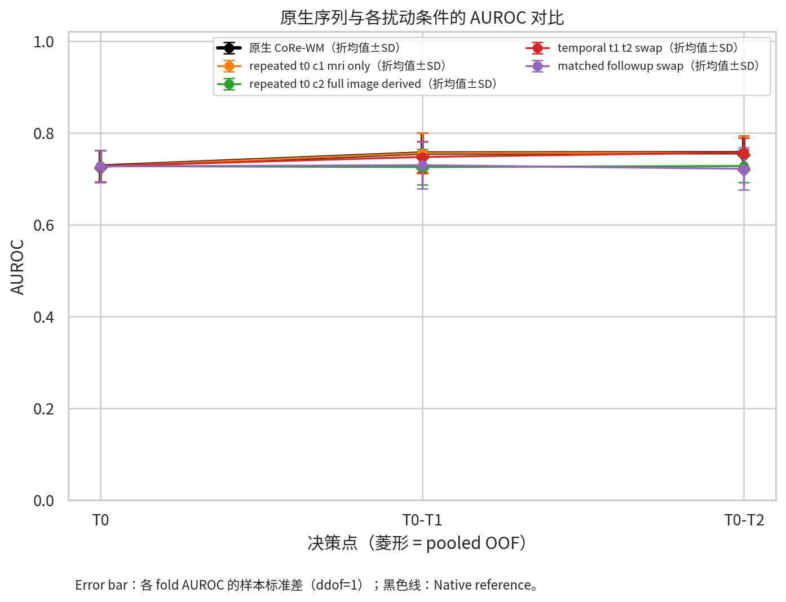
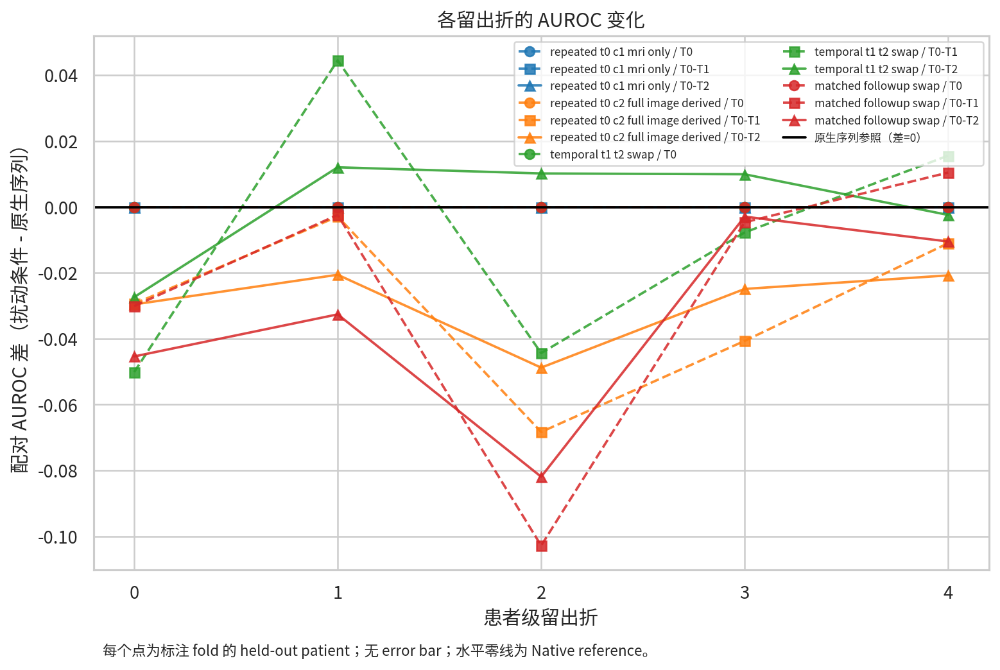
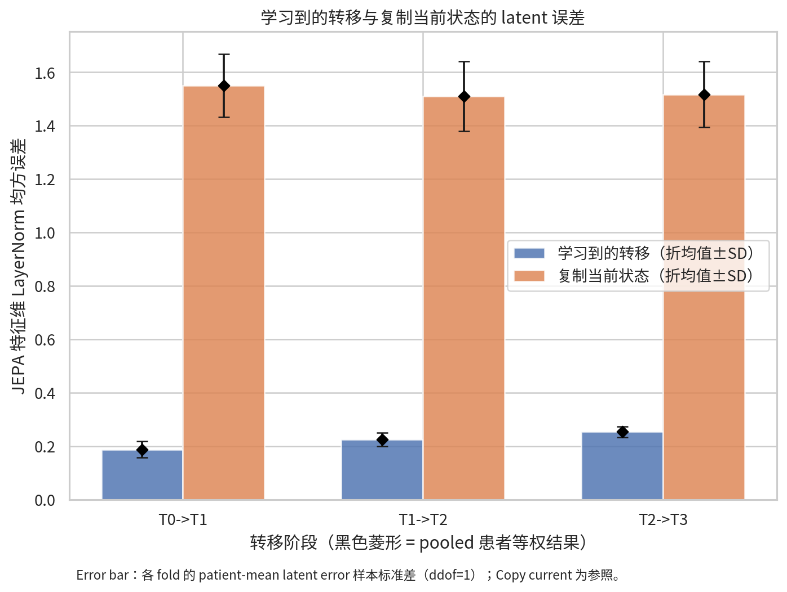
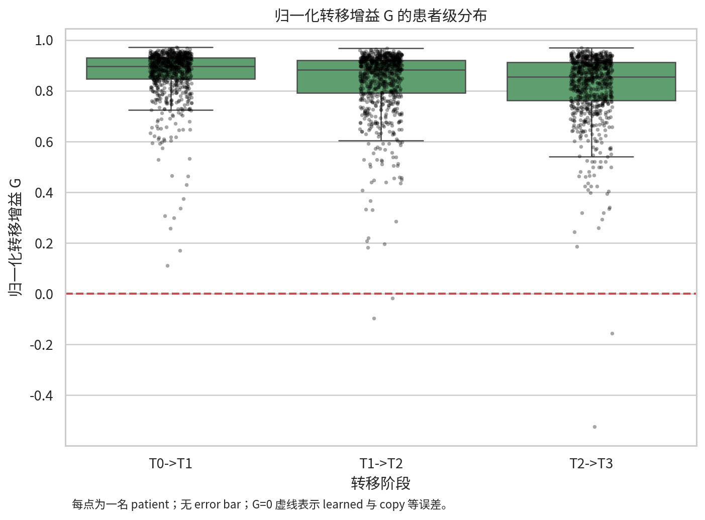
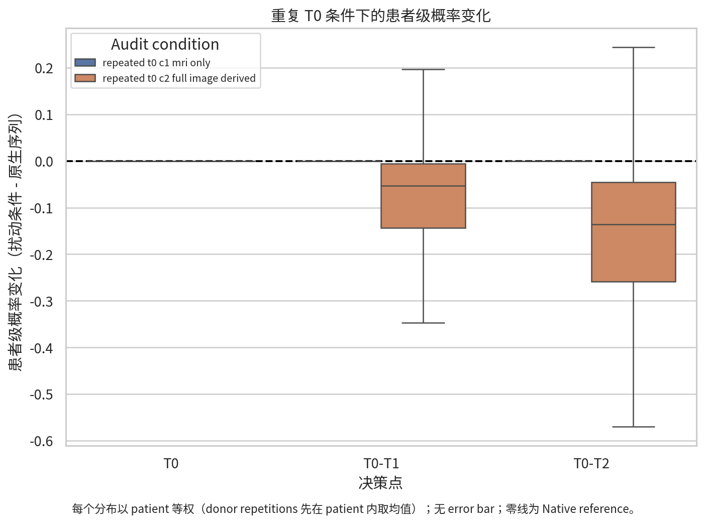
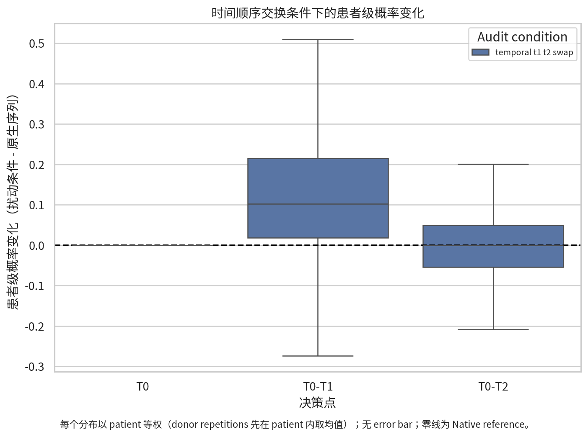
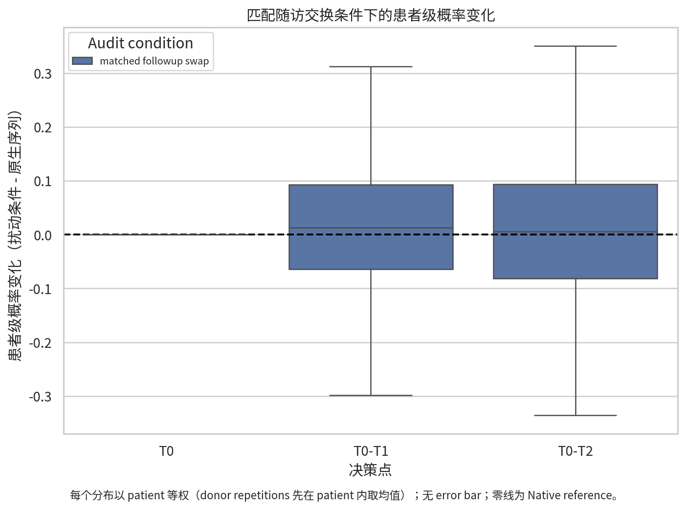
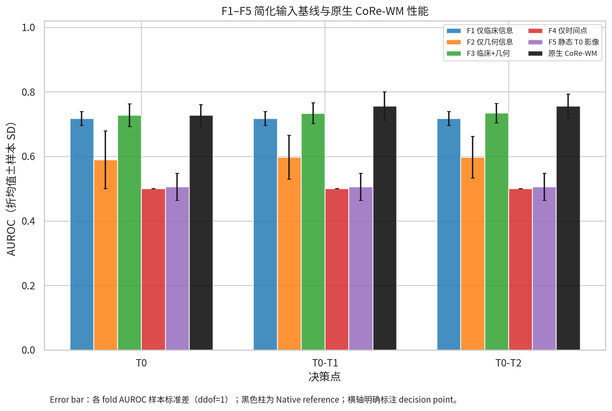

# CoRe-WM 系统性 Shortcut Audit 报告

报告日期：2026-08-06  
仓库分支：`feature/ispy-clean-corejepa`  
仓库提交：`c413ec86af04795434bdc19e65bbb006c966f379`  
实验协议：`corejepa_shortcut_audit_retraining_v1`

> **实验身份声明**：原始五折 checkpoint、fold-specific readout、prediction 和论文数值均未随仓库提供，项目方随后明确授权“只参考 repo 里的模型设计概念，实验数据部分可以自己重新训练”。因此，本报告是基于当前仓库设计完成的五折 **audit retraining**，不是原 checkpoint 或论文数值复现。文中的“native/原生序列”只表示相对于本次重训练 checkpoint 未做输入扰动的内部参照。

## 结论摘要

本次审计得到的联合结论是：CoRe-WM 的学习转移明显优于直接复制当前 latent，因而不支持简单的 identity-copy shortcut；但当前 primary pCR 路径在架构上完全不读取 MRI latent，而只读取 geometry 与 clinical/treatment/time condition。临床先验能够解释绝大部分 pCR 区分性能，geometry 在临床信息之上提供较小的补充。真实 follow-up MRI 对 combined latent prediction 的增量很小，正确时间顺序也没有带来更低的 latent error 或更好的 pooled pCR discrimination。匹配 donor 的 follow-up 被替换后，AUROC 有小幅但可检测的下降，说明存在一定患者特异性随访信号；不过 primary pCR 中可归因的部分是 donor geometry，而不能归因于 donor MRI。

因此，当前证据支持“模型学到了明显非复制的状态转移”，但不足以证明它学到了可用于 pCR 的、患者特异且有方向性的治疗相关 MRI 演化。更强的证据指向 clinical-prevalence shortcut、geometry/condition 主导的 primary endpoint，以及有限的 temporal-order benefit。

---

## 1. 研究目的

本研究诊断当前 CoRe-WM 是否真正使用纵向 MRI 演化，或主要依赖以下 shortcut：

1. 直接复制当前 latent state；
2. 重复使用 T0 静态影像表型；
3. 依赖 HR、HER2、MammaPrint、年龄和治疗信息；
4. 依赖 lesion mask、体积和 geometry descriptor；
5. 只使用 nominal timepoint；
6. 将时间点视作无方向集合；
7. 使用亚型或治疗组的平均响应，而非患者特异轨迹。

诊断单位分成两条不能混淆的路径：

- **JEPA latent 路径**：预测和 target 均为 192-D `appearance + geometry projection` 组合状态，learned prediction 还包含 `FutureResponseState` 给出的 latent correction；
- **primary pCR 路径**：64-D `FutureResponseState` 仅由 observed geometry 与 clinical/treatment/time condition 产生，再进入 Frozen Landmark Readout（FLR），不直接读取 MRI latent。

所有结论均联合考虑 A–F，不以单一实验宣告模型“存在”或“不存在”某种 shortcut。

## 2. 仓库、数据与现有流程说明

### 2.1 仓库定位与实现

当前工作树确认位于目标分支和提交。仓库检查的完整记录见 [repository_inspection.md](repository_inspection.md)。关键实现如下：

| 功能 | 仓库路径 |
|---|---|
| paper 配置 | `ispy_jepa_tmi_clean/configs/paper_v1.yaml` |
| patient records 与原单次 split | `ispy_jepa_tmi_clean/corejepa/data/records.py` |
| DCE8、ROI 与 9-D geometry | `ispy_jepa_tmi_clean/corejepa/data/imaging.py` |
| online/EMA encoder | `ispy_jepa_tmi_clean/corejepa/models/encoder.py`、`models/corejepa.py` |
| causal conditioned transition | `ispy_jepa_tmi_clean/corejepa/models/transition.py` |
| Factorized Response State | `ispy_jepa_tmi_clean/corejepa/models/response_state.py` |
| JEPA loss、训练、EMA、导出 | `ispy_jepa_tmi_clean/corejepa/training/` |
| Frozen Landmark Readout | `ispy_jepa_tmi_clean/corejepa/readout/flr.py` |
| 审计 wrapper 与 tests | `shortcut_audit/auditlib/`、`shortcut_audit/tests/` |

每名患者按 `T0,T1,T2,T3` 排列，输入 contract 为 `image [4,8,32,96,96]`、`geometry [4,9]` 和 `condition [3,25]`。DCE8 的第 8 通道是 ROI mask；9-D geometry 还通过独立 projector 输入，因此 lesion 几何被 mask channel 与 q 两种形式暴露。Condition 同时包含 target visit one-hot、observed-prefix bits、exact treatment arm、HR、HER2、MammaPrint 和标准化年龄；Transformer 另有 learned positional embedding，nominal time 信号是冗余的。

Online visit state 是 192-D `VisitProjector(VisitEncoder3D(DCE8)) + GeometryProjector(q)`；image transition 是三层、四头、512-D FFN 的 causal Transformer，并以 FiLM 接收 condition。EMA target encoder 对 encoder、projector 和 geometry projector 做 momentum 0.996 更新。六 expert 的 `FutureResponseState` 由 q 与 condition 生成 64-D response state、geometry reconstruction 和 192-D latent correction；最终 JEPA prediction 是 image prediction 与 correction 之和。

### 2.2 五折、样本与数据隔离

正式审计采用 seed-2026 五折 manifest：

```text
<ISPY2_ROOT>/
  _matched_breastdcedl_t0_dicomrepair_rgb224_seed2026/
  matched_patient_cv_splits_seed2026.csv
SHA256 = 143e482d711225c0611006d99bd7345d2fa1a5c16c65fbaf8399341a0d26aa38
```

该 manifest 覆盖 808 名 I-SPY2 患者，每人恰好一次作为 held-out test；每折 test 有 55 名 pCR 阳性。fold 0–2 为 train/validation/test = 525/121/162，fold 3–4 为 526/121/161。每折 representation 只用 primary train 加 156 名不加载 pCR 的 I-SPY1 患者；validation 只用于无监督 checkpoint selection，test 不参与训练或选择。Readout 只用该折 primary train 拟合，超参数和 threshold 只用 validation，test label 只用于最终报告。

### 2.3 Preprocessing 身份

影像采用完整 legacy cache `legacy_adaptive_axiscanon_v1_autoroi_t0fallback_minfrac0.5`，adapter 只读 `x [4,8,32,96,96]`，并调用 clean `mask_geometry(x[:,7])` 重算 q。它覆盖 964/964 人，但不是 clean `build_patient_tensor` 的逐例等价输出：3,232 个 I-SPY2 visit 中有 154 个 ROI crop 不同，涉及 77/808 人。106-D response feature 使用 clean 代码重新生成，文件 SHA256 为 `87698b7cd4f7d0130c30a6dac58958948dc094e29f3659f646ee2dd7ea120ac0`。完整兼容性证据见 [cache_compatibility.md](cache_compatibility.md) 和 [response_cache_validation.json](../metrics/response_cache_validation.json)。

### 2.4 Primary endpoint 的关键实现边界

当前 primary FLR 的真实计算图是：

```text
observed q + nominal time + clinical + treatment
  -> FutureResponseState [64]
  -> landmark_features [1283]
  -> shared class-balanced logistic regression
  -> pCR probability
```

它不是 `MRI trajectory latent -> pCR readout`。因此 C1 只替换 MRI 而保留 q 时，primary 概率按架构应保持不变；C2、D、E 的 primary 概率变化来自被替换或交换的 geometry/conditioned response state，不能归因于 MRI。MRI 的使用情况只能由 JEPA latent 诊断和另行定义的 F5 readout 辅助判断。

## 3. 原始结果复现情况与 Native Reference（A）

### 3.1 原始复现状态

严格意义上的原始结果复现**未完成且不可执行**：clean 分支只有一次 70/15/15 split，没有五折入口；预期的 `best_corejepa.pt`、`frozen_states.npz`、`flr.pkl`、predictions、threshold 和论文参考数值均不存在。历史前置检查记录在 [prerequisite_check.json](../metrics/prerequisite_check.json)。本报告没有使用 legacy checkpoint、随机权重或新结果冒充原模型。

项目方授权重训练后，实验身份切换为 [retraining_protocol.md](retraining_protocol.md) 定义的五折 audit retraining。五折均运行 7 个 epoch，并在 epoch 3 由无监督 validation prediction loss 选择最佳 checkpoint；五折最低 validation `visit_state_std` 为 0.2177，均高于 0.05 防塌缩门槛。完整训练核验见 [fivefold_training_validation.json](../metrics/fivefold_training_validation.json)。

### 3.2 Checkpoint、seed、readout 与 threshold

| fold | GPU | seed | pretrain / val / test | best val prediction | checkpoint SHA256（前 12 位） | T0 / T0–T1 / T0–T2 threshold |
|---:|---:|---:|---:|---:|---|---|
| 0 | 0 | 2026 | 681 / 121 / 162 | 0.207271 | `73cd563b7abd` | 0.4088 / 0.5421 / 0.3765 |
| 1 | 1 | 2027 | 681 / 121 / 162 | 0.174211 | `cdff64f06a12` | 0.6698 / 0.4898 / 0.4050 |
| 2 | 2 | 2028 | 681 / 121 / 162 | 0.203779 | `aaa006d069af` | 0.5554 / 0.5076 / 0.5431 |
| 3 | 0 | 2029 | 682 / 121 / 161 | 0.238904 | `a0606aa5874d` | 0.6579 / 0.5386 / 0.6427 |
| 4 | 1 | 2030 | 682 / 121 / 161 | 0.185672 | `ca24f3391cef` | 0.5327 / 0.4661 / 0.5186 |

每折 FLR 是一个共享三个 landmark 的 class-balanced logistic regression。L1/L2 与 C 根据 validation weighted AUROC 选择，landmark weights 为 2:1:0.5；选中的 `(penalty,C)` 依次为 `(L1,0.1)`、`(L2,0.03)`、`(L1,0.1)`、`(L2,0.03)`、`(L1,0.1)`。每个 decision point 的 threshold 由 validation 最大 Youden J 选择。该规则满足审计规格，但不同于 repo 原 FLR 固定 0.5 的行为。

### 3.3 A：审计重训练的 native 结果

“折均值 ± SD”使用五个 held-out fold 的样本标准差（ddof=1）；pooled OOF 由 808 名唯一患者组成，含 275 名 pCR 阳性和 533 名阴性。

| decision point | AUROC：折均值 ± SD / pooled | AUPRC：折均值 ± SD / pooled | pooled accuracy | pooled sensitivity | pooled specificity |
|---|---:|---:|---:|---:|---:|
| T0 | 0.7274 ± 0.0338 / 0.7243 | 0.5966 ± 0.0514 / 0.5863 | 0.6819 | 0.5673 | 0.7411 |
| T0–T1 | 0.7558 ± 0.0441 / 0.7513 | 0.6232 ± 0.0383 / 0.6023 | 0.7030 | 0.7018 | 0.7036 |
| T0–T2 | 0.7566 ± 0.0368 / 0.7520 | 0.6213 ± 0.0297 / 0.6035 | 0.6869 | 0.7127 | 0.6735 |

各折 native 指标如下；这些结果是内部 native reference，不能与缺失的论文结果作数值一致性声明。

| decision point | fold | n | AUROC | AUPRC | accuracy | sensitivity | specificity |
|---|---:|---:|---:|---:|---:|---:|---:|
| T0 | 0 | 162 | 0.7364 | 0.6465 | 0.5926 | 0.7636 | 0.5047 |
| T0 | 1 | 162 | 0.6853 | 0.5649 | 0.6852 | 0.3818 | 0.8411 |
| T0 | 2 | 162 | 0.7191 | 0.5334 | 0.6728 | 0.4909 | 0.7664 |
| T0 | 3 | 161 | 0.7180 | 0.5869 | 0.7267 | 0.5091 | 0.8396 |
| T0 | 4 | 161 | 0.7780 | 0.6512 | 0.7329 | 0.6909 | 0.7547 |
| T0–T1 | 0 | 162 | 0.7767 | 0.6609 | 0.7531 | 0.6364 | 0.8131 |
| T0–T1 | 1 | 162 | 0.6843 | 0.5609 | 0.6235 | 0.6364 | 0.6168 |
| T0–T1 | 2 | 162 | 0.7840 | 0.6361 | 0.7469 | 0.7636 | 0.7383 |
| T0–T1 | 3 | 161 | 0.7425 | 0.6419 | 0.6894 | 0.6727 | 0.6981 |
| T0–T1 | 4 | 161 | 0.7913 | 0.6163 | 0.7019 | 0.8000 | 0.6509 |
| T0–T2 | 0 | 162 | 0.7726 | 0.6387 | 0.6543 | 0.7818 | 0.5888 |
| T0–T2 | 1 | 162 | 0.7062 | 0.5938 | 0.6235 | 0.8182 | 0.5234 |
| T0–T2 | 2 | 162 | 0.7701 | 0.5940 | 0.7099 | 0.6364 | 0.7477 |
| T0–T2 | 3 | 161 | 0.7338 | 0.6174 | 0.7205 | 0.5818 | 0.7925 |
| T0–T2 | 4 | 161 | 0.8003 | 0.6627 | 0.7267 | 0.7455 | 0.7170 |

## 4. A–F 的实现方式

| 实验 | 实现与不变量 |
|---|---|
| A Native | 恢复每折冻结 checkpoint 和 FLR；不改输入；使用该折 validation-selected threshold。 |
| B Copy-current | `learned=output.prediction`，`copy=output.visit_state[:,:-1]`，`target=output.target`；target 为 stop-gradient EMA native target；距离严格复刻 feature-wise LayerNorm 后的 MSE，并同时报告 raw MSE 与 cosine。 |
| C1 Repeated-T0 MRI-only | 将 follow-up 的 image channels 0–6 替换为同患者 T0，保留真实 follow-up ROI mask、q、condition 和 nominal temporal embedding。 |
| C2 Repeated-T0 full image-derived | 将 follow-up 全部 8 个 DCE8 channels 与 q 替换为 T0，对 condition 与 nominal temporal embedding 不做修改。 |
| D Temporal order | 将 T1/T2 的全部 8 channels 与 q 作为整体交换，temporal embedding 不交换；paired latent 误差始终对比未扰动的 native EMA target。T0–T2 是主要诊断，T0–T1 是将 T2 放入名义 T1 位置的辅助诊断。 |
| E Matched follow-up swap | recipient 保留 T0、clinical/treatment 和 nominal time；donor T1/T2 的 8-channel visit 与 q 一起替换。Donor 限于同一 held-out fold、非本人、visit compatible，并 hard-match HR/HER2 subtype 与 treatment family，再按 baseline volume、年龄和 MammaPrint 距离排序；匹配不读取 pCR。 |
| F1 Clinical only | HR、HER2、MammaPrint、age z-score、exact treatment arm、decision one-hot，共 20 维。 |
| F2 Geometry only | baseline、current、相对 baseline 差、最近差、相对变化、prefix mean（各 9 维）和 decision one-hot，共 57 维。 |
| F3 Clinical + Geometry | F1 clinical base 与 F2 合并，decision one-hot 只保留一次，共 74 维。 |
| F4 Timepoint only | 仅 3-D nominal decision one-hot；intercept 由 logistic estimator 提供。 |
| F5 Static T0 imaging | `model.projector(model.encoder(image[:,0]))` 的 192-D T0 appearance state 在三个 decision point 重复，再加 decision one-hot，共 195 维；不调用 geometry projector，也不读取 follow-up，但 encoder 输入的 DCE8 仍含 ROI mask channel。 |

所有 paired perturbation 使用冻结模型和原 readout，`model.eval()` 下执行，不用 test label 选择 perturbation、checkpoint、threshold 或 donor。F1–F5 使用与 primary readout 相同的 train/validation/test 隔离、class balancing、C/penalty 网格和 validation-only threshold protocol。

正式命令入口及参数为：

```bash
# 五折训练；正式运行的 GPU 映射依次为 0:0、1:1、2:2、3:0、4:1
conda run -n bowen python shortcut_audit/scripts/train_retrained_fold.py \
  --fold <0..4> --gpu <gpu> --allow-training

# 每折 A–F 与 donor 评估
conda run -n bowen python shortcut_audit/scripts/evaluate_retrained_fold.py \
  --fold <0..4> --gpu <gpu> \
  --fold-dir shortcut_audit/runs/retrain_paper_v1/fold_<XX> \
  --eval-output shortcut_audit/results/fold_<XX> \
  --donor-output shortcut_audit/donor_results/fold_<XX> \
  --cache <ISPY2_ROOT>/_mixed_ispy1_train_cache_dce8_adaptivephase_axiscanonv1_autoroi_t0fallback_minfrac05_z32_y96_x96 \
  --allow-evaluation

# 五折汇总、2,000 次 patient-block bootstrap 与八图
conda run -n bowen python shortcut_audit/scripts/run_reporting.py \
  --bootstrap 2000 --seed 2026 --allow-reporting

# 按审计类别固化逐折及合并 OOF prediction CSV
conda run -n bowen python shortcut_audit/scripts/materialize_prediction_exports.py \
  --allow-export

# 报告补充汇总及其 hash manifest
conda run -n bowen python shortcut_audit/scripts/summarize_auxiliary_results.py \
  --allow-summary
conda run -n bowen python shortcut_audit/scripts/write_supplemental_metrics_manifest.py \
  --allow-manifest

# 生成只覆盖去标识化汇总、图和报告的 GitHub 结论包 manifest
conda run -n bowen python shortcut_audit/scripts/write_conclusion_manifest.py \
  --allow-manifest
```

五折共保存 2,424 条 native、7,272 条 C/D、12,120 条 F1–F5 和 21,870 条 donor prediction，共 43,686 条 prediction-level rows。字段包含 patient、fold、decision point、condition、label、probability、threshold、checkpoint，以及适用时的 donor、repetition 和 matching distance。完整性汇总见 [prediction_coverage.csv](../metrics/prediction_coverage.csv)。

## 5. 定量结果

### 5.1 统计约定与机器可读结果

除特别说明外，差值均为 `comparison - native`。折间 SD 使用 ddof=1；paired bootstrap 按患者成块重采样 2,000 次，seed=2026，报告 percentile 95% CI。Donor 主比较先在每名 recipient 内平均可用 donor，再按患者等权；每个 donor rank 的结果另报。完整表位于：

- [fold_metrics.csv](../metrics/fold_metrics.csv)、[fold_summary.csv](../metrics/fold_summary.csv)、[pooled_oof.csv](../metrics/pooled_oof.csv)；
- [native_differences.csv](../metrics/native_differences.csv)、[paired_bootstrap.csv](../metrics/paired_bootstrap.csv)；
- [probability_change_summary.csv](../metrics/probability_change_summary.csv)；
- [copy_pooled_metrics.csv](../metrics/copy_pooled_metrics.csv)、[copy_bootstrap.csv](../metrics/copy_bootstrap.csv)、[perturbation_latent_pooled.csv](../metrics/perturbation_latent_pooled.csv)；
- [conclusion_artifacts_manifest.json](../metrics/conclusion_artifacts_manifest.json)（GitHub 结论包的相对路径、行数和 SHA256）。

### 5.2 B：Copy-current latent baseline

Pooled 与折汇总结果如下。LayerNorm-MSE 是原 JEPA distance；“改善”与 G 数值相同乘以 100%。

| transition | learned / copy LayerNorm-MSE（折均 ± SD） | pooled learned / copy raw MSE | pooled learned / copy cosine | G：折均 ± SD / pooled | pooled 改善 |
|---|---:|---:|---:|---:|---:|
| T0→T1 | 0.1875 ± 0.0301 / 1.5501 ± 0.1182 | 0.0357 / 0.2769 | 0.8999 / 0.2238 | 0.8698 ± 0.0363 / 0.8698 | 86.98% |
| T1→T2 | 0.2245 ± 0.0246 / 1.5102 ± 0.1305 | 0.0416 / 0.2799 | 0.8816 / 0.2436 | 0.8366 ± 0.0401 / 0.8366 | 83.66% |
| T2→T3 | 0.2532 ± 0.0192 / 1.5163 ± 0.1228 | 0.0459 / 0.2837 | 0.8675 / 0.2407 | 0.8181 ± 0.0361 / 0.8181 | 81.81% |
| 全部 transition | 0.2217 ± 0.0245 / 1.5256 ± 0.1229 | 0.0411 / 0.2802 | 0.8830 / 0.2361 | 0.8415 ± 0.0374 / 0.8415 | 84.15% |

每折 G 均远大于 0：

| transition | fold 0 | fold 1 | fold 2 | fold 3 | fold 4 |
|---|---:|---:|---:|---:|---:|
| T0→T1 | 0.8602 | 0.9052 | 0.8858 | 0.8114 | 0.8863 |
| T1→T2 | 0.8305 | 0.8732 | 0.8550 | 0.7702 | 0.8539 |
| T2→T3 | 0.8188 | 0.8526 | 0.8334 | 0.7574 | 0.8282 |

患者级 G 的中位数及 2.5%–97.5% 经验分位数分别为：T0→T1 0.8972 `[0.6156,0.9553]`、T1→T2 0.8833 `[0.5043,0.9506]`、T2→T3 0.8546 `[0.4659,0.9484]`；G>0 的比例依次为 100%、99.75% 和 99.75%。这清楚否定了“learned transition 与复制当前状态几乎一样”的简单 identity-copy 假设。

正式的 2,000 次患者块 bootstrap 进一步给出 G 的等患者权重 95% CI：T0→T1 为 0.8698 `[0.8628,0.8763]`、T1→T2 为 0.8366 `[0.8275,0.8454]`、T2→T3 为 0.8181 `[0.8077,0.8277]`，全部 transition 为 0.8415 `[0.8341,0.8486]`。配对的 `copy error - learned error` 也在三段均明确大于 0；结论级统计见 [copy_bootstrap.csv](../metrics/copy_bootstrap.csv)。2,000 次原始 bootstrap draws 仍保留在本地审计目录，按约束不提交 Git。

不过，target 与 current state 均包含 geometry projection，learned prediction 还使用 q/condition 生成的 response correction，因此 B 不能单独证明改善来自 MRI appearance evolution。

### 5.3 C–E：pCR discrimination 与配对差值

T0 未被 follow-up 扰动，除 E 的 807 人 paired 子集外与 native 相同，故下表集中报告 T0–T1 与 T0–T2。每格“折 AUROC/AUPRC”均为均值 ± 折间 SD。

| 条件 | 决策点 | n | pooled AUROC / AUPRC | 折 AUROC / AUPRC | accuracy / sensitivity / specificity | ΔAUROC（相对；95% CI） | ΔAUPRC（95% CI） |
|---|---|---:|---:|---:|---:|---:|---:|
| C2 repeated T0 full | T0–T1 | 808 | 0.7230 / 0.5857 | 0.7253±0.0390 / 0.5945±0.0576 | 0.7079 / 0.4873 / 0.8218 | -0.0283（-3.77%；[-0.0492,-0.0075]） | -0.0166（[-0.0505,+0.0195]） |
| C2 repeated T0 full | T0–T2 | 808 | 0.7212 / 0.5865 | 0.7277±0.0357 / 0.5934±0.0562 | 0.6943 / 0.3127 / 0.8912 | -0.0308（-4.09%；[-0.0573,-0.0054]） | -0.0170（[-0.0598,+0.0223]） |
| D T1/T2 swap | T0–T1 辅助 | 808 | 0.7459 / 0.5920 | 0.7474±0.0337 / 0.6115±0.0501 | 0.6064 / 0.8327 / 0.4897 | -0.0054（-0.72%；[-0.0309,+0.0210]） | -0.0102（[-0.0536,+0.0397]） |
| D T1/T2 swap | T0–T2 主要 | 808 | 0.7522 / 0.6135 | 0.7571±0.0317 / 0.6324±0.0455 | 0.6881 / 0.6982 / 0.6829 | +0.0002（+0.03%；[-0.0238,+0.0261]） | +0.0100（[-0.0322,+0.0513]） |
| E matched donor mean | T0–T1 | 807 | 0.7277 / 0.5959 | 0.7293±0.0511 / 0.6115±0.1026 | 0.6679 / 0.6727 / 0.6654 | -0.0232（-3.09%；[-0.0464,-0.0002]） | -0.0064（[-0.0452,+0.0324]） |
| E matched donor mean | T0–T2 | 807 | 0.7185 / 0.5848 | 0.7216±0.0458 / 0.6016±0.0924 | 0.6592 / 0.6582 / 0.6598 | -0.0331（-4.41%；[-0.0585,-0.0064]） | -0.0188（[-0.0611,+0.0283]） |

C1 MRI-only 的三个 decision point 在 primary pCR 上都与 native 相同到数值精度：pooled AUROC/AUPRC 差均为 0，bootstrap CI 也是 `[0,0]`；最大单患者数值差小于 `6.3×10^-7`。这是 primary FLR 不接收 MRI latent 的结构性结果，不是“MRI 没有信息”的经验检验。

关键条件的 fold-wise AUROC change 显示明显异质性：

| 条件 / 决策点 | fold 0 | fold 1 | fold 2 | fold 3 | fold 4 |
|---|---:|---:|---:|---:|---:|
| C2 / T0–T1 | -0.0294 | -0.0029 | -0.0683 | -0.0407 | -0.0110 |
| C2 / T0–T2 | -0.0296 | -0.0206 | -0.0488 | -0.0249 | -0.0208 |
| D / T0–T2 | -0.0274 | +0.0121 | +0.0102 | +0.0099 | -0.0024 |
| E / T0–T1 | -0.0301 | -0.0024 | -0.1028 | -0.0046 | +0.0105 |
| E / T0–T2 | -0.0454 | -0.0326 | -0.0819 | -0.0029 | -0.0105 |

### 5.4 C–E：患者级概率变化

| 条件 | 决策点 | n | mean Δp | mean / median absolute Δp | absolute Δp>0.05 | absolute Δp>0.10 |
|---|---|---:|---:|---:|---:|---:|
| C1 repeated T0 MRI-only | T0–T1 | 808 | `1.27×10^-9` | `2.13×10^-9` / 0 | 0% | 0% |
| C1 repeated T0 MRI-only | T0–T2 | 808 | `5.39×10^-10` | `1.31×10^-9` / 0 | 0% | 0% |
| C2 repeated T0 full | T0–T1 | 808 | -0.0842 | 0.1006 / 0.0621 | 56.68% | 36.14% |
| C2 repeated T0 full | T0–T2 | 808 | -0.1612 | 0.1741 / 0.1373 | 78.22% | 61.26% |
| D T1/T2 swap | T0–T1 辅助 | 808 | +0.1174 | 0.1516 / 0.1219 | 75.50% | 56.06% |
| D T1/T2 swap | T0–T2 主要 | 808 | +0.0021 | 0.0914 / 0.0529 | 51.11% | 29.46% |
| E matched donor mean | T0–T1 | 807 | +0.0049 | 0.1021 / 0.0792 | 66.17% | 40.89% |
| E matched donor mean | T0–T2 | 807 | +0.0049 | 0.1201 / 0.0882 | 69.14% | 45.35% |

C2 导致概率整体下移，说明真实 follow-up geometry 对 primary response state 有贡献。D 的 T0–T2 平均有符号变化接近 0，但平均绝对变化为 0.0914，说明个体变化相互抵消；模型对输入位置有反应，却没有从正确顺序获得更好的总体区分。E 同样表现为较大的个体概率变化与较小的平均有符号变化。

### 5.5 C–E：固定 native target 的 latent 与 response-state 诊断

T0→T1 只观察 T0，所有 follow-up 扰动均不改变该 transition。下表为患者等权 pooled 结果；latent error 是对固定 native EMA target 的 LayerNorm-MSE。

| 条件 | transition | native error | 扰动 error | error change | response-state mean absolute change | response-state L2 change |
|---|---|---:|---:|---:|---:|---:|
| C1 repeated T0 MRI-only | T1→T2 | 0.224520 | 0.226012 | +0.001492 | 0 | 0 |
| C1 repeated T0 MRI-only | T2→T3 | 0.253152 | 0.254749 | +0.001597 | 0 | 0 |
| C2 repeated T0 full | T1→T2 | 0.224520 | 0.224926 | +0.000406 | 0.107555 | 1.068369 |
| C2 repeated T0 full | T2→T3 | 0.253152 | 0.253427 | +0.000275 | 0.161421 | 1.603235 |
| D T1/T2 swap | T1→T2 | 0.224520 | 0.222343 | -0.002177 | 0.145021 | 1.442743 |
| D T1/T2 swap | T2→T3 | 0.253152 | 0.252836 | -0.000317 | 0.145691 | 1.451976 |
| E matched donor | T1→T2 | 0.224628 | 0.232216 | +0.007588 | 0.172747 | 1.721056 |
| E matched donor | T2→T3 | 0.253064 | 0.259599 | +0.006535 | 0.224533 | 2.232425 |

C1 去除真实 follow-up MRI appearance 后，latent error 只增加约 0.0015–0.0016；C2 虽明显改变 geometry-driven response state，combined latent error 增幅反而更小。D 交换顺序没有增加 latent error，两个 transition 的 error 还略低。E 替换患者特异 follow-up 后 error 增加 0.0065–0.0076，是四类 perturbation 中最一致的恶化，但绝对量仍较小。

### 5.6 E：donor matching、每次 repetition 与覆盖率

匹配使用 seed 1729，每名 recipient 请求 10 名 donor。807/808 人至少有一名 donor，成功率 99.88%；639 人得到完整 10 名 donor，168 人部分匹配，唯一未匹配患者的研究 ID 已隐去（`no_hard_match_candidate`），共 7,290 对，平均 9.03 名 donor/recipient。所有 pair 的 subtype、treatment family 和 visit compatibility 匹配率均为 100%，没有 relaxed pair；MammaPrint 匹配率为 68.63%，平均 baseline volume distance 为 0.503 个 z-score，平均 age distance 为 1.063 个 z-score。完整映射、失败和 balance 文件位于本地 `shortcut_audit/donor_results/fold_XX/`（不进入 Git），汇总见 [donor_matching_summary.csv](../metrics/donor_matching_summary.csv)。

| fold | recipients | matched / unmatched | full-10 / partial | pairs | mean donors | success rate |
|---:|---:|---:|---:|---:|---:|---:|
| 0 | 162 | 162 / 0 | 126 / 36 | 1,466 | 9.05 | 100.00% |
| 1 | 162 | 161 / 1 | 134 / 27 | 1,476 | 9.11 | 99.38% |
| 2 | 162 | 162 / 0 | 130 / 32 | 1,458 | 9.00 | 100.00% |
| 3 | 161 | 161 / 0 | 129 / 32 | 1,450 | 9.01 | 100.00% |
| 4 | 161 | 161 / 0 | 120 / 41 | 1,440 | 8.94 | 100.00% |
| pooled | 808 | 807 / 1 | 639 / 168 | 7,290 | 9.03 | 99.88% |

每个 donor rank 的 pooled OOF 结果如下。后续 rank 只包含拥有足够 donor 的 recipient，因此 n 从 807 降至 639；这也解释了 T0 在 repetition 汇总中随 rank 变化，不能把该变化解释为 follow-up perturbation。主 E 比较采用前述 patient-within-donor mean，避免 donor 数较多的患者获得更大权重。

| repetition | n | T0–T1 AUROC / AUPRC | T0–T2 AUROC / AUPRC |
|---:|---:|---:|---:|
| 1 | 807 | 0.7079 / 0.5789 | 0.7119 / 0.5751 |
| 2 | 807 | 0.7014 / 0.5442 | 0.6927 / 0.5389 |
| 3 | 792 | 0.6921 / 0.5352 | 0.6713 / 0.5135 |
| 4 | 764 | 0.7196 / 0.5660 | 0.7034 / 0.5547 |
| 5 | 739 | 0.6956 / 0.5336 | 0.6919 / 0.5347 |
| 6 | 721 | 0.6716 / 0.5254 | 0.6633 / 0.4989 |
| 7 | 707 | 0.6814 / 0.5255 | 0.6517 / 0.4916 |
| 8 | 675 | 0.6910 / 0.5316 | 0.6742 / 0.5094 |
| 9 | 639 | 0.6821 / 0.5127 | 0.6641 / 0.4939 |
| 10 | 639 | 0.6784 / 0.5349 | 0.6840 / 0.5416 |
| repetition 均值 ± SD | 10 次 | 0.6921±0.0146 / 0.5388±0.0198 | 0.6809±0.0192 / 0.5252±0.0281 |

每折、每 repetition 的完整 accuracy、sensitivity 和 specificity 见 [repetition_metrics.csv](../metrics/repetition_metrics.csv)。

### 5.7 F：Simplified-input baselines

| baseline | 决策点 | pooled AUROC / AUPRC | 折 AUROC / AUPRC（均值 ± SD） | accuracy / sensitivity / specificity | ΔAUROC（相对；95% CI） | ΔAUPRC（95% CI） |
|---|---|---:|---:|---:|---:|---:|
| F1 Clinical | T0 | 0.7125 / 0.5638 | 0.7176±0.0210 / 0.5665±0.0445 | 0.6262 / 0.7273 / 0.5741 | -0.0118（-1.62%；[-0.0320,+0.0079]） | -0.0225（[-0.0563,+0.0112]） |
| F1 Clinical | T0–T1 | 0.7125 / 0.5638 | 0.7176±0.0210 / 0.5665±0.0445 | 0.6262 / 0.7273 / 0.5741 | -0.0388（-5.17%；[-0.0656,-0.0125]） | -0.0385（[-0.0827,+0.0070]） |
| F1 Clinical | T0–T2 | 0.7125 / 0.5638 | 0.7176±0.0210 / 0.5665±0.0445 | 0.6262 / 0.7273 / 0.5741 | -0.0395（-5.25%；[-0.0691,-0.0099]） | -0.0398（[-0.0878,+0.0102]） |
| F2 Geometry | T0 | 0.5918 / 0.4211 | 0.5897±0.0895 / 0.4512±0.1035 | 0.6027 / 0.3600 / 0.7280 | -0.1325（-18.29%；[-0.1773,-0.0868]） | -0.1652（[-0.2222,-0.1063]） |
| F2 Geometry | T0–T1 | 0.5959 / 0.4476 | 0.5975±0.0677 / 0.4604±0.0961 | 0.5668 / 0.5200 / 0.5910 | -0.1555（-20.69%；[-0.1980,-0.1120]） | -0.1547（[-0.2126,-0.0935]） |
| F2 Geometry | T0–T2 | 0.6022 / 0.4461 | 0.5976±0.0646 / 0.4603±0.0813 | 0.5903 / 0.4436 / 0.6660 | -0.1498（-19.92%；[-0.1955,-0.1025]） | -0.1575（[-0.2165,-0.0932]） |
| F3 Clinical+Geometry | T0 | 0.7195 / 0.5785 | 0.7279±0.0356 / 0.6052±0.0556 | 0.6832 / 0.6764 / 0.6867 | -0.0047（-0.65%；[-0.0229,+0.0120]） | -0.0078（[-0.0373,+0.0266]） |
| F3 Clinical+Geometry | T0–T1 | 0.7231 / 0.5822 | 0.7337±0.0324 / 0.6118±0.0549 | 0.6584 / 0.6909 / 0.6417 | -0.0282（-3.75%；[-0.0530,-0.0020]） | -0.0201（[-0.0604,+0.0251]） |
| F3 Clinical+Geometry | T0–T2 | 0.7273 / 0.5831 | 0.7343±0.0297 / 0.6072±0.0541 | 0.6869 / 0.6509 / 0.7054 | -0.0246（-3.27%；[-0.0528,+0.0034]） | -0.0204（[-0.0644,+0.0248]） |
| F4 Timepoint | T0 | 0.5004 / 0.3405 | 0.5000±0.0000 / 0.3403±0.0012 | 0.3403 / 1.0000 / 0.0000 | -0.2239（-30.91%；[-0.2666,-0.1781]） | -0.2458（[-0.2991,-0.1963]） |
| F4 Timepoint | T0–T1 | 0.5004 / 0.3405 | 0.5000±0.0000 / 0.3403±0.0012 | 0.3403 / 1.0000 / 0.0000 | -0.2510（-33.40%；[-0.2951,-0.2068]） | -0.2618（[-0.3173,-0.2097]） |
| F4 Timepoint | T0–T2 | 0.5004 / 0.3405 | 0.5000±0.0000 / 0.3403±0.0012 | 0.3403 / 1.0000 / 0.0000 | -0.2516（-33.46%；[-0.2975,-0.2049]） | -0.2630（[-0.3216,-0.2092]） |
| F5 Static T0 appearance | T0 | 0.5127 / 0.3496 | 0.5058±0.0417 / 0.3472±0.0375 | 0.4666 / 0.5709 / 0.4128 | -0.2116（-29.21%；[-0.2654,-0.1586]） | -0.2367（[-0.2959,-0.1726]） |
| F5 Static T0 appearance | T0–T1 | 0.5127 / 0.3496 | 0.5058±0.0417 / 0.3472±0.0375 | 0.4666 / 0.5709 / 0.4128 | -0.2386（-31.76%；[-0.2905,-0.1836]） | -0.2527（[-0.3069,-0.1881]） |
| F5 Static T0 appearance | T0–T2 | 0.5127 / 0.3496 | 0.5058±0.0417 / 0.3472±0.0375 | 0.4666 / 0.5709 / 0.4128 | -0.2393（-31.82%；[-0.2904,-0.1870]） | -0.2540（[-0.3130,-0.1903]） |

F1 与 F3 已接近 native：F1 的 AUROC 绝对差为 0.0118–0.0395，F3 为 0.0047–0.0282。F2 单独明显较弱，说明 geometry 不是独立的主要判别来源；但 F3 与 primary native 接近，说明 clinical 与 geometry 联合可解释 primary 路径的大部分区分性能。F4 为随机水平，排除“只靠 timepoint 即可区分患者”。F5 近随机，表明该冻结 T0 appearance 对线性 pCR readout 不足，但不能排除非线性或其他任务中的影像信息。

### 5.8 Threshold-dependent 指标的折均值 ± SD

为完整呈现 validation-selected threshold 下的折间变异，以下补充 C2、D、E 与 F1–F5 的 accuracy、sensitivity 和 specificity 折均值 ± 样本 SD。C1 与 native 的对应数值相同，见 3.3 节；所有指标相对 native 的 absolute/relative difference 见 [native_differences.csv](../metrics/native_differences.csv)。

| 条件 | 决策点 | accuracy | sensitivity | specificity |
|---|---|---:|---:|---:|
| C2 | T0 | 0.6820±0.0563 | 0.5673±0.1561 | 0.7413±0.1382 |
| C2 | T0–T1 | 0.7080±0.0397 | 0.4873±0.0931 | 0.8217±0.0426 |
| C2 | T0–T2 | 0.6943±0.0220 | 0.3127±0.1683 | 0.8914±0.0810 |
| D | T0 | 0.6820±0.0563 | 0.5673±0.1561 | 0.7413±0.1382 |
| D | T0–T1 | 0.6064±0.0279 | 0.8327±0.0622 | 0.4896±0.0553 |
| D | T0–T2 | 0.6882±0.0537 | 0.6982±0.1017 | 0.6831±0.1132 |
| E | T0 | 0.6817±0.0563 | 0.5673±0.1561 | 0.7410±0.1380 |
| E | T0–T1 | 0.6679±0.0424 | 0.6727±0.0643 | 0.6653±0.0557 |
| E | T0–T2 | 0.6593±0.0697 | 0.6582±0.1229 | 0.6599±0.1413 |
| F1 | T0 | 0.6263±0.0542 | 0.7273±0.0900 | 0.5740±0.1043 |
| F1 | T0–T1 | 0.6263±0.0542 | 0.7273±0.0900 | 0.5740±0.1043 |
| F1 | T0–T2 | 0.6263±0.0542 | 0.7273±0.0900 | 0.5740±0.1043 |
| F2 | T0 | 0.6027±0.0628 | 0.3600±0.0673 | 0.7279±0.1111 |
| F2 | T0–T1 | 0.5667±0.0670 | 0.5200±0.1452 | 0.5906±0.1516 |
| F2 | T0–T2 | 0.5904±0.0294 | 0.4436±0.2192 | 0.6663±0.1270 |
| F3 | T0 | 0.6832±0.0465 | 0.6764±0.1490 | 0.6867±0.1244 |
| F3 | T0–T1 | 0.6585±0.0421 | 0.6909±0.0936 | 0.6419±0.0809 |
| F3 | T0–T2 | 0.6869±0.0219 | 0.6509±0.1320 | 0.7056±0.0890 |
| F4 | T0 | 0.3403±0.0012 | 1.0000±0.0000 | 0.0000±0.0000 |
| F4 | T0–T1 | 0.3403±0.0012 | 1.0000±0.0000 | 0.0000±0.0000 |
| F4 | T0–T2 | 0.3403±0.0012 | 1.0000±0.0000 | 0.0000±0.0000 |
| F5 | T0 | 0.4664±0.0947 | 0.5709±0.2735 | 0.4121±0.2780 |
| F5 | T0–T1 | 0.4664±0.0947 | 0.5709±0.2735 | 0.4121±0.2780 |
| F5 | T0–T2 | 0.4664±0.0947 | 0.5709±0.2735 | 0.4121±0.2780 |

## 6. 图表

图表 manifest、聚合方式、误差条定义和 SHA256 见 [required_figures_manifest.json](../figures/required_figures_manifest.json)。图 1、3、8 的误差条均为五折指标的样本 SD（ddof=1）；图 2 每点是一折、无误差条；图 4–7 是患者级分布、无误差条。

### 图 1：Native 与 perturbation AUROC



### 图 2：各折 AUROC change



### 图 3：Learned transition 与 copy-current latent error



### 图 4：Normalized transition gain G



### 图 5：Repeated-T0 概率变化



### 图 6：Temporal swap 概率变化



### 图 7：Matched follow-up swap 概率变化



### 图 8：F1–F5 与 native



## 7. 可能的 shortcut 证据

### 7.1 Clinical-prevalence 与 geometry/condition 主导

F1 clinical-only 的 pooled AUROC 为 0.7125，距离 native 仅 0.0118（T0）和约 0.039（两个 follow-up decision）；F3 clinical+geometry 的差距进一步缩小到 0.0047–0.0282。更关键的是，primary FLR 在架构上只读取 geometry 与 clinical/treatment/time condition。因此，当前 primary pCR 性能的大部分能够由临床先验与几何路径解释，这是本次审计最强的 shortcut 证据。

### 7.2 真实 follow-up MRI 的增量证据很弱

C1 用 T0 替换真实 follow-up MRI、但保留 mask/q 后，primary pCR 概率结构性不变；在 JEPA latent 路径中，T1→T2 和 T2→T3 error 仅增加 0.00149 和 0.00160。C2 的 AUROC 下降约 0.028–0.031，但 C2 同时替换 geometry，而 primary pCR 变化只可能来自 geometry。故现有结果不能把 C2 的性能差归因于 MRI。

### 7.3 正确时间方向没有体现为更优目标

D 在主要 T0–T2 decision 上使 51.11% 患者的概率变化超过 0.05，说明模型并非完全忽略位置；然而 pooled AUROC 几乎不变（+0.0002），latent error 也没有增加。五折 AUROC change 有正有负。这支持“模型会响应顺序扰动”，但同时提示它未把正确时间方向稳定转化为更好的预测或区分性能。

### 7.4 患者特异轨迹贡献存在但有限

E 的 donor-averaged AUROC 在 T0–T1/T0–T2 下降 0.0232/0.0331，AUROC bootstrap CI 刚好或明确低于 0；latent error 增加 0.00759/0.00654。另一方面，相对 AUROC 下降仅 3.09%/4.41%，AUPRC CI 跨 0，且 primary pCR 改变来自 donor geometry。结果支持一定患者特异性信号，但也支持大量性能来自可跨患者保留的 clinical/treatment 先验和群体平均结构。

## 8. 不支持 shortcut 的证据与 a–f 明确回答

### 8.1 不支持 shortcut 的证据

- **不支持 identity copy**：learned LayerNorm-MSE 比 copy 低 81.81%–86.98%，G 的 pooled 值为 0.818–0.870，几乎所有患者 G>0。
- **不支持纯 timepoint shortcut**：F4 AUROC 约 0.500，无法区分患者。
- **不支持 geometry-alone 解释全部性能**：F2 AUROC 仅 0.592–0.602，明显低于 native；geometry 的作用主要在与临床条件联合时体现。
- **不支持完全患者无关的 trajectory**：matched donor swap 使 AUROC 下降、combined latent error 上升，并引起多数患者超过 0.05 的概率变化。
- **不支持模型完全忽略输入顺序**：D 在个体层面造成明显 response state 与概率变化，虽然总体 performance 没有方向性收益。

### 8.2 验收问题 a–f

| 问题 | 明确回答 |
|---|---|
| a. Transition model 是否明显优于复制当前 latent state？ | **是。** 三个 transition 的 learned error 相对 copy 下降约 82%–87%，G 远高于 0；简单 identity-copy shortcut 不成立。该结论针对包含 appearance+geometry 的组合 latent，不能自动等同于 MRI-only evolution。 |
| b. 真实 follow-up MRI 是否比 repeated T0 提供显著额外信息？ | **当前证据不足以回答“显著提供”。** Primary pCR 根本不读取 MRI；C1 的 combined latent error 仅小幅增加。C2 的 AUROC 下降 CI 排除 0，但变化来自同步替换的 geometry，不能归因于 MRI。就本实现可识别的证据而言，真实 follow-up MRI appearance 的额外贡献较弱。 |
| c. 模型是否对时间顺序敏感？ | **个体输出敏感，但正确顺序没有稳定优势。** T0–T2 temporal swap 的 mean absolute Δp=0.0914，51.11% 患者超过 0.05；然而 AUROC 不降、latent error 也不增。因此存在位置敏感性，但缺少有方向演化学习的证据。 |
| d. 模型是否依赖患者特异的 follow-up trajectory？ | **存在有限依赖。** Matched donor swap 使 AUROC 下降 0.023–0.033、latent error 增加约 0.0065–0.0076，并引起明显患者级概率变化；但 primary pCR 的可识别依赖是患者特异 geometry，不能分离为 MRI 依赖。 |
| e. Clinical 和 geometry 在多大程度上解释最终性能？ | **解释了大部分 primary pCR discrimination。** Clinical-only AUROC 0.7125，clinical+geometry 为 0.7195–0.7273，分别距 native 0.0118–0.0395 和 0.0047–0.0282；geometry-only 仅 0.5918–0.6022。临床是主导，geometry 提供补充及纵向变化。 |
| f. 当前 image-only trajectory 是否确实学习到了治疗相关演化？ | **尚不能确认。** B 证明模型学到非复制的组合状态转移；但 primary endpoint 排除 MRI latent、C1 影响很小、D 无方向性收益、F5 近随机。现有实验不足以证明 image-only trajectory 学到了可用于 pCR 的治疗相关演化。 |

## 9. 实验限制

1. **不是原模型复现**：原五折 checkpoint、readout 和论文数值缺失，本报告只能评估审计重训练实例。
2. **影像 cache 非 clean 等价**：154/3,232 个 I-SPY2 visit 的 ROI crop 与 clean 实现不同，涉及 77 人；这可能影响跨实现外推。
3. **primary readout 的可识别性限制**：FLR 不读取 MRI latent，因而 primary pCR audit 不能估计 MRI 的增量效应；C2/D/E 又同时改变 geometry。
4. **combined latent 不是 image-only**：EMA target 和 visit state 都包含 geometry projection，prediction 还包含 geometry/condition response correction。B、C–E latent 指标不能直接解释成纯影像演化。
5. **F5 是线性探针**：F5 的近随机结果只说明当前冻结 T0 appearance 对该线性、共享 landmark readout 不可分；不排除非线性或其他任务信息。其 DCE8 encoder 输入仍含 ROI mask channel。
6. **donor 覆盖不完全**：1 人无法 hard match，168 人不足 10 名 donor；高 rank repetition 的 cohort 逐步缩小。MammaPrint 匹配率仅 68.63%，平均年龄距离约 1.06 个 z-score。
7. **扰动是诊断性 OOD 输入**：repeated T0、T1/T2 swap 和跨患者 follow-up 拼接并非临床有效序列；模型反应不能直接解释为现实干预效应。
8. **统计范围**：仅 808 名 I-SPY2 完整四访视患者、单一 cohort；bootstrap 为内部患者重采样，未做外部验证或多重比较校正。
9. **fold 与 seed 绑定**：每折使用 `2026+fold` 单一 seed，折间差异同时包含样本划分和初始化差异；E 的 fold 2 degradation 明显大于其他折。
10. **T3 order diagnostic 未实现**：B 覆盖 T2→T3 latent，但 D 只执行任务主要的 T1/T2 swap，没有额外的 `[T0,T3,T2,T1]` diagnostic。
11. **阈值协议与 repo 原行为不同**：本审计按规格使用 validation-selected threshold；clean repo 原 FLR 固定 0.5，二者不能混作同一 endpoint。
12. **ROI fallback**：66 个 visit 使用 `legacy_full_field_empty_ftv`，可能在 geometry audit 中引入与生物学响应无关的模式。

## 10. 对下一阶段模型设计的建议

1. 将下一版 primary endpoint 明确拆成三套预注册 readout：clinical-only、clinical+geometry、clinical+geometry+MRI trajectory，并在完全相同的 fold/validation protocol 下报告逐步增量和 paired CI。
2. 为 MRI 轨迹建立真正接收 appearance latent 的冻结 probe，同时保留 geometry-free 和 mask-free sensitivity analysis；否则无法回答影像是否带来 pCR 信息。
3. 将 clinical、geometry、MRI、time embedding 分别做 evaluation-time conditional permutation/dropout，特别检查在 clinical+geometry 已知条件下 MRI 的条件增益。
4. 把 copy-current 设为所有 latent 实验的固定强基线，并在后续独立方法研究中考虑对“超过 copy 的 margin”进行显式验证；本次审计不修改当前核心 loss。
5. 增加 direction-specific counterfactual evaluation：正确顺序、全排列、相同 visit 重复和不同时距编码，并将“顺序导致输出变化”与“正确顺序降低 native-target error”分开报告。
6. 扩展 donor audit：在不使用 outcome 的前提下改善 age/MammaPrint/volume matching，保证每名 recipient 固定 donor 数，并分别进行 MRI-only donor swap 与 geometry-only donor swap，以分离两种来源。
7. 重建与目标分支逐例等价的 clean tensor cache，复核 77 名 crop-sensitive 患者及 66 个 full-field fallback visit；同时按 ROI provenance 分层报告。
8. 在多个训练 seed 和外部 cohort 上重复五折审计，预先指定 primary comparison，避免从多种 perturbation 中事后选择结论。
9. 将 F1/F3 作为所有后续模型版本的强制 comparator。只有 MRI trajectory 在 paired OOF 上稳定超过 clinical+geometry，并对 repeated-T0、temporal-order 和 donor-swap 同时表现出一致敏感性，才应声称学习到了治疗相关、患者特异且有方向的影像演化。

总体而言，下一阶段最重要的不是立即增加模型复杂度，而是让 endpoint 真正接收并可隔离 MRI trajectory，并用增量、配对和反事实证据证明它超越 clinical+geometry 先验。
